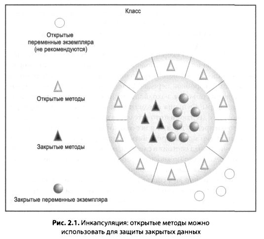
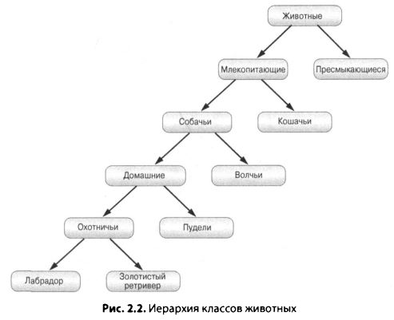
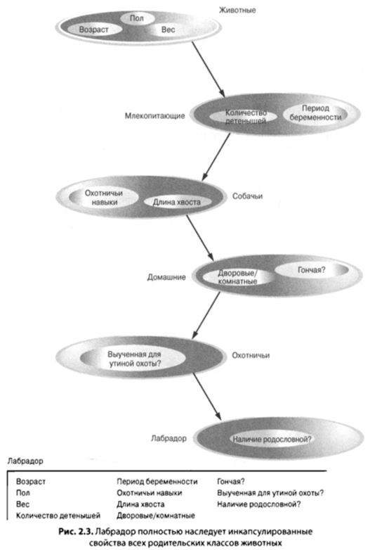
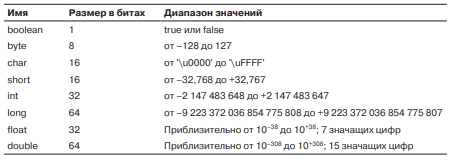
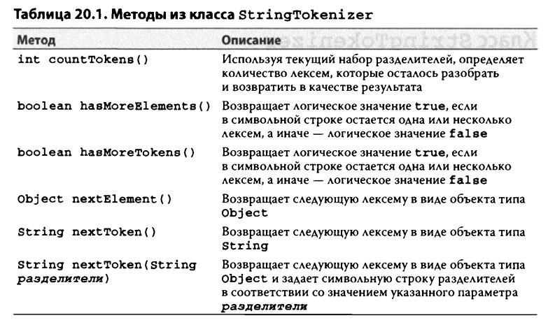
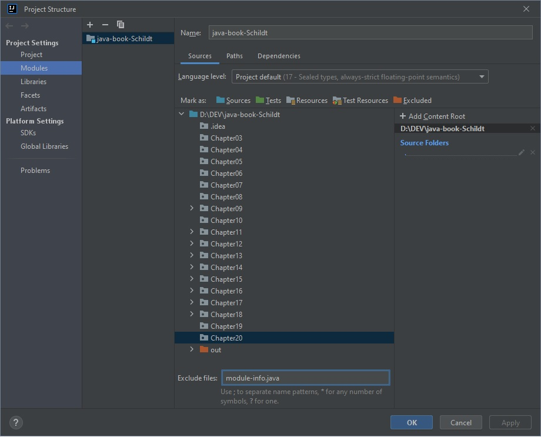

<small>

## Книга "Java полное руководство - Герберт Шилдт, 10-е издание, 2018г."

### [Java: The Complete Reference, Tenth Edition](http://www.williamspublishing.com/Books/978-5-6040043-6-4.html "http://www.williamspublishing.com/Books/978-5-6040043-6-4.html")

## Book "The Complete Reference - Herbert Schildt, 10-e, 2018."

<small>

(*Информация содержит основные моменты с примерами кода...*)

[Показать все Содержание ...](./README.md "весь список ...")

</small>

#### Оглавление

<details ГЛАВА 1><summary>ГЛАВА 1. "История и развитие языка Java"</summary>
<blockquote>

Чтобы досконально изучить язык программирования Java, следует понять причины его создания, факторы, обусловившие его
формирование, а также унаследованные
им особенности. Подобно другим удачным языкам программирования, предшествовавшим Java, этот язык сочетает в себе лучшие
элементы из своего богатого наследия
и новаторские концепции, применение которых обусловлено его особым положением. В то время как остальные главы этой книги
посвящены практическим вопросам
программирования на Java, в том числе его синтаксису, библиотекам и приложениям,
в этой главе поясняется, как и почему был разработан этот язык, что делает его столь
важным и как он развивался за годы своего существования.
Несмотря на то что язык Java неразрывно связан с Интернетом, важно помнить,
что это, прежде всего, язык программирования. Разработка и усовершенствование
языков программирования обусловлены двумя основными причинами:
• адаптация к изменяющимся средам и областям применения;
• реализация улучшений и усовершенствований в области программирования.
Как будет показано в этой главе, разработка языка Java почти в равной мере была обусловлена обеими этими причинами.

**Версия Java SE 9**

Главным нововведением в версии JDK 9 являются модули, позволяющие указывать взаимосвязи и зависимости в прикладном
коде, а также расширяющие возможности управления доступом в Java. Вместе с модулями в языке Java появился
новый синтаксический элемент и несколько ключевых слов. Кроме того, в состав JDK была включена утилита jlink,
позволяющая создавать на стадии выполнения образ прикладного файла типа JMOD, содержащего только нужные модули.
Модули также оказали заметное влияние на библиотеку Java API, поскольку, начиная с версии JDK 9, библиотечные пакеты
организованы в модули.

</blockquote>
</details>

<details ГЛАВА 2><summary>ГЛАВА 2. "Краткий обзор Java"</summary>
<blockquote>

Как и во всех остальных языках программирования, элементы Java существуют
не сами по себе. Они скорее действуют совместно, образуя язык в целом. Но такая
их взаимосвязанность может затруднять описание какого-то одного аспекта Java,
не затрагивая ряда других. Зачастую для понимания одного языкового средства
необходимо знать другое средство. Поэтому в этой главе представлен краткий
обзор ряда основных языковых средств Java. Приведенный в ней материал послужит отправной точкой для создания и понимания простых программ на Java.
Большинство рассмотренных в этой главе вопросов будут подробнее обсуждаться
в остальных главах данной части.

**Объектно-ориентированное программирование**

Объектно-ориентированное программирование (ООП) составляет основу Java.
По существу, все программы на Java являются в какой-то степени объектно-ориентированными. Язык Java связан с ООП настолько тесно, что, прежде чем приступить к написанию на нем даже простейших программ, следует вначале ознакомиться с основными принципами ООП. Поэтому начнем с рассмотрения теоретических вопросов ооп.

**Две парадигмы**

Все компьютерные программы состоят из двух элементов: _кода_ и _данных_. Более
того, программа принципиально может быть организована вокруг своего кода или
своих данных. Иными словами, организация одних программ определяется тем,
"_что происходит_", а других - тем, "_на что оказывается влияние_". Существуют две парадигмы создания программ. Первая из них называется моделью, ориентированной
на процессы, и характеризует программу как последовательность линейных шагов
(т.е. кода). Модель, ориентированную на процессы, можно рассматривать в качестве
кода, воздействующего на данные. Такая модель довольно успешно применяется
в процедурных языках вроде С. Но, как отмечалось в главе 1, подобный подход порождает ряд трудностей в связи с увеличением размеров и сложности программ.

С целью преодолеть увеличение сложности программ была начата разработка
подхода, называемого объектно-ориентированным программированием. Объектноориентированное программирование позволяет организовать программу вокруг ее
данных (т.е. объектов) и набора вполне определенных интерфейсов с этими данными. Объектно-ориентированную программу можно охарактеризовать как данные,
управляющие доступом к коду. Как будет показано далее, передавая функции управления данными, можно получить несколько организационных преимуществ.

**Абстракция**

Важным элементом ООП является абстракция. Человеку свойственно представлять сложные явления и объекты, прибегая к абстракции. Например, люди
представляют себе автомобиль не в виде набора десятков тысяч отдельных деталей, а в виде совершенно определенного объекта, имеющего свое особое поведение. Эта абстракция позволяет не задумываться о сложности деталей, составляющих автомобиль, скажем, при поездке в магазин. Можно не обращать внимания
на подробности работы двигателя, коробки передач и тормозной системы. Вместо
этого объект можно использовать как единое целое.

Эффективным средством применения абстракции служат иерархические классификации. Это позволяет упрощать семантику сложных систем, разбивая их
на более управляемые части. Внешне автомобиль выглядит единым объектом. Но
стоит заглянуть внутрь, как становится ясно, что он состоит из нескольких подсистем: рулевого управления, тормозов, аудиосистемы, привязных ремней, обогревателя, навигатора и т.п. Каждая из этих подсистем, в свою очередь, собрана из более
специализированных узлов. Например, аудиосистема состоит из радиоприемника,
проигрывателя компакт-дисков и/или аудиокассет. Суть всего сказанного состоит в том, что структуру автомобиля (или любой другой сложной системы) можно
описать с помощью иерархических абстракций.

Иерархические абстракции сложных систем можно применять и к компьютерным программам. Благодаря абстракции данные традиционной, ориентированной
на процессы, программы можно преобразовать в составляющие ее объекты, а последовательность этапов процесса - в совокупность сообщений, передаваемых
между этими объектами. Таким образом, каждый из этих объектов описывает свое
особое поведение. Эти объекты можно считать отдельными сущностями, реагирующими на сообщения, предписывающие им выполнить конкретное действие.
В этом, собственно, и состоит вся суть ООП.

Принципы ООП лежат как в основе языка Java, так и восприятия мира человеком.
Важно понимать, каким образом эти принципы реализуются в программах. Как станет
ясно в дальнейшем, ООП является еще одной, но более эффективной и естественной
парадигмой создания программ, способных пережить неизбежные изменения, сопровождающие жизненный цикл любого крупного программного проекта, включая зарождение общего замысла, развитие и созревание. Например, при наличии тщательно
определенных объектов и ясных, надежных интерфейсов с этими объектам можно
безбоязненно и без особого труда извлекать или заменять части старой системы.

**Три принципа ООП**

Все языки объектно-ориентированного программирования предоставляют механизмы, облегчающие реализацию объектно-ориентированной модели. Этими
механизмами являются инкапсуляция, наследование и полиморфизм. Рассмотрим
эти принципы ООП в отдельности.

**Инкапсуляция**

Механизм, связывающий код и данные, которыми он манипулирует, защищая оба
эти компонента от внешнего вмешательства и злоупотреблений, называется инкапсуляцией. Инкапсуляцию можно считать защитной оболочкой, которая предохраняет код и данные от произвольного доступа со стороны другого кода, находящегося
снаружи оболочки. Доступ к коду и данным, находящимся внутри оболочки, строго
контролируется тщательно определенным интерфейсом. Чтобы провести аналогию с реальным миром, рассмотрим автоматическую коробку передач автомобиля.
Она инкапсулирует немало сведений об автомобиле, в том числе величину ускорения, крутизну поверхности, по которой совершается движение, а также положение
рычага переключения скоростей. Пользователь (в данном случае водитель) может
оказывать влияние на эту сложную инкапсуляцию только одним способом: перемещая рычаг переключения скоростей. На коробку передач нельзя воздействовать,
например, с помощью индикатора поворота или дворников. Таким образом, рычаг
переключения скоростей является строго определенным, а по существу, единственным интерфейсом с коробкой передач. Более того, происходящее внутри коробки
передач не влияет на объекты, находящиеся вне ее. Например, переключение передач не включает фары! Функция автоматического переключения передач инкапсулирована, и поэтому десятки изготовителей автомобилей могут реализовать ее как
угодно. Но с точки зрения водителя все эти коробки передач работают одинаково.
Аналогичный принцип можно применять и в программировании. Сильная сторона
инкапсулированного кода состоит в следующем: всем известно, как получить доступ
к нему, а следовательно, его можно использовать независимо о подробностей реализации и не опасаясь неожиданных побочных эффектов.

Основу инкапсуляции в Java составляет класс. Подробнее классы будут рассмотрены в последующих главах, а до тех пор полезно дать хотя бы краткое их описание.
Класс определяет структуру и поведение (данные и код), которые будут совместно
использоваться набором объектов. Каждый объект данного класса содержит структуру и поведение, которые определены классом, как если бы объект был "отлит"
в форме класса. Поэтому иногда объекты называют экземплярами класса. Таким образом, класс - это логическая конструкция, а объект - ее физическое воплощение.

При создании класса определяются код и данные, которые образуют этот класс.
Совместно эти элементы называются членами класса. В частности, определенные
в классе данные называются переменными-членами или переменными экземпляра,
а код, оперирующий данными, - методами-членами или просто методами. (То, что
программирующие на Java называют методами, программирующие на С/С++ называют функциями.) В программах, правильно написанных на Java, методы определяют,
каким образом используются переменные-члены. Это означает, что поведение и интерфейс класса определяются методами, оперирующими данными его экземпляра.

Назначение класса состоит в инкапсуляции сложной структуры программы, и поэтому существуют механизмы сокрытия сложной структуры реализации в самом
классе. Каждый метод или переменная в классе могут быть помечены как закрытые
или открытые. Открытый интерфейс класса представляет все, что должны или могут знать внешние пользователи класса. Закрытые методы и данные могут быть доступны только для кода, который является членом данного класса. Следовательно,
любой другой код, не являющийся членом данного класса, не может получать доступ
к закрытому методу или переменной. Закрытые члены класса доступны другим частям программы только через открытые методы класса, и благодаря этому исключается возможность выполнения неправомерных действий. Это, конечно, означает,
что открытый интерфейс должен быть тщательно спроектирован и не должен раскрывать лишние подробности внутреннего механизма работы класса (рис. 2.1).



**Наследование**

Процесс, в результате которого один объект получает свойства другого, называется наследованием. Это очень важный принцип ООП, поскольку наследование обеспечивает принцип иерархической классификации. Как отмечалось ранее,
большинство знаний становятся доступными для усвоения благодаря иерархической (т.е. нисходящей) классификации. Например, золотистый ретривер - часть
классификации собак, которая, в свою очередь, относится к классу млекопитающих, а тот - к еще большему классу животных. Без иерархий каждый объект должен был бы явно определять все свои характеристики. Но благодаря наследованию
объект должен определять только те из них, которые делают его особым в классе. Объект может наследовать общие атрибуты от своего родительского объекта.
Таким образом, механизм наследования позволяет сделать один объект частным
случаем более общего случая. Рассмотрим этот механизм подробнее.

Как правило, большинство людей воспринимают окружающий мир в виде иерархически связанных между собой объектов, подобных животным, млекопитающим и собакам. Если требуется привести абстрактное описание животных, можно сказать, что они обладают определенными свойствами: размеры, умственные
способности и костная система. Животным присущи также определенные особенности поведения: они едят, дышат и спят. Такое описание свойств и поведения составляет определение класса животных.

Если бы потребовалось описать более конкретный класс животных, например
млекопитающих, следовало бы указать и более конкретные свойства, в частности
тип зубов и молочных желез. Такое определение называется подклассом животных, которые относятся к суперклассу (родительскому классу) млекопитающих.
А поскольку млекопитающие - лишь более точно определенные животные, то они
наследуют все свойства животных. Подкласс нижнего уровня иерархии классов
наследует все свойства каждого из его родительских классов (рис. 2.2).



Наследование связано также с инкапсуляцией. Если отдельный класс инкапсулирует определенные свойства, то любой его подкласс будет иметь те же самые свойства
плюс любые дополнительные свойства, определяющие его специализацию (рис. 2.3).
Благодаря этому ключевому принципу сложность объектно-ориентированных программ нарастает в арифметической, а не геометрической прогрессии. Новый подкласс наследует атрибуты всех своих родительских классов и поэтому не содержит непред сказуемые взаимодействия с большей частью остального кода системы.



**Полиморфизм**

_Полиморфизм_ (от греч. "много форм") - это принцип ООП, позволяющий использовать один и тот же интерфейс для общего класса действий. Каждое действие
зависит от конкретной ситуации. Рассмотрим в качестве примера стек, действующий как список обратного магазинного типа. Допустим, в программе требуются
стеки трех типов: для целочисленных значений, для числовых значений с плавающей точкой и для символов. Алгоритм реализации каждого из этих стеков остается неизменным, несмотря на отличия в данных, которые в них хранятся. В языке,
не являющемся объектно-ориентированным, для обращения со стеком пришлось
бы создавать три разных ряда подпрограмм под отдельными именами. А в языке
Java благодаря принципу полиморфизма для обращения со стеком можно определить общий ряд подпрограмм под одними и теми же общими именами.

В более общем смысле принцип полиморфизма нередко выражается фразой
"один интерфейс, несколько методов': Это означает, что можно разработать общий интерфейс для группы связанных вместе действий. Такой подход позволяет уменьшить сложность программы, поскольку один и тот же интерфейс служит
для указания общего класса действий. А выбор конкретного действия (т.е. метода)
делается применительно к каждой ситуации и входит в обязанности компилятора.
Это избавляет программиста от необходимости делать такой выбор вручную. Ему
нужно лишь помнить об общем интерфейсе и правильно применять его.
Если продолжить аналогию с собаками, то можно сказать, что собачье обоняние - полиморфное свойство. Если собака почувствует запах кошки, она залает
и погонится за ней. А если собака почувствует запах своего корма, то у нее начнется слюноотделение, и она поспешит к своей миске. В обоих случаях действует одно
и то же чувство обоняния. Отличие лишь в том, что именно издает запах, т.е. в типе
данных, воздействующих на нос собаки! Этот общий принцип можно реализовать,
применив его к методам в программе на Java. Совместное применение полиморфизма, инкапсуляции и наследования

Если принципы полиморфизма, инкапсуляции и наследования применяются
правильно, то они совместно образуют среду программирования, поддерживающую разработку более устойчивых и масштабируемых программ, чем в том случае,
когда применяется модель, ориентированная на процессы. Тщательно продуманная иерархия классов служит прочным основанием для многократного использования кода, на разработку и проверку которого были затрачены время и усилия.
Инкапсуляция позволяет возвращаться к ранее созданным реализациям, не нарушая код, зависящий от открытого интерфейса применяемых в приложении классов. А полиморфизм позволяет создавать понятный, практичный, удобочитаемый
и устойчивый код.

Из двух приведенных ранее примеров из реальной жизни пример с автомобилями более полно иллюстрирует возможности ООП. Если пример с собаками вполне подходит для рассмотрения ООП с точки зрения наследования, то у примера
с автомобилями больше общего с программами. Садясь за руль различных типов
(подклассов) автомобилей, все водители пользуются наследованием. Независимо
от того, является автомобиль школьным автобусом, легковым, спортивным автомобилем или семейным микроавтобусом, все водители смогут легко найти руль,
тормоза, педаль акселератора и пользоваться ими. Немного повозившись с рычагом переключения передач, большинство людей могут даже оценить отличия ручной коробки передач от автоматической, поскольку они имеют ясное представление об общем родительском классе этих объектов - системе передач.

Пользуясь автомобилями, люди постоянно взаимодействуют с их инкапсулированными характеристиками. Педали тормоза и газа скрывают невероятную
сложность соответствующих объектов за настолько простым интерфейсом, что
для управления этими объектами достаточно нажать ступней педаль! Конкретная
реализация двигателя, тип тормозов и размер шин не оказывают никакого влияния на порядок взаимодействия с определением класса педалей.

И наконец, полиморфизм ясно отражает способность изготовителей автомобилей предлагать большое разнообразие вариантов, по сути, одного и того же средства передвижения. Так, на автомобиле могут быть установлены система тормозов
с защитой от блокировки или традиционные тормоза, рулевая система с гидроусилителем или с реечной передачей и 4-, 6- или 8-цилиндровые двигатели. Но
в любом случае придется нажать на педаль тормоза, чтобы остановиться, вращать
руль, чтобы повернуть, и нажать на педаль акселератора, чтобы автомобиль двигался быстрее. Один и тот же интерфейс может быть использован для управления
самыми разными реализациями.

Как видите, благодаря совместному применению принципов инкапсуляции,
наследования и полиморфизма отдельные детали удается превратить в объект,
называемый автомобилем. Это же относится и к компьютерным программам.
Принципы ООП позволяют составить связную, надежную, сопровождаемую программу из многих отдельных частей.

Как отмечалось в начале этого раздела, каждая программа на Java является объектно-ориентированной. Точнее говоря, в каждой программе на Java применяются
принципы инкапсуляции, наследования и полиморфизма. На первый взгляд может
показаться, что не все эти принципы проявляются в коротких примерах программ,
приведенных в остальной части этой главы и ряде последующих глав, тем не менее
они в них присутствуют. Как станет ясно в дальнейшем, многие языковые средства
Java являются составной частью встроенных библиотек классов, в которых широко
применяются принципы инкапсуляции, наследования и полиморфизма.

**Первый пример простой программы**

А теперь, когда разъяснены самые основы объектно-ориентированного характера Java, рассмотрим несколько практических примеров программ, написанных
на этом языке. Начнем с компиляции и запуска короткого примера программы, обсуждаемого в этом разделе. Оказывается, что эта задача не так проста, как может
показаться на первый взгляд.

```java
/*
Это простая программа на Java.
Присвоить исходному файлу имя "Example.java"
*/
class Example {
   // Эта программа начинается с вызова метода main()
   public static void main(String[] args) {
      System.out.println("Пpocтaя программа на Java.");
```

---
**На заметку!** Здесь и далее используется стандартный комплект разработчика Java SE 9 Developer's Кit
(JDK 9), предоставляемый компанией Oracle. Если же для написания программ на Java применяется интегрированная среда разработки (ИСР), то для компиляции и выполнения программ
может потребоваться другая процедура, включая и выбор кодировки для ввода-вывода текста.
В таком случае обращайтесь за справкой к документации на применяемую ИСР.

**Ввод кода программы**

Для большинства языков программирования имя файла, который содержит исходный код программы, не имеет значения. Но в Java дело обстоит иначе. Прежде
всего следует твердо усвоить, что исходному файлу очень важно присвоить имя.
В данном примере исходному файлу должно быть присвоено `Example.java`. И вот почему.

В языке Java исходный файл официально называется единицей компиляции. Он,
среди прочего, представляет собой текстовый файл, содержащий определения одного или нескольких классов. (Будем пока что пользоваться исходными файлами,
содержащими только один класс.) Компилятор Java требует, чтобы исходный файл имел расширение `.java`.

Как следует из исходного кода рассматриваемого здесь примера программы, определенный в ней класс также называется `Example`. И это не случайно. В Java
весь код должен размещаться в классе. По принятому соглашению имя главного класса должно совпадать с именем файла, содержащего исходный код программы. 
Кроме того, написание имени исходного файла должно точно соответствовать имени главного класса, включая строчные и прописные буквы. Дело в том, что
в коде Java учитывается регистр букв. На первый взгляд, соглашение о строгом соответствии имен файлов и классов может показаться произвольным. Но на самом
деле оно упрощает сопровождение и организацию программ.

**Компиляция программы**

Чтобы скомпилировать программу Example, запустите компилятор (javac), указав имя исходного файла в командной строке следующим образом:

      C:\>javac Example.java

Компилятор `javac` создаст файл `Example.class`, содержащий версию байткода. Как пояснялось ранее, байт-код Java является промежуточным представле
нием программы, содержащим инструкции, которые будет выполнять виртуальная машина JVM. Следовательно, компилятор `javac` выдает результат, который
не является непосредственно исполняемым кодом.

Чтобы выполнить программу, следует воспользоваться загрузчиком приложений Java, который называется `java`. Ему нужно передать имя класса `Example`
в качестве аргумента командной строки, как показано ниже.

      C:\>java Example

Выполнение данной программы приведет к выводу на экран следующего результата:

      Простая программа на Java.

В процессе компиляции исходного кода каждый отдельный класс помещается
в собственный выходной файл, называемый по имени класса и получающий расширение `.class`. Поэтому исходным файлам программ на Java целесообразно
присваивать имена, совпадающие с именами классов, которые содержатся в файлах с расширением `.class`. При запуске загрузчика приложений `java` описанным
выше способом в командной строке на самом деле указывается имя класса, который нужно выполнить. Загрузчик приложений автоматически будет искать файл
с указанным именем и расширением `.class`. И если он найдет такой файл, то выполнит код, содержащийся в указанном классе.

**Подробный анализ первого примера программы**

Хотя сама программа `Example.java` небольшая, с ней связано несколько важных особенностей, характерных для всех программ на Java. 
Проанализируем подробно каждую часть этой программы. Начинается эта программа со следующих строк:

```java
/*
Это простая программа на Java.
Присвоить исходному файлу имя "Example.java"
*/
```

Эти строки кода содержат комментарий. Подобно большинству других языков программирования, Java позволяет вставлять примечания к коду программы
в ее исходный файл. Компилятор игнорирует содержимое комментариев. Эти
комментарии описывают или поясняют действия программы для тех, кто просматривает ее исходный код. В данном случае комментарий описывает программу
и напоминает, что исходному файлу должно быть присвоено имя `Example.java`.
Разумеется, в реальных прикладных программах комментарии служат главным образом для пояснения работы отдельных частей программы или действий, выполняемых отдельными языковыми средствами.

В языке Java поддерживаются три вида комментариев. Комментарий, приведенный в начале программы, называется многострочным. Этот вид комментариев
должен начинаться со знаков `/ *` и оканчиваться знаками `* /`. 

Весь текст, расположенный между этими двумя парами символов, игнорируется компилятором.

</blockquote>
</details>

<details ГЛАВА 3><summary>ГЛАВА 3. "Типы данных, переменные и массивы"</summary>

> 
>
>**Целые числа.**
>
>**bуtе** 8-разрядный тип данных со знаком от -128 до 127.
>
>**short** представляет 16-разрядные целочисленные значения со знаком в пределах от -32768 до 32767.
>
>**int** это тип 32-разрядных целочисленных значений со знаком в пределах от -2147483648 до 2147483647.
>
>**long** этот тип 64-разрядных целочисленных значений со знаком удобен в тех случаях, когда длины типа int недостаточно
> для хранения требуемого значения.
>
>**Числа с плавающей точкой.**
>
>**float** Этот тип определяет числовое значение с плавающей точкой одинарной точности, для хранения которого в
> оперативной памяти требуется 32 бита.
>
>**doublе** Для хранения числовых значений с плавающей точкой двойной точности, как обозначает ключевое слово doublе, в
> оперативной памяти требуется 64 бита.
>
>
>**Символы.**
>
>**char**, представляющий символы, например буквы и цифры, из определенного набора.  
> Символы представлены в Юникоде (Unicode), для хранения этих символов требуется 16 бит, диапазон от О до 65536.
>
>
>**Логические значения.**
>
>**boolean**, предназначенный для хранения логических значений.
>
>Переменные этого типа могут принимать только одно из двух возможных значений: **true** (истинное) или **false** (
> ложное).
>
>**Управляющие последовательности символов**
>
>|Управляющая последовательность|Описание|
>|:-----------------------------|:-------|
>|\ddd|Восьмеричный символ ( ddd) |
>|\uxxxx|Шестнадцатеричный символ в Юникоде (.хххх)|
>|\'|Одинарная кавычка|
>|\"|Двойная кавычка|
>|'\'|Обратная косая черта|
>|\r|Возврат каретки|
>|\n|Новая строка (или перевод строки)|
>|\f|Подача страницы|
>|\t|Табуляция|
>|\b|Возврат на одну позицию ("забой")|
>
>
>**Область видимости и срок действия переменных**
>
>При открытии каждого нового блока кода создается новая область видимости. Область видимости определяет, какие именно
> объекты доступны для других частей программы. Она определяет также продолжительность существования этих объектов.
>
>Области видимости могут быть вложенными. Так, вместе с каждым блоком кода, по существу, создается новая, вложенная
> область видимости. В таком случае внешняя область видимости включает в себя внутреннюю область. Это означает, что
> объекты, объявленные во внешней области видимости, будут доступны для кода из внутренней области видимости, но не
> наоборот. Объекты, объявленные во внутренней области видимости, будут недоступны за ее пределами.
>
>
>**Автоматическое преобразование типов в Java**
>
>Когда данные одного типа присваиваются переменной другого типа, выполняется автоматическое преобразование типов, если
> удовлетворяются два условия:
>
>* оба типа совместимы;
>* длина целевого типа больше длины исходного типа.
>
>
>**Правила продвижения типов**
>
>В языке Java определен ряд правил продвижения типов, применяемых к выражениям. Сначала все значения типа byte, short и
> char продвигаются к типу int, как пояснялось выше. Затем тип всего выражения продвигается к типу long, если
> один из его операндов относится к типу long. Если же один из операндов относится к типу float, то тип всего выражения
> продвигается к типу float. А если любой из операндов относится к типу douЫe, то и результат вычисления всего
> выражения относится к типу double.
>
>
>[Chapter03/Conversion - Продемонстрировать приведение типов](./Chapter03/Conversion.java "Посмотреть пример Java")
>
>[Chapter03/Scope - Продемонстрировать область видимости блока кода](./Chapter03/Scope.java "Посмотреть пример Java")
>
>
>**Массивы**
>
>*Массив* - это группа однотипных переменных, для обращения к которым используется общее имя. В языке Java допускается
> создание массивов любого типа и разной размерности. Доступ к конкретному элементу массива осуществляется по его
> индексу.
> Массивы предоставляют удобный способ группирования связанной вместе информации.    
> Массивы бывают ОДНОМЕРНЫЕ и МНОГОМЕРНЫЕ.
>
>[Chapter03/Array - Продемонстрировать применение одномерного массива](./Chapter03/Array.java "Посмотреть пример Java")
>
>[Chapter03/CountDayArray - Усовершенствованная версия предыдущей программы](./Chapter03/CountDayArray.java "Посмотреть пример Java")
>
>[Chapter03/TwoDArray - Двумерный массив](./Chapter03/TwoDArray.java "Посмотреть пример Java")
>
>[Chapter03/Matrix - Инициализировать двухмерный массив](./Chapter03/Matrix.java "Посмотреть пример Java")
>
>[Chapter03/DuoArray - Применение двумерного массива](./Chapter03/DuoArray.java "Посмотреть пример Java")
>
>[Chapter03/ThreeArray - Пример трехмерного массива](./Chapter03/ThreeArray.java "Посмотреть пример Java")
>
>[Chapter03/TwoDAgain - Резервирование памяти вручную для массива с разной размерностью второго измерения](./Chapter03/TwoDAgain.java "Посмотреть пример Java")
>
>[Chapter03/Average - Вычисление среднего из массива значений](./Chapter03/TwoDAgain.java "Посмотреть пример Java")
</details>

<details ГЛАВА 4><summary>ГЛАВА 4. "Операции"</summary>

>
>[Chapter04/BasicMath - Продемонстрировать основные арифметические операции](./Chapter04/BasicMath.java "Посмотреть пример Java")
>
>[Chapter04/Modulus - Операция деления по модулю "%" (возвращает остаток от деления)](./Chapter04/Modulus.java "Посмотреть пример Java")
>
>[Chapter04/OpEquals - Составные операции с присваиванием](./Chapter04/OpEquals.java "Посмотреть пример Java")
>
>
>**Поразрядные операции в Java**
>```  
>"~"    - Поразрядная унарная операция НЕ  
>"&"    - Поразрядная логическая операция И  
>"|"    - Поразрядная логическая операция ИЛИ  
>"^"    - Поразрядная логическая операция исключающее ИЛИ  
>">>"   - Сдвиг вправо  
>">>>"  - Сдвиг вправо с заполнением нулями  
>"<<"   - Сдвиг влево  
>"&="   - Поразрядная логическая операция И с присваиванием  
>"|="   - Поразрядная логическая операция ИЛИ с присваиванием  
>"^="   - Поразрядная логическая операция исключающее ИЛИ с присваиванием  
>">>="  - Сдвиг вправо с присваиванием  
>">>>=" - Сдвиг вправо с заполнением нулями и присваиванием  
>"<<="  - Сдвиг влево с присваиванием  
>```
>
>[Chapter04/BitLogic - Продемонстрировать применение поразрядных логических операций](./Chapter04/BitLogic.java "Посмотреть пример Java")
>
>[Chapter04/HexByte - Маскирование двоичных разрядов расширения знака](./Chapter04/HexByte.java "Посмотреть пример Java")
>
>[Chapter04/ByteShift - Сдвиг влево значения типа byte](./Chapter04/ByteShift.java "Посмотреть пример Java")
>
>[Chapter04/ByteLeft - Сдвиг влево](./Chapter04/ByteLeft.java "Посмотреть пример Java")
>
>
>**Операции отношения(сравнения)**
>```
>"=="   - Равно  
>"!="   - Не равно  
>">"    - Больше  
>"<"    - Меньше  
>">="   - Больше или равно  
>"<="   - Меньше или равно
>```
>
>**Логические операции**
>```
>&  - Логическая операция И  
>|  - Логическая операция ИЛИ  
>^  - Логическая операция исключающее ИЛИ  
>|| - Укороченная логическая операция ИЛИ  
>&& - Укороченная логическая операция И  
>!  - Логическая унарная операция НЕ  
>&= - Логическая операция И с присваиванием  
>|= - Логическая операция ИЛИ с присваиванием  
>^= - Логическая операция исключающее ИЛИ с присваиванием  
>== - Равенство  
>!= - Неравенство  
>?: - Тернарная условная операция типа если"., то"., иначе".
>```
>
>[Chapter04/Ternary - Продемонстрировать применение тернарной операции "?"](./Chapter04/Ternary.java "Посмотреть пример Java")

</details>

<details ГЛАВА 5><summary>ГЛАВА 5. "Управляющие операторы"</summary>

>
>Управляющие операторы применяются для реализации переходов и ветвлений в потоке исполнения команд программы, исходя из
> ее состояния. Управляющие операторы в программе на Java можно разделить на следующие категории: операторы выбора,
> операторы цикла и операторы перехода. Операторы выбора позволяют выбирать разные ветви выполнения команд в
> соответствии
> с результатом вычисления заданного выражения или состоянием переменной. Операторы цикла позволяют повторять выполнение
> одного или нескольких операторов (т.е. они образуют циклы). Операторы перехода обеспечивают возможность нелинейного
> выполнения программы.
>
>[Chapter05/SampleSwitch - Простой пример применения оператора switch](./Chapter05/SampleSwitch.java "Посмотреть пример Java")
>
>[Chapter05/NoBody - Цикл whilе (целевая часть цикла может быть пустой)](./Chapter05/NoBody.java "Посмотреть пример Java")
>
>[Chapter05/DoWhile - Продемонстрировать применение оператора цикла do-while](./Chapter05/DoWhile.java "Посмотреть пример Java")
>
>[Chapter05/ChoiceMenu - Использовать оператор цикла do-while для выбора пункта меню.](./Chapter05/ChoiceMenu.java "Посмотреть пример Java")
>
>[Chapter05/ForEach - Пример цикла for в стиле for each](./Chapter05/ForEach.java "Посмотреть пример Java")
>
>[Chapter05/ForEachDuoArray - Применение цикла for в стиле for each для обращения к двухмерному массиву](./Chapter05/ForEachDuoArray.java "Посмотреть пример Java")
>
>[Chapter05/BreakWhile - Применение оператора break во вложенных циклах](./Chapter05/BreakWhile.java "Посмотреть пример Java")
>
>[BreakToLabel - Применение оператора Ьreak с меткой для выхода из вложенных циклов.](./Chapter05/BreakToLabel.java "Посмотреть пример Java")
>
>[Chapter05/Continue - Продемонстрировать применение оператора continue](./Chapter05/Continue.java "Посмотреть пример Java")
>
>[Chapter05/Return - Оператор return немедленно прекращает выполнение метода, в теле которого он находится.](./Chapter05/Return.java "Посмотреть пример Java")
>
>[Chapter05/ContinueLabel - Применение оператора continue с меткой](./Chapter05/ContinueLabel.java "Посмотреть пример Java")
</details>

<details ГЛАВА 6><summary>ГЛАВА 6. "Введение в классы"</summary>

>
>**Класс определяет форму и сущность объекта.**
>
>*Класс* - это шаблон для создания объекта, а *Объект* - это экземпляр класса.
>
>Поскольку *Объект* является экземпляром *Класса*, то понятия объект и экземпляр употребляются в одном и том же
> смысле.  
> При определении Класса объявляется его конкретная форма и сущность. Для этого указываются данные, которые он содержит,
> а также код, воздействующий на эти данные.
> И хотя очень простые Классы могут содержать только код или только данные, большинство классов, применяемых в реальных
> программах, содержат оба компонента.  
> Данные, или переменные, определенные в классе, называются переменными экземпляра. Код содержится в теле методов.
> Вместе
> с переменными зкземпляра
> методы, определенные в классе, называются цленами класса. В большинстве классов действия над переменными зкземпляра и
> доступ к ним осуществляют методы,
> определенные в этом классе. Таким образом, именно методы, как правило, определяют порядок использования данных класса.
>
>Как упоминалось выше, *переменные*, определенные в классе, называются переменными экземпляра, поскольку каждый
> экземпляр класса (т.е. каждый объект
> класса) содержит собственные копии этих переменных. Таким образом, данные одного объекта *отделены и отличаются* от
> данных другого объекта.  
> Все методы имеют ту же общую форму, что и метод main(), но большинство методов редко объявляются как static или
> public.
>
>*В общей форме класса отсутствует определение метода main(). Его нужно указывать только в тех случаях, когда данный
класс служит отправной точкой для выполнения программы.*
>
>[Chapter06/BoxDemo - Программа, использующая класс Box](./Chapter06/BoxDemo.java "Посмотреть пример Java")
>
>[Chapter06/BoxDemo2 - В этой программе объявляются два объекта класса Вох](./Chapter06/BoxDemo2.java "Посмотреть пример Java")
>
>[Chapter06/BoxDemo3 - В этой программе применяется метод с параметрами](./Chapter06/BoxDemo3.java "Посмотреть пример Java")
>
>[Chapter06/BoxDemo4 - В классе Box4 применяется параметрзованный конструктор](./Chapter06/BoxDemo4.java "Посмотреть пример Java")
>
>[Chapter06/BoxDemo5 - Перегрузка методов](./Chapter06/BoxDemo5.java "Посмотреть пример Java")
>
>[Chapter06/Stack - Реализация класса Stack](./Chapter06/Stack.java "Посмотреть пример Java")
>
>[Chapter06/TestStack - Применение класса Stack](./Chapter06/TestStack.java "Посмотреть пример Java")
</details>

<details ГЛАВА 7><summary>ГЛАВА 7. "Подробное рассмотрение классов и методов"</summary>

> <details><summary>Перегрузка методов</summary>
>
>*Перегрузка* методов поддерживает *полиморфизм*, поскольку это один из способов реализации в Java принципа **один
интерфейс, несколько методов**.
> Зачастую требуется реализовать, по существу, один и тот же метод для разных типов данных.  
> *Перегрузка методов ценна тем, что позволяет обращаться к похожим методам по общему имени*.
>
>*Полиморфизм позволяет свести несколько имен к одному*.    
> При перегрузке метода каждый его вариант может выполнять любые требующиеся действия.
>
>[Chapter07/OverloadDemo - Продемонстрировать перегрузку методов](./Chapter07/OverloadDemo.java "Посмотреть пример Java")
>
>[Chapter07/OverloadDemo2 - Применить автоматическое преобразование типов к перегрузке](./Chapter07/OverloadDemo.java "Посмотреть пример Java")
>
>Наряду с перегрузкой обычных методов можно также выполнять перегрузку *методов-конструкторов*.  
> В качестве параметров объекты чаще всего употребляются в конструкторах. Нередко новый объект приходится создавать
> таким образом, чтобы он первоначально ничем не отличался от уже существующего объекта. Для этого придется
> определить конструктор, принимающий в качестве параметра *объект своего класса*. Например, очередная версия класса Вох
> позволяет инициализировать один объект другим.
>
>[Chapter07/BoxDemo01 - В этой версии класса Вох один объект допускается инициализировать другим объектом](./Chapter07/BoxDemo01.java "Посмотреть пример Java")
>
></details>

> <details><summary>Передача агрументов - Вызов по значению</summary>
>
>В этом случае значение аргумента копируется в формальный параметр подпрограммы. Следовательно, изменения, вносимые в
> параметр подпрограммы, не оказывают никакого влияния на аргумент.  
> Когда методу передается аргумент *примитивного* типа, его передача происходит *по значению*. В итоге создается копия
> аргумента, и все, что происходит с параметром, принимающим этот аргумент, не оказывает никакого влияния за пределами
> вызываемого метода.
>
>[Chapter07/CallByValue02 - Аргументы примитивных типов передаются по значению](./Chapter07/CallByValue02.java "Посмотреть пример Java")
>
></details>

> <details><summary>Передача объектов</summary>
>
>При передаче объекта в качестве аргумента методу ситуация меняется коренным образом, поскольку *объекты*, по существу,
> передаются при вызове по *ссылке*.
>
>Важно помнить, что при объявлении переменной *типа класса* создается лишь *ссылка на объект* этого класса.
>
>Таким образом, при передаче этой ссылки методу принимающий ее параметр будет ссылаться на тот же самый объект, на
> который ссылается и аргумент. По существу, это означает, что объекты действуют так, как будто они передаются методам
> по
> ссылке. Но изменения объекта в теле метода оказывают влияние на объект, указываемый в качестве аргумента.
>
>[Chapter07/CallObjLink03 - Объекты передаются по ссылке на них](./Chapter07/CallObjLink03.java "Посмотреть пример Java")
>
></details>

> <details><summary>Возврат объектов</summary>
>
>Метод может возвращать любой тип данных, в том числе созданные типы классов. При каждом вызове метода в программе
> создается *новый объект*, а *ссылка* на него возвращается вызывающей части программы.
>
>В примере демонстрируется важный момент:
>* память выделяется для всех объектов динамически с помощью операции *new*, а следовательно, программисту не нужно
   принимать никаких мер, чтобы объект не вышел за пределы области своего действия, поскольку выполнение метода, в
   котором он был создан, прекращается.   
   > *Объект* будет существовать до тех пор, пока существует *ссылка* на него в каком-нибудь другом месте программы.  
   > В отсутствие любых *ссылок* на объект он будет *уничтожен* при последующей сборке "мусора".
>
>В этом примере проrраммы метод icrByTen() возвращает объект, в котором значение переменной "а" на "1О" больше значения
> этой переменной в вызывающем объекте:
>
>[Chapter07/ReturnObject04 - Возврат объекта](./Chapter07/ReturnObject04.java "Посмотреть пример Java")
></details>

> <details><summary>Рекурсия</summary>
>
>Процесс определения чего-либо относительно самого себя называется Рекурсией. В Java Рекурсия - это средство, которое
> позволяет методу вызывать самого себя.   
> Такой метод называется *Рекурсивным*.  
> Когда рекурсивный метод вызывает сам себя, новым локальным переменным и параметрам выделяется место в стеке и код
> метода выполняется с этими новыми исходными значениями.
> При каждом возврате из вызова рекурсивного метода прежние локальные переменные и параметры удаляются из стека, а
> выполнение продолжается с точки вызова в самом методе.
> Рекурсивные методы выполняют действия, которые можно сравнить с раскладыванием и складыванием телескопической трубы.
>
>Недостаток:  
> Слишком большое количество вызовов рекурсивного метода может привести к переполнению стека, поскольку параметры и
> локальные переменные сохраняются в стеке,
> а при каждом новом вызове создаются новые копии этих значений. В таком случае в исполняющей системе Java возникнет
> исключение.
>
>Преимущество:  
> Главное преимущество рекурсивных методов заключается в том, что их можно
> применять для реализации более простых и понятных вариантов некоторых алгоритмов, чем их итерационные аналоги.
> Например,
> алгоритм быстрой сортировки
> очень трудно реализовать итерационным способом. А некоторые виды алгоритмов, связанных с искусственным интеллектом,
> легче всего реализовать с помощью рекурсивных решений.
>
>Важно!!!  
> При написании рекурсивных методов следует позаботиться о том, чтобы в каком-нибудь другом месте программы
> присутствовал условный оператор i f, осуществляющий возврат из метода без его рекурсивного вызова. В противном случае
> возврата из рекурсивно вызываемого метода так и не произойдет.
> Подобная ошибка очень часто встречается при организации рекурсии. Поэтому на стадии разработки рекурсивных методов
> рекомендуется как можно чаще делать вызовы метода println(),чтобы следить за происходящим и прерывать выполнение при
> обнаружении ошибки.
>
>*Классическим примером рекурсии служит вычисление факториала числа.*  
> Факториал числа N - это произведение всех целых чисел от 1 до N.   
> Например, факториал числа 3 равен 1*2*3, т.е. 6.  
> Ниже показано, как вычислить факториал, используя рекурсивный метод:
>
>[Chapter07/Recursion05 - Простой пример рекурсии (вычисление Факториала)](./Chapter07/Recursion05.java "Посмотреть пример Java")
>
>[Chapter07/Recursion06 - Еще один пример рекурсии](./Chapter07/Recursion06.java "Посмотреть пример Java")
></details>

> <details><summary>Управление доступом</summary>
>
>Инкапсуляция позволяет управлять доступом к членам класса из отдельных частей программы.  
> В языке Java определяются следующие модификаторы доступа: *рublic (открытый), private (закрытый)* и *protected (
защищенный)*, а также уровень доступа, предоставляемый по умолчанию. Модификатор доступа protected применяется только
> при наследовании.
>
>Когда член объявляется с модификатором доступа *рublic*, он становится доступным из любого
> другого кода. А когда член класса объявляется с модификатором доступа *private*,
> он доступен только другим членам этого же класса. Теперь становится понятно,
> почему в объявлении метода **main()** всегда присутствует модификатор *рublic*.
> Этот метод вызывается из кода, находящегося за пределами данной программы, т.е. из исполняющей системы Java.
> В отсутствие модификатора доступа по умолчанию член класса считается открытым в своем пакете, но недоступным для кода,
> находящегося за пределами этого пакета.
>
>В следующем примере демонстрируется отличие модификаторов *рublic и private*:
>
>[Chapter07/TestAccess07 - Демонстрация модификаторов доступа](./Chapter07/TestAccess07.java "Посмотреть пример Java")
>
>В качестве более реального примера организации управления доступом рассмотрим следующую усовершенствованную версию
> класса Stack.
>
>[Chapter07/StackTest08 - Пример, усовершенствованной версии класса Stack](./Chapter07/StackTest08.java "Посмотреть пример Java")
></details>

> <details><summary>Ключевое слово static</summary>
>
>Когда член класса объявлен как *static (статический)*, он доступен до создания любых объектов его класса и без ссылки
> на какой-нибудь объект.
> Статическими могут быть объявлены как методы, так и переменные. Наиболее распространенным примером статического члена
> служит метод **main()**, который объявляется как *static*,
> поскольку он должен быть объявлен до создания любых объектов.
> Переменные экземпляра, объявленные как *static*, по существу, являются глобальными. При объявлении объектов класса
> этих
> переменных их копии не создаются. Вместо этого все экземпляры класса совместно используют одну и ту же
> статическую переменную.
>
>На методы, объявленные как *static*, налагаются следующие ограничения:
>* Они могут непосредственно вызывать только другие статические методы.
>* Им непосредственно доступны только статические переменные.
>* Они никоим образом не могут делать ссылки типа *this* или *super*.
>
>Если для инициализации статических переменных требуется произвести вычисления, то для этой цели достаточно объявить
> статический блок, который будет выполняться только один раз при первой загрузке класса.   
> В приведенном ниже примере демонстрируется класс, который содержит статический метод, несколько статических переменных
> и статический блок инициализации.
>
>[Chapter07/UseStatic09 - В этой версии класса Вох один объект допускается инициализировать другим объектом](./Chapter07/UseStatic09.java "Посмотреть пример Java")
>
>За пределами класса, в котором определены статические методы и переменные, ими можно пользоваться независимо от любого
> объекта. Для этого достаточно
> указать имя их класса через *операцию-точку* непосредственно перед их именами. Так, если требуется вызвать статический
> метод за пределами его класса, это можно сделать, используя следующую общую форму:
>
>```Java
> имя_класса.метод()
>```
>
>Здесь имя_класса обозначает имя того класса, в котором объявлен статический метод. Как видите, эта форма аналогична
> той, что применяется для вызова
> нестатических методов через переменные ссылки на объекты. Аналогично для доступа к статической переменной ее имя
> следует
> предварить именем ее класса через
*операцию-точку*. Именно так в Java реализованы управляемые версии глобальных методов и переменных.
>
>Обратимся к конкретному примеру. В теле метода main() обращение к статическому методу callme() и статической
> переменной "b" осуществляется по имени их класса "UseStatic09":
>
>[Chapter07/UseStaticByName09 - В этой версии класса Вох один объект допускается инициализировать другим объектом](./Chapter07/UseStaticByName09.java "Посмотреть пример Java")
></details>

> <details><summary>Массивы</summary>
>
>Имея представление о классах, можно сделать следующий важный вывод относительно Массивов: *все они реализованы как
объекты*.  
> В частности, размер массива, т.е. количество элементов, которые может содержать массив, хранится в его переменной
> экземпляра
*length*. Все массивы обладают этой переменной как свойством, которое всегда содержит размер массива.
>
>В качестве примера ниже приведена усовершенствованная версия класса Stack. Напомним, что в предшествующих версиях этого
> класса всегда создавался 10-элементный стек.
*А новая версия класса Stack позволяет создавать стеки любого размера*.
>
>Значение свойства stck.length используется с целью предотвратить переполнение стека!!!
>
>[Chapter07/StackTest10 - Усовершенствованный класс Stack, в котором используется свойство длины массива](./Chapter07/StackTest10.java "Посмотреть пример Java")
></details>

> <details><summary>Вложенные и внутренние классы</summary>
>
>Существуют два типа вложенных классов: *Статические и Нестатические.*
> Статическим называется такой вложенный класс, который объявляется с модификатором доступа static. А поскольку он
> является статическим, то должен обращаться к нестатическим членам своего внешнего класса посредством объекта. Это
> означает, что вложенный статический класс не может непосредственно ссылаться на нестатические члены своего внешнего
> класса. В силу этого ограничения статические вложенные классы применяются редко.
> Наиболее важным типом вложенного класса является *Внутренний класс.*  
*Внутренний класс* - это нестатический вложенный класс. Он имеет доступ ко всем переменным и методам своего внешнего
> класса и может непосредственно ссылаться на них таким же образом, как и остальные нестатические члены внешнего класса.
>
>[Chapter07/InnerClassDemo11 - Продемонстрировать применение внутреннего класса](./Chapter07/InnerClassDemo11.java "Посмотреть пример Java")
>
>Внутренний класс имеет доступ ко всем элементам своего внешнего класса, но не наоборот.
> Члены внутреннего класса доступны только в области действия внутреннего класса и не могут быть
> использованы внешним классом. Как показано в приведенном ниже примере программы, переменная у
> объявлена как переменная экземпляра класса Inner. Поэтому она недоступна за пределами этого класса
> и не может использоваться в методе showy().
>
>[Chapter07/InnerClassDemo12 - Эта программа не подлежит компиляции !!!](./Chapter07/InnerClassDemo12.java "Посмотреть пример Java")
>
>Внутренние классы можно определять и в области видимости любого блока кода.
> Например, вложенный класс можно определить в блоке кода, относящегося к методу, или даже в теле цикла for.
>
>[Chapter07/InnerClassDemo13 - В этой версии класса Вох один объект допускается инициализировать другим объектом](./Chapter07/InnerClassDemo13.java "Посмотреть пример Java")
></details>

> <details><summary>Краткий обзор класса String</summary>
>
>Во-первых, следует уяснить, что любая создаваемая символьная строка на самом деле является объектом класса *String*. И
> даже строковые константы в действительности являются объектами класса *String*.
>
>Во-вторых, объекты класса *String* являются неизменяемыми. Как только такой объект будет создан, его содержимое не
> подлежит изменению. На первый
> взгляд это может показаться серьезным ограничением, но на самом деле это не так по следующим причинам:
>* Если требуется изменить символьную строку, то всегда можно создать новую символьную строку, содержащую все
   требующиеся изменения.
>* В языке Java определены классы *StringBuffer и StringBuilder*, равноправные классу *String* и допускающие изменение
   символьных строк, что позволяет выполнять в Java все обычные операции с символьными строками.
>
>В классе *String* содержится ряд методов, которыми можно пользоваться, программируя на Java.
> Так, с помощью метода *equals()* можно проверить две символьные строки на равенство, а метод *length()* позволяет
> выяснить длину символьной строки.   
> Вызывая метод *charAt()*, можно получить символ по заданному индексу. Ниже приведены общие формы этих трех методов.
>```Java
> boolean еquаls(вторая_строка)
> int length ()
> char сhаrАt(индекс)
>```
>
>[Chapter07/StringDemo14 - Продемонстрировать некоторые методы из класса String](./Chapter07/StringDemo14.java "Посмотреть пример Java")
>
>Подобно массивам объектов любого другого типа, могут существовать и массивы символьных строк.
>
>[Chapter07/StringDemo15 - Продемонстрировать применение массивов объектов типа String](./Chapter07/StringDemo15.java "Посмотреть пример Java")
></details>

> <details><summary>Аргументы переменной длины</summary>
>
>Метод, который принимает переменное количество арrументов, называется *методом с аргументами переменной длины*.  
> До версии J2SE 5 обработка арrументов переменной длины моrла выполняться двумя способами, ни один из которых не был
> особенно удобным.
>
>* Во-первых, если максимальное количество аргументов было небольшим и известным, можно было создавать перегружаемые
   варианты метода - по одному для каждого из возможных способов вызова метода. И хотя такой способ вполне
   работоспособен, он пригоден только в редких случаях.
>
>* Во-вторых, когда максимальное количество возможных аргументов было большим или неизвестным, применялся подход, при
   котором аргументы сначала размещались в массиве, а затем массив передавался методу.
>
>Такой подход демонстрируется в следующем примере программы:
>
>[Chapter07/UseArrayToPassVariableToMethod16 - Использовать массив для передачи методу переменной количество аргументов.](./Chapter07/UseArrayToPassVariableToMethod16.java "Посмотреть пример Java")
>
>В данной программе аргументы передаются методу vaTest() через массив v. Этот старый подход к обработке аргументов
> переменной длины позволяет методу vaTest() принимать любое количество аргументов. Но он требует, чтобы эти аргументы
> были вручную размещены в массиве до вызова метода vaTest(). Создание массива при каждом вызове метода vaTest() -
> задача
> не только трудоемкая, но и чреватая ошибками. Методы с аргументами переменной длины обеспечивают более простой и
> эффективный подход к обработке таких аргументов.
>
>Для указания аргументов переменной длины служат три точки (...). В приведенном ниже примере показано, каким образом
> метод vaTest () можно объявить с аргументами переменной длины.
>```Java
>static void vaтest(int ... v)
>``` 
>В этой синтаксической конструкции компилятору предписывается, что метод vaTest() может вызываться без аргументов или с
> несколькими аргументами.
> В итоге массив v неявно объявляется как массив типа int[]. Таким образом, в теле метода vaTest() доступ к массиву v
> осуществляется с помощью синтаксиса обычного массива.
>
>ВАЖНО отметить!!!
>* Во-первых, как отмечалось ранее, в теле метода vaTest() переменная v действует как массив, поскольку она
   действительно является массивом. Синтаксическая конструкция ... просто указывает компилятору, что в данном методе
   предполагается использовать переменное количество аргументов и что эти аргументы будут храниться в массиве, на
   который ссылается переменная v.
>
>* Во-вторых, метод vaTest() вызывается в методе main() с разным количеством аргументов, в том числе и совсем без них.
   Аргументы автоматически размещаются в массиве и передаются переменной v. Если же аргументы отсутствуют, длина этого
   массива равна нулю.
>
>[Chapter07/VarArgs17 - Продемонстрировать применение аргументов переменной длины](./Chapter07/VarArgs17.java "Посмотреть пример Java")
>
>Наряду с параметром переменной длины у метода могут быть и "обычные" параметры. Но параметр переменной длины должен
> быть *последним* среди всех параметров, объявляемых в методе.
>```Java
>int doit(int а, int Ь, douЬle с, int ... vals) { }
>```
>Существует еще одно ограничение: *метод должен содержать только один параметр с переменным количеством аргументов.*
>
>Далее приведена измененная версия метода vaTest(), который принимает как обычный аргумент, так и аргументы переменной
> длины.
>
>[Chapter07/VarArgs18 - Продемонстрировать применение аргументов переменной длины](./Chapter07/VarArgs18.java "Посмотреть пример Java")
></details>

> <details><summary>Перегрузка методов с аргументами переменной длины</summary>
>
>Метод, принимающий аргументы переменной длины, можно перегружать. Есть два возможных способа перегрузки метода с
> аргументами переменной длины.
>
>* Первый способ состоит в том, что у параметра данного метода с переменным количеством аргументов могут быть разные
   типы. Именно это имеет место в вариантах метода vaRest ( int ... ) и vaTest (boolean ... ). Напомним, что языковая
   конструкция . . . вынуждает компилятор обрабатывать параметр как массив заданного типа. Поэтому, используя разные
   типы аргументов переменной длины, можно выполнять перегрузку методов с переменным количеством аргументов таким же
   образом, как и обычных методов с массивом разнотипных параметров. В этом случае исполняющая система Java использует
   отличие в типах аргументов для выбора нужного варианта перегружаемого метода.
>
>* Второй способ перегрузки метода с аргументами переменной длины состоит в том, чтобы добавить один или несколько
   обычных параметров. Именно это и было сделано при объявлении метода vaTest (String, int ... ). В данном случае для
   выбора нужного варианта метода исполняющая система Java использует не только количество аргументов, но и их тип.
>
>[Chapter07/VarArgs19 - Аргументы переменной длины и перегрузка](./Chapter07/VarArgs19.java "Посмотреть пример Java")
>
>ВАЖНО отмеить!!!  
> Метод, поддерживающий переменное количество аргументов, может быть также перегружен методом, который не поддерживает
> такую возможность. Так, в приведенном выше примере программы метод vaTest() может быть перегружен методом vaTest().
> Этот специализированный вариант вызывается только при наличии аргумента типа int. Если же передаются два или более
> аргумента типа int, то будет выбран вариант метода vaTest (int ... v) с аргументами переменной длины.
></details>

> <details><summary>Аргументы переменной длины и неоднозначность</summary>
>
>При перегрузке метода, принимающего аргументы переменной длины, могут происходить непредвиденные ошибки. Они связаны с
> неоднозначностью, которая
> может возникать при вызове перегружаемого метода с аргументами переменной длины.  
> Параметр с переменным количеством аргументов может быть пустым, поэтому этот вызов может быть преобразован в вызов
> метода vaTest (int ... )
> или vaTest (boolean ... ). А поскольку вполне допустимы оба варианта, то данный вызов принципиально неоднозначен.
>
>[Chapter07/VarArgs20 - Аргументы переменной длины, перегрузка и Неоднозначность](./Chapter07/VarArgs20.java "Посмотреть пример Java")
>
>Приведенные ниже перегружаемые варианты метода vaTest() изначально неоднозначны, несмотря на то, что один из них
> принимает обычный параметр.
>```Java
>    static void vaTest (int ... v) { // ...
>    static void vaTest (int n, int ... v) { // ... 
>```
>Несмотря на то что оба списка параметров метода vaTest() отличаются, компилятор не в состоянии разрешить следующий
> вызов:
>```Java
>vaTest(1)
>``` 
>Из-за ошибок неоднозначности, подобных описанным выше, иногда приходится отказываться от перегрузки и просто
> использовать один и тот же метод под двумя разными именами. Кроме того, ошибки неоднозначности порой служат признаком
> принципиальных изъянов в программе, которые можно устранить, тщательно проработав решения поставленной задачи.
>
></details>

</details>

<details ГЛАВА 8><summary>ГЛАВА 8. "Наследование"</summary>

> <details><summary>Основы наследования</summary>
>
>Как только Суперкласс, который определяет общие свойства объекта, будет создан, он может наследоваться для разработки
> специализированных классов. Каждый подкласс добавляет собственные особые характеристики. В этом и состоит вся суть
> наследования.
>
>[Chapter08/SimpleInheritance01 - Простой пример наследования](https://github.com/aykononov/JavaSchildt/blob/master/Chapter08/SimpleInheritance01.java "Посмотреть пример Java")
>
></details>

> <details><summary>Практический пример наследования</summary>
>
>Если ссылочной переменной из Суперкласса присваивается ссылка на объект Подкласса, то доступ предоставляется только к
> указанным в ней частям объекта, определяемого в Суперклассе, потому-что Суперклассу неизвестно, что именно добавляет в
> него Подкласс.
>
>[Chapter08/DemoBoxWeight02 - Пример, где наследование применяется для расширения класса](https://github.com/aykononov/JavaSchildt/blob/master/Chapter08/DemoBoxWeight02.java "Посмотреть пример Java")
>
></details>

> <details><summary>Вызов конструкторов Суперкласса с помощью ключевого слова super</summary>
>
>При вызове метода super() из Подкласса вызывается конструктор его непосредственного Суперкласса. Таким образом, метод
> super() всегда обращается к Суперклассу, находящемуся в иерархии непосредственно над вызывающим классом. Это
> справедливо
> даже для многоуровневой иерархии. Кроме того, вызов метода super() должен быть непременно сделан в первом операторе,
> выполняемом в теле конструктора Подкласса.
>
>[Chapter08/DemoBoxWeight03 - Вызов конструкторов Суперкласса с помощью ключевого слова super](https://github.com/aykononov/JavaSchildt/blob/master/Chapter08/DemoBoxWeight03.java "Посмотреть пример Java")
>
></details>

> <details><summary>Посмотрим на ссылочные переменные...</summary>
>
>Можно посмотреть и сравнить, как выглядят ссылочные переменные при клонировании объектов и копировании ссылок на
> объекты.
>
>[Chapter08/ReferenceVariables04 ](https://github.com/aykononov/JavaSchildt/blob/master/Chapter08/ReferenceVariables04.java "Посмотреть пример Java")
>
></details>

> <details><summary>Создание многоуровневой иерархии</summary>
>
>Каждый Подкласс наследует все характеристики всех его Суперклассов. Подкласс BoxWeight служит в качестве Суперкласса
> для создания Подкласса BoxShipment и добавляет к ним поле cost. Благодаря наследованию в классе BoxShipment можно
> использовать ранее определенные классы Вох и BoxWeight, добавляя только те дополнительные данные, которые требуются
> для
> его собственного специализированного применения. В этом и состоит одна из самых ценных особенностей наследования. Она
> позволяет использовать код повторно. Приведенный пример демонстрирует еще одну важную особенность наследования: метод
> super() всегда ссылается на конструктор ближайшего по иерархии Суперкласса. В методе super() из класса BoxSlipment
> вызывается конструктор класса BoxWeight. А в методе super() из класса BoxWeight вызывается конструктор класса Вох.
> Если
> в иерархии классов требуется передать параметры конструктору Cуперкласса, то все подклассы должны передавать эти
> параметры вверх по иерархии. Данное утверждение справедливо независимо от того, нуждается ли Подкласс в собственных
> параметрах.
>
>[Chapter08/DemoShipment05 - Пример, создания многоуровневой иерархии](https://github.com/aykononov/JavaSchildt/blob/master/Chapter08/DemoShipment05.java "Посмотреть пример Java")
>
></details>

> <details><summary>Порядок вызова конструкторов</summary>
>
>В иерархии классов конструкторы вызываются в порядке наследования, начиная с суперкласса и кончая подклассом. Более
> того, этот порядок остается неизменным независимо от того, используется форма super() или нет, поскольку вызов метода
> super() должен быть в первом операторе, выполняемом в конструкторе подкласса. Если метод super() не вызывается, то
> используется конструктор по умолчанию или же конструктор без параметров из каждого суперкласса.
>
>[Chapter08/CallingConstr06 - Порядок вызова конструкторов](https://github.com/aykononov/JavaSchildt/blob/master/Chapter08/CallingConstr06.java "Посмотреть пример Java")
>
></details>

> <details><summary>Переопределение методов</summary>
>
>Если в иерархии классов совпадают имена и сигнатуры типов методов из Подкласса и Суперкласса, то говорят, что метод из
> Подкласса переопределяет метод из Суперкласса. Когда переопределенный метод вызывается из своего Подкласса, он всегда
> ссылается на свой вариант, определенный в Подклассе. А вариант метода, определенный в Суперклассе, будет скрыт.
>
>[Chapter08/OverrideMethod07 - Пример, переопределения методов](https://github.com/aykononov/JavaSchildt/blob/master/Chapter08/OverrideMethod07.java "Посмотреть пример Java")
>
></details>

> <details><summary>Перегрузка методов</summary>
>
>Переопределение методов выполняется только в том случае, если имена и сигнатуры типов обоих методов одинаковы. В
> противном случае оба метода считаются перегружаемыми.
>
>[Chapter08/OverloadMethod08 - Пример, перегрузки методов](https://github.com/aykononov/JavaSchildt/blob/master/Chapter08/OverloadMethod08.java "Посмотреть пример Java")
>
></details>

> <details><summary>Динамическая диспетчеризация методов</summary>
>
>Динамическая диспетчеризация методов - это механизм, с помощью которого вызов переопределенного метода разрешается во
> время выполнения, а не компиляции.
> Ссылочная переменная из Суперкласса может ссылаться на объект Подкласса. Когда переопределенный метод вызывается по
> ссылке на Суперкласс, нужный вариант этого метода выбирается в Java в зависимости от типа объекта, на который делается
> ссылка в момент вызова.
>
>В этом примере создаются один Суперкласс А и два его Подкласса В и С. В Подклассах В и С переопределяется метод
> callme(), объявляемый в классе А. В методе main() объявляются объекты классов А, В и С, а также переменная ref ссылки
> на
> объект типа А. Затем переменной ref присваивается по очереди ссылка на объект каждого из классов А, В и С, и по этой
> ссылке вызывается метод callme().
> Как следует из результата, выводимого этой программой, выполняемый вариант метода callme() определяется исходя из типа
> объекта, на который делается ссылка в момент вызова. Если бы выбор делался по типу ссылочной переменной ref, то
> выводимый результат отражал бы три вызова одного и того же метода callme() из класса А.
>
>[Chapter08/DynamicMethodDispatching09 - Динамическая диспетчеризация методов](https://github.com/aykononov/JavaSchildt/blob/master/Chapter08/DynamicMethodDispatching09.java "Посмотреть пример Java")
>
></details>

> <details><summary>Назначение и Применение переопределенных методов</summary>
>
>Переопределенные методы позволяют поддерживать в Java полиморфизм во время выполнения. Это позволяет определить в общем
> классе методы, которые станут общими для всех производных от него классов, а в подклассах - конкретные реализации
> некоторых или всех этих методов.
>
>Переопределенные методы предоставляют еще один способ реализовать в Java принцип полиморфизма "один интерфейс,
> множество методов".
>
>Одним из основных условий успешного применения полиморфизма является ясное понимание, что суперклассы и подклассы
> образуют иерархию по степени увеличения специализации. Если суперкласс применяется правильно, он предоставляет все
> элементы, к<?торые могут непосредственно использоваться в подклассе. В нем также определяются те методы, которые
> должны
> быть реализованы в самом производном классе. Это дает удобную возможность определять в подклассе его собственные
> методы,
> сохраняя единообразие интерфейса. Таким образом, сочетая наследование с переопределенными методами, в суперклассе
> можно
> определить общую форму для методов, которые будут использоваться во всех его подклассах.
>
>Динамический полиморфизм, реализуемый во время выполнения, это один из самых эффективных механизмов
> объектно-ориентированной архитектуры, обеспечивающих повторное использование и надежность кода. Возможность вызывать
> из
> библиотек уже существующего кода методы для экземпляров новых классов, не прибегая к повторной компиляции и в то же
> время сохраняя ясность абстрактного интерфейса, является сильнодействующим средством.
>
>Практический пример, в котором применяется переопределение методов. В приведенной ниже программе создается суперкласс
> Figure для хранения размеров двумерного объекта, а также определяется метод area() для расчета площади этого объекта.
> Кроме того, в этой программе создаются два класса,
> Rectangle и Triangle, производные от класса Figure. Метод area() переопределяется в каждом из этих подклассов, чтобы
> возвращать площадь четырехугольника и треугольника соответственно.
>
>[Chapter08/FigureFindArea10 - Применение динамического полиморфизма](https://github.com/aykononov/JavaSchildt/blob/master/Chapter08/FigureFindArea10.java "Посмотреть пример Java")
>
></details>

> <details><summary>Применение абстрактных классов</summary>
>
>Чтобы убедиться, что в подклассе действительно переопределяются все необходимые методы, достаточно в суперклассе
> объявить их с модификатором доступа abstract. В суперклассе для них никакой реализации не предусмотрено.
> Следовательно,
> эти методы должны быть переопределены в подклассе, где нельзя просто воспользоваться их вариантом, определенным в
> суперклассе.
>
>Любой класс, содержащий один или несколько абстрактных методов, должен быть также объявлен как абстрактный. У
> абстрактного класса не может быть никаких объектов. Это означает, что экземпляр абстрактного класса не может быть
> получен непосредственно с помощью операции new.
> Любой подкласс, производный от абстрактного класса, должен реализовать все абстрактные методы из своего суперкласса
> или же сам быть объявлен абстрактным.
>
>Кроме того, нельзя объявлять абстрактные конструкторы или абстрактные статические методы.
>
>[Chapter08/AbstractDemo11 - Применение абстрактных методов и классов](https://github.com/aykononov/JavaSchildt/blob/master/Chapter08/AbstractDemo11.java "Посмотреть пример Java")
>
></details>

> <details><summary>Предотвращение переопределения с помощью ключевого слова final</summary>
>
>Методы, объявленные как f inal, переопределяться не могут. Это способствует увеличению производительности программы,
> поскольку Компилятор вправе встраивать вызовы этих методов, так как ему известно, что они не будут переопределены в
> подклассе.
>
>```java
>class A {
>    final void meth() {
>        System.out.println("Этo конечный метод.");
>    }   
>}
>class B extends A {
>    void meth() {
>        // ОШИБКА!!! Этот метод не может быть переопределен.
>    }
>}
>```
></details>

> <details><summary>Предотвращение наследования с помощью ключевого слова final</summary>
>
>Иногда требуется предотвратить наследование класса. Для этого в начале объявления класса следует указать ключевое слово
> f inal. Объявление класса конечным неявно делает конечными и все его методы. Нетрудно догадаться, что одновременное
> объявление класса как abstract и final недопустимо, поскольку абстрактный класс принципиально является незавершенным,
> и
> только его подклассы предоставляют полную реализацию методов. Ниже приведен пример конечного класса.
> Как следует из комментария к приведенному выше коду, класс В не может наследовать от класса А, поскольку класс А
> объявлен конечным.
>
>```java
>final class A {
>    // ...
>}
>// Следующий класс недопустим!!!
>class B extends A {
>   // ОШИБКА!!! Класс А не может иметь подклассы.
>}
>```
></details>

> <details><summary>Класс Object</summary>
>
>В языке Java определен один специальный класс, называемый Obj ect. Все остальные классы являются подклассами,
> производными от этого класса. Это означает, что класс Obj ect служит суперклассом для всех остальных классов, и
> ссылочная переменная из класса Obj ect может ссылаться на объект любого другого класса. А поскольку массивы
> реализованы
> в виде классов, то ссылочная переменная типа Obj ect может ссылаться и на любой массив. В классе Obj ect определены
> методы, перечисленные ниже:
>
>|Метод |Назначение |
>|:-----------------------------|:-------------------------------------|
>|Object clone() |Создает новый объект, не отличающийся от клонируемго |
>|boolean equals(Object object) | Определяет, равен ли один объект другому |
>|void finalize() |Вызывается перед удалением неиспользуемого объекта (не рекомендован для применения, начиная с версии JDK 9) |
>|Class<?> getClass() |Получает класс объекта во время выполнения |
>|int hashCode() |Возвращает хеш-код, связанный с вызывающим объектом |
>|void notify() |Возобновляет исполнение потока, ожидающего вызывающего объекта |
>|void notifyAll() |Возобновляет исполнение всех потоков, ожидающих вызывающий объект |
>|String toString() |Возвращает символьную строку, описывающую объект |
>|void wait() |Ожидает другого потока исполнения |
>|void wait(long миллисекунд) |Ожидает другого потока исполнения |
>
>Методы getClass(), notify(), notifyAll() и wait() объявлены как final. Остальные методы можно переопределять (они будут
> описаны в последующих главах данной книги). Обратите, однако, внимание на два метода: equals() и toString(). Метод
> equals() сравнивает два объекта. Если объекты равны, он возвращает логическое значение true, а иначе - логическое
> значение false.
> Точное определение равенства зависит от типа сравниваемых объектов. Метод toString() возвращает символьную строку с
> описанием объекта, для которого он вызван. Кроме того, метод toString() вызывается автоматически, когда содержимое
> объекта выводится с помощью метода println(). Этот метод переопределяется во многих классах, чтобы приспосабливать
> описание к создаваемым в них конкретным типам объектов.
>
></details>

</details>

<details ГЛАВА 9><summary>ГЛАВА 9. "Пакеты и интерфейсы"</summary>

**Очень важно освоить пакеты и интерфейсы настолько, чтобы свободно пользоваться этими языковыми средствами,
программируя на Java.**

> <details><summary>Определение пакета</summary>
>
>Пакеты являются контейнерами классов и служат для разделения пространств имен классов.  
> Классы и пакеты одновременно служат для инкапсуляции и обозначения пространства имен и области видимости переменных и
> методов. Пакеты служат в качестве контейнеров для классов и других подчиненных пакетов, а классы - для данных и кода.
> Класс - наименьшая единица абстракции в Java. Характер взаимодействия пакетов и классов в Java определяет четыре
> категории доступности членов классов.
>* Подклассы из одного пакета.
>* Классы из одного пакета, не являющиеся подклассами.
>* Подклассы из разных пакетов.
>* Классы, не относящиеся к одному пакету и не являющиеся подклассами.
>
>Три модификатора доступа (private, рublic и protected) обеспечивают различные способы создания многих уровней доступа,
> необходимых для этих категорий.  
> Любой компонент, объявленный как (рublic), доступен из любого кода. А любой компонент, объявленный как (private),
> недоступен для компонентов, находящихся за пределами его класса.
> Если в объявлении члена класса отсутствует явно указанный модификатор доступа, этот член доступен для подклассов и
> других классов из данного пакета. Такой уровень доступа используется по умолчанию.
> Если же требуется, чтобы компонент был доступен за пределами его текущего пакета, но только классам, непосредственно
> производным от данного класса, такой компонент должен быть объявлен как (protected).  
> Для класса, не являющегося вложенным, может быть указан только один из двух возможных уровней доступа: по умолчанию и
> открытый (рublic). Если класс объявлен как (рublic), он доступен из любого другого кода.
> Если у класса имеется уровень доступа по умолчанию, такой класс оказывается доступным только для кода из данного
> пакета.
> Если же класс оказывается открытым, он должен быть единственным открытым классом, объявленным в файле, а имя этого
> файла
> должно
> совпадать с именем класса.
>
></details>

> <details><summary>Пример доступа к пакетам</summary>
>
>[Chapter09/pkg01/MainDemo - получить экземпляры различных классов из пакета pkg01](https://github.com/aykononov/JavaSchildt/blob/master/Chapter09/pkg01/MainDemo.java "Посмотреть пример Java")
>
>[Chapter09/pkg01/MainDemo - получить экземпляры различных классов из пакета pkg02](https://github.com/aykononov/JavaSchildt/blob/master/Chapter09/pkg02/MainDemo.java "Посмотреть пример Java")
>
></details>

> <details><summary>Импорт пакетов</summary>
>
>Все классы из стандартной библиотеки Java хранятся в пакете **java**. Основные языковые средства хранятся в пакете **
> java.lang**, входящем в пакет **java**. Обычно каждый пакет или класс, который требуется использовать, приходится
> импортировать. Но, поскольку программировать на Java бесполезно без многих средств, определенных в пакете **
> java.lang**,
> компилятор неявно импортирует его для всех программ. Это равнозначно наличию следующей строки кода в каждой из
> программ
> на Java:
>```Java
>import java.lang.*;
>```
>Компилятор никак не отреагирует на наличие классов с одинаковыми именами в двух разных пакетах, импортируемых в форме
> со звездочкой, если только не будет предпринята попытка воспользоваться одним из этих классов. В таком случае
> возникнет
> ошибка во время компиляции, и тогда имя класса придется указать явно вместе с его пакетом.  
> Следует особо подчеркнуть, что указывать оператор **import** совсем не обязательно. *Полностью уточненное имя* класса
> с
> указанием всей иерархии пакетов можно использовать везде, где допускается имя класса. Например, в приведенном ниже
> фрагменте кода применяется оператор **import**.
>```Java
>import java.util.*;
>class MyDate extends Date { ... }
>```  
>Этот же фрагмент кода, но без оператора **import**, где класс **Date** определен с помощью полностью уточненного его
> имени.
>```Java
>class MyDate extends java.util.Date { ... }
>```  
>При импорте пакета классам, не производным от классов из данного пакета в импортирующем коде, будут доступны только те
> элементы пакета, которые объявлены как **рublic**. Так, если требуется, чтобы упоминавшийся ранее класс **Balance** из
> пакета **mypack** был доступен в качестве самостоятельного класса за пределами пакета **mypack**, его следует объявить
> как **public** и разместить в отдельном файле:
>
>[Chapter09/mypack/Balance - Пример самостоятельного класса за пределами пакета mypack](https://github.com/aykononov/JavaSchildt/blob/master/Chapter09/mypack/Balance.java "Посмотреть пример Java")
>
>Класс Balance объявлен как **рublic**. Его конструктор и метод **show()** также объявлены как **public**. Это означает,
> что они доступны для любого кода за пределами пакета **mypack**.  
> Например, класс **TestBalance** импортирует пакет **mypack**, и поэтому в нем может быть использован класс **
> Ваlancе**:
>
>[Chapter09/mypack02/TestBalance - Пример пример, класс TestBalance импортирует пакет mypack](https://github.com/aykononov/JavaSchildt/blob/master/Chapter09/mypack02/TestBalance.java "Посмотреть пример Java")
></details>

> <details><summary>Интерфейсы</summary>
>
>В версии JDK 8 ключевое слово **interface** дополнено средством, значительно изменяющим его возможности. До версии JDK
> 8 в интерфейсе вообще нельзя было ничего реализовать.
>
>С версии JDK 8, метод можно объявлять в интерфейсе с *реализачией по умолчанию*, т.е. указать его поведение. В *
> традиционной* форме интерфейсы можно попрежнему создавать и использовать и без методов с реализацией по умолчанию.
>
>*Интерфейсы* аналогичны классам, но они *не содержат* переменные экземпляра и объявления их методов, как правило, не
> содержат тело метода.
>
>Как только *интерфейс* определен, его может реализовать любое количество классов. А один класс может реализовать любое
> количество интерфейсов.
> Чтобы реализовать *интерфейс*, в классе должен быть создан полный набор методов, определенных в этом интерфейсе и в
> каждом классе могут быть определены особенности собственной реализации этого интерфейса.
>
>Ключевое слово **intеrfасе** позволяет в полной мере использовать принцип полиморфизма **"один интерфейс, несколько
методов"**.
>
>Если *интерфейс* объявлен как **public**, он может быть использован в любом другом коде. В этом случае интерфейс должен
> быть *единственным открытым интерфейсом*, объявленным в файле, а *имя этого файла должно совпадать с именем
интерфейса*.
>
>Каждый класс, который включает в себя интерфейс, должен реализовать все его методы. В объявлениях интерфейсов могут
> быть объявлены *переменные*. Они неявно объявляются как *final и stаtiс*, т.е. их нельзя изменить в классе,
> реализующем
> интерфейс. Кроме того, они должны быть *инициализированы*. Все методы и переменные неявно объявляются в интерфейсе
> как **рubliс**.
>```Java
>interface Callback {
>    void callback(int param);
>}
>```
></details>

> <details><summary>Реализация интерфейсов</summary>
>
>Как только интерфейс определен, он может быть реализован в одном или нескольких классах. Чтобы реализовать интерфейс, в
> определение класса требуется
> включить выражение **implements**, а затем создать методы, определенные в интерфейсе.
>
>Если в классе реализуется больше одного интерфейса, имена интерфейсов разделяются запятыми. Так, если в классе
> реализуются два интерфейса, в которых
> объявляется один и тот же метод, то этот же метод будет использоваться клиентами любого из двух интерфейсов. Методы,
> реализующие элементы интерфейса,
> должны быть объявлены как **public**. Кроме того, сигнатура типа реализующего метода должна в точности совпадать с
> сигнатурой типа, указанной в определении **interface**.
>
>[Chapter09/Interfaces/Callback - Пример, где объявляется простой интерфейс Callback](https://github.com/aykononov/JavaSchildt/blob/master/Chapter09/Interfaces/Callback.java "Посмотреть пример Java")
>
>**ВАЖНО!!!** Если метод реализуется из интерфейса, он должен быть объявлен как **рublic**.
>
>[Chapter09/Interfaces/Client - Пример, где реализуется приведенный ранее интерфейс Callback](https://github.com/aykononov/JavaSchildt/blob/master/Chapter09/Interfaces/Client.java "Посмотреть пример Java")
>
>
></details>

> <details><summary>Доступ к реализациям через ссылки на интерфейсы</summary>
>
>*Переменные* можно объявлять как ссылки на объекты, в которых используется тип *интерфейса*, а не тип класса. Таким
> образом переменной можно ссылаться на любой экземпляр любого класса, реализующего объявленный интерфейс.
> Одна из главных особенностей интерфейсов - при вызове метода по одной из таких ссылок нужный вариант будет выбираться
> в зависимости от конкретного экземпляра интерфейса, на который делается ссылка. Поиск исполняемого метода
> осуществляется
> динамически во время выполнения, что позволяет создавать классы позднее, чем код, из которого вызываются методы этих
> классов.
> Вызывающий код может выполнять диспетчеризацию методов с помощью интерфейса, даже не имея никаких сведений о
> вызываемом
> коде.
>
>Обратите внимание: переменной "с" присвоен экземпляр класса Client, несмотря на то, что она объявлена с типом
> интерфейса Callback. Переменную с можно использовать для доступа
> к методу callback(), она не предоставляет доступа к каким-нибудь другим членам класса Client. Переменная ссылки на
> интерфейс располагает только сведениями о методах, объявленных в том интерфейсе, на который она ссылается. Таким
> образом, переменной с нельзя пользоваться
> для доступа к методу nonI faceMeth(),поскольку этот метод объявлен в классе Client, а не в интерфейсе Callback.
>
>[Chapter09/Interfaces/TestIface - Пример программы, где метод callback() вызывается через переменную ссылки на интерфейс Callback](https://github.com/aykononov/JavaSchildt/blob/master/Chapter09/Interfaces/TestIface.java "Посмотреть пример Java")
>
>Чтобы продемонстрировать *полиморфные* возможности, создадим вторую реализацию интерфейса Callback.
>
>[Chapter09/Interfaces/Client2 - Вторая реализация интерфейса Callback](https://github.com/aykononov/JavaSchildt/blob/master/Chapter09/Interfaces/Client2.java "Посмотреть пример Java")
>
>Вызываемый вариант метода callback() выбирается в зависимости от типа объекта, на который переменная "с" ссылается во
> время выполнения.
>
>[Chapter09/Interfaces/TestIface2 - Пример программы демонстрирует полиморфные возможности](https://github.com/aykononov/JavaSchildt/blob/master/Chapter09/Interfaces/TestIface2.java "Посмотреть пример Java")
></details>

> <details><summary>Частичные реализации</summary>
>
>Если класс включает в себя интерфейс, но не полностью реализует определенные в нем методы, он должен быть объявлен
> как **abstract**.  
> В данном примере кода класс Incomplete не реализует метод callback(), поэтому он должен быть объявлен как *
> абстрактный*. Любой класс, наследующий от класса Incomplete, должен реализовать метод callback() или быть также
> объявленным как **abstract**.
>```Java
>abstract class Incomplete implements Callback {
>    int a, b;
>
>    void show() {
>        System.out.println(a + " " + b);
>    }
>    // ...
>}
>```
>
></details>

> <details><summary>Вложенные интерфейсы</summary>
>
>Интерфейс может быть объявлен членом класса или другого интерфейса. Такой интерфейс называется интерфейсом-членом или *
> вложенным интерфейсом*. Вложенный
> интерфейс может быть объявлен как *рublic, private или protected*. Этим он отличается от интерфейса верхнего уровня,
> который должен быть объявлен как *publiс*
> или использовать уровень доступа *по умолчанию*. Когда *вложенный интерфейс* используется за пределами объемлющей его
> области действия, *его имя должно быть дополнительно уточнено именем класса или интерфейса*, членом которого он
> является. Это означает, что за пределами класса или интерфейса, в котором объявлен вложенный интерфейс, его имя должно
> быть уточнено полностью.
>
>Обращаем внимание на то, что в классе А определяется вложенный интерфейс NestedIF, объявленный как рublic. Затем
> вложенный интерфейс реализуется в классе В следующим образом:
>```Java
>implements A.NestedIF
>```  
>
>[Chapter09/NestedInterfaces/NestedIFDemo - Пример вложенного интерфейса](https://github.com/aykononov/JavaSchildt/blob/master/Chapter09/NestedInterfaces/NestedIFDemo.java "Посмотреть пример Java")
></details>

> <details><summary>Применение интерфейсов</summary>
>
>В предыдущих Главе 6 был разработан класс Stack, реализующий простой стек фиксированного размера. Однако стек можно
> реализовать разными способами, но независимо от реализации стека,
> его интерфейс остается неизменным. Это означает, что методы push() и рор() определяют интерфейс стека независимо от
> особенностей его реализации. А поскольку интерфейс стека отделен от его реализации, то такой интерфейс можно
> определить
> без особого труда, оставив уточнение конкретных деталей в его реализации.
>
>[Chapter06/Stack - класс Stack фиксированного размера](https://github.com/aykononov/JavaSchildt/blob/master/Chapter06/Stack.java "Посмотреть пример Java")
>
>Создадим сначала интерфейс, определяющий целочисленный стек, разместив его в файле IntStack.java. Этот интерфейс будет
> использоваться в обеих реализациях стека.
>
>[Chapter09/Stack/IntStack - Пример интерфейса для целочисленного стека](https://github.com/aykononov/JavaSchildt/blob/master/Chapter09/Stack/IntStack.java "Посмотреть пример Java")
>
>В приведенной ниже программе создается класс FixedStack, реализующий версию целочисленного стека фиксированной длины.
>
>[Chapter09/Stack/IFFixedStack - Реализация интерфейса IntStack для стека фиксированного размера](https://github.com/aykononov/JavaSchildt/blob/master/Chapter09/Stack/IFFixedStack.java "Посмотреть пример Java")
>
>Ниже приведена еще одна реализация интерфейса IntStack, в которой с помощью того же самого определения interface
> создается динамический стек. В этой реализации каждый стек создается с первоначальной длиной. При превышении этой
> начальной длины размер стека увеличивается. Каждый раз, когда возникает потребность в дополнительном свободном месте,
> размер стека удваивается.
>
>[Chapter09/Stack/IFDynStack - Реализация "наращиваемого" стека](https://github.com/aykononov/JavaSchildt/blob/master/Chapter09/Stack/IFDynStack.java "Посмотреть пример Java")
>
>В приведенном ниже примере программы создается класс, в котором используются обе реализации данного интерфейса в
> классах FixedStack и DynStack.
> Для этого применяется ссылка на интерфейс. Это означает, что поиск вариантов при вызове методов push() и рор()
> осуществляется во время выполнения, а не во время компиляции.
>
>В этой программе переменная myStack содержит ссылку на интерфейс IntStack. Следовательно, когда она ссылается на
> переменную dynStack, выбираются варианты методов push() и рор(), определенные при реализации данного интерфейса в
> классе
> DynStack.
> Когда же она ссылается на переменную fixedStack, выбираются варианты методов push() и рор(),определенные при
> реализации
> данного интерфейса в классе FixedStack. Как отмечалось ранее, все эти решения принимаются во время выполнения.
>
>[Chapter09/Stack/IFTestЗ - Создать переменную интерфейса и обратиться к обоим стекам через нее](https://github.com/aykononov/JavaSchildt/blob/master/Chapter09/Stack/IFTestЗ.java "Посмотреть пример Java")
>
>*Обращение к нескольким реализациям интерфейса через ссылочную переменную интерфейса является наиболее эффективным
средством в Java для поддержки полиморфизма во время выполнения*.
></details>

> <details><summary>Переменные в интерфейсах</summary>
>
>Интерфейсы можно применять для импорта совместно используемых констант в несколько классов путем простого объявления
> интерфейса, который содержит
> переменные, инициализированные нужными значениями. Когда интерфейс включается в класс (т.е. реализуется в нем}, имена
> всех этих переменных оказываются в области действия констант.
>
>Если интерфейс не содержит никаких методов, любой класс, включающий такой интерфейс, на самом деле ничего
> не реализует. Это все равно, как если бы класс импортировал постоянные поля
> в пространство имен класса в качестве конечных переменных. В следующем примере программы эта методика применяется для
> реализации автоматизированной системы "принятия решений":
>
>[Chapter09/VariablesInInterfaces/AskМe - Реализация автоматизированной системы "принятия решений"](https://github.com/aykononov/JavaSchildt/blob/master/Chapter09/VariablesInInterfaces/AskМe.java "Посмотреть пример Java")
>
>*В рассматриваемом здесь примере программы два класса, Question и AskMe, реализуют интерфейс SharedConstants, в котором
определены константы NO(Нет), YES(Да), МАУВЕ(Возможно), SOON(Вскоре), LATER(Позже) и NEVER(Никогда). Код из каждого
класса ссылается на эти константы так, как если бы они определялись и наследовались непосредственно в каждом классе*.
></details>

> <details><summary>Расширение интерфейсов</summary>
>
>Ключевое слово *extends* позволяет одному интерфейсу наследовать другой.
>
>Синтаксис определения такого наследования аналогичен синтаксису наследования классов. Когда класс реализует интерфейс,
> наследующий другой интерфейс, он должен предоставлять реализации всех методов, определенных по цепочке наследования
> интерфейсов.
>
>[Chapter09/ExtendsInterfaces/IFExtend - Пример расширения интерфейсов](https://github.com/aykononov/JavaSchildt/blob/master/Chapter09/ExtendsInterfaces/IFExtend.java "Посмотреть пример Java")
></details>

> <details><summary>Методы с реализацией по умолчанию</summary>
>
>До версии JDK 8 в интерфейсе нельзя было вообще реализовывать методы. Эти методы были абстрактными и не имели своего
> тела - *традиционная форма интерфейса*.  
> В версии JDK 8 появилась новая возможность вводить в интерфейс так называемый *метод с реализацией по умолчанию*,
> разрешает объявлять в интерфейсе метод не с абстрактным, а конкретным телом.
>
>**Метод с реализацией по умолчанию дает возможность предоставить средства, позволяющие расширять интерфейсы, не нарушая
уже существующий код**.
>
>Важно отметить, что внедрение методов с реализацией по умолчанию не изменяет главную особенность интерфейсов:
> неспособность сохранять данные состояния. В частности, в интерфейсе по-прежнему недопустимы переменные экземпляра.
> Следовательно, интерфейс отличается от класса тем, что он не допускает сохранение состояния. Более того, создавать
> экземпляр самого интерфейса нельзя.
> Поэтому интерфейс должен быть по-прежнему реализован в классе, если требуется получить его экземпляр, несмотря на
> возможность определять в интерфейсе
> методы с реализацией по умолчанию, начиная с версии JDK 8.
>
>Замечание!!! *Методы с реализацией по умолчанию* служат специальным целям. А *создаваемые интерфейсы* по-прежнему
> определяют, главным образом, *ЧТО* именно следует сделать, но не *КАК* это сделать.
>
>При объявлении *метода с реализацией по умолчанию* указывается ключевое слово default:
>```Java
>interface  MyInterFace {
>    // Это обычный метод
>    int getNumber();
>    
>    // Метод с реализацией по умолчанию - он просто возвращает символьную строку
>    default String getString() {
>        return "Объект типа String по умолчанию";
>    }
>}
>```  
>В связи с тем что в объявление метода getString() включена его *реализация по умолчанию*, его совсем не обязательно
> переопределять в классе, реализующем интерфейс MyInterFace.
>
>[Chapter09/DefaultMethods/DefaultMethMain - Пример использования реализации метода по умолчанию](https://github.com/aykononov/JavaSchildt/blob/master/Chapter09/DefaultMethods/DefaultMethMain.java "Посмотреть пример Java")
>
>[Chapter09/DefaultMethods/DefaultMethMain2 - В этом классе предоставляются реализации обоих методов](https://github.com/aykononov/JavaSchildt/blob/master/Chapter09/DefaultMethods/DefaultMethMain2.java "Посмотреть пример Java")
>
>Усовершенствуем интерфейс IntStack дополнив его новыми функциональными возможностями, не нарушая уже существующий код.
> Благодаря внедрению методов с реализацией по умолчанию добавим метод очищающий стек, чтобы подготовить его к
> повторному использованию.  
> Например, интерфейс IntStack можно усовершенствовать следующим образом:
>```Java
>interface IntStack {
>    void push(int item); // сохранить элемент в стеке
>    int pop(); // извлечь элемент из стека
>    
>    // метод очищающий стек по умолчанию
>    default void clear() {
>    System.out.println("Метод очищающий стек пока не реализован.");
>    }   
>}
>```
>Данный метод пока только выводит сообщение по умолчанию. Его нельзя вызвать из уже существующего класса, реализующего
> интерфейс IntStack.
>
>Но метод clear() может быть реализован в новом классе вместе с интерфейсом IntStack. Новую реализацию метода clear()
> потребуется определить лишь в том случае, если он используется.
>
>*Метод с реализацией по умолчанию* предоставляет возможность сделать следующее:
>* изящно расширить интерфейс со временем;
>* предоставить дополнительные функциональные возможности, исключая замещающую реализацию в классе, если эти
   функциональные возможности не требуются.
>
>*Методы с реализацией по умолчанию* предоставляют отчасти возможности, которые обычно связываются с понятием *
> множественного наследования*. Например, в одном классе можно реализовать два интерфейса. Если
> в каждом из этих интерфейсов предоставляются методы с реализацией по умолчанию, то некоторое поведение наследуется от
> обоих интерфейсов.
>* Приоритет отдается реализации метода в классе над его реализацией в интерфейсе.
>* В тех случаях, когда один интерфейс наследует другой и в обоих интерфейсах определяется общий метод с реализацией по
   умолчанию, предпочтение отдается варианту метода из наследующего интерфейса.
></details>

> <details><summary>Применение статических методов в интерфейсе</summary>
>
>В JDK 8, у интерфейсов появилась еще одна возможность: определять в нем один или несколько *статических методов*.  
> Метод, объявляемый в интерфейсе как static, можно вызывать независимо от любого объекта. И для этого не требуется ни
> реализация такого метода в интерфейсе, ни экземпляр самого интерфейса. Напротив, для вызова статического метода
> достаточно указать имя интерфейса и через точку имя самого метода.  
> В приведенном ниже примере кода демонстрируется ввод статического метода getDefaultNumber() в упоминавшийся ранее
> интерфейс MyIF. Этот метод возвращает нулевое значение.
>```Java
>public interface MyIF {
>     // Это объявление обычного метода в интерфейсе. Он НЕ предоставляет реализацию по умолчанию
>     int getNumber();
> 
>     // А это объявление метода с реализацией по умолчанию. Обратите внимание на его реализацию по умолчанию
>     default String() {
>         return "Объект типа String по умолчанию";
>     }
> 
>     // Это объявление статического метода в интерфейсе
>     static int getDefaultNumber {
>         return 0;
>     }
> }
>```
>Метод getDefaultNumber() может быть вызван следующим образом:
>```Java
> int defNum = MyIF.getDefaultNumber(); 
>```
>Для вызова метода getDefaultNumber() реализация или экземпляр интерфейса MyIF не требуется, поскольку это *статический
метод*.
>
>Замечание: *статические методы из интерфейсов не наследуются ни реализующими их классами, ни подчиненными
интерфейсами.*
>
>[Chapter09/ExtendsInterfaces/IFExtend - Пример расширения интерфейсов](https://github.com/aykononov/JavaSchildt/blob/master/Chapter09/ExtendsInterfaces/IFExtend.java "Посмотреть пример Java")
></details>

> <details><summary>Закрытые методы интерфейсов</summary>
>
>С версии JDK 9, в интерфейс можно включать *закрытый метод*. Такой метод можно вызвать только из метода, *реализуемого
по умолчанию* или другого
*закрытого метода* в том же самом интерфейсе. А поскольку *закрытый метод* интерфейса объявляется как private, то им
> нельзя воспользоваться в коде за пределами того интерфейса, где он определен.
>
>**Главное преимущество закрытого метода** интерфейса заключается в том, что он позволяет использовать общий фрагмент
> кода в двух и большем числе методов
> с реализацией по умолчанию, исключая тем самым дублирование кода.
>
>В качестве примера ниже приведена очередная версия интерфейса IntStack с двумя реализуемыми по умолчанию методами
> popNElements() и skipAndPopNElements().
> Первый из них возвращает массив из N элементов, начиная с вершины стека, а второй сначала пропускает указанное
> количество элементов, а затем возвращает массив из следующих N элементов. В обоих методах вызывается закрытый метод
> getElements() с целью извлечь из стека массив с указанным количеством элементов.
>
>Обратите внимание на то, что закрытый метод getElements() вызывается в обоих методах popNElements() и
> skipAndPopNElements() с целью получить возвращаемый массив извлекаемых из стека элементов. Благодаря этому исключается
> дублирование одного и того
> же кода в этих реализуемых по умолчанию методах.
>
>Следует, однако, иметь в виду, что метод getElements() нельзя вызвать за пределами его интерфейса, поскольку он
> объявлен закрытым. Это означает, что
> его применение ограничивается пределами интерфейса IntStack (в данном случае - методами с реализацией по умолчанию). А
> поскольку для извлечения элементов из стека в методе getElements() применяется метод рор(), то в нем
> автоматически вызывается вариант данного метода, предоставляемый в реализации интерфейса IntStack. Следовательно,
> метод
> пригоден для работы с классом
> любого стека, реализующим интерфейс IntStack.
>```java
>//Очередная версия интерфейса IntStack с закрытым методом, применяемым в двух реализуемых по умолчанию методах.
> interface IntStack {
>     void push(int item); // сохранить элемент в стеке
>     int pop();           // извлечь элемент из стека
> 
>     // Метод с реализацией по умолчанию, возвращающий массив из N элементов, начиная с вершины стека
>     default int[] popNElements(int n) {
>         return getElements(n); // возвратить запрашиваемые элементы из стека
>     }
> 
>     // Метод с реализацией по умолчанию, возвращающий из стека массив из N элементов,
>     // следующих после указанного количества пропускаемых элементов
>     default int[] skipAndPopNElements(int skip, int n) {
>         getElements(skip);      // пропустить указанное количество элементов в стеке
>         return getElements(n);  // возвратить запрашиваемые элементы из стека
>     }
> 
>     // Закрытый метод, возвращающий массив из N элементов, начиная с вершины стека
>     private int[] getElements(int n) {
>         int[] elements = new int[n];
>         for (int i = 0; i < n; i++) elements[i] = pop();
>         return elements;
>     }
> }
>``` 
>*Как правило, закрытые методы интерфейсов не находят широкого применения.*
></details>

</details>

<details ГЛАВА 10><summary>ГЛАВА 10. "Обработка исключений"</summary>

> <details><summary>Исключение</summary>
>
>**Исключение** - это ошибка, возникающая во время выполнения. Исключение представляет собой объект, описывающий
> исключительную ситуацию, возникающую в определенной части програмного кода.
> Когда возникает такая ситуация, в вызвавшем ошибку методе генерируется объект, который представляет исключение. Этот
> метод может обработать исключение самостоятельно или же пропустить его. Так или иначе, в определенный
> момент исключение перехватывается и обрабатывается. Исключения могут генерироваться автоматически исполняющей системой
> Java или вручную в прикладном коде. Исключения, генерируемые исполняющей системой Java, имеют
> отношение к фундаментальным ошибкам, нарушающим правила языка Java или ограничения, налагаемые исполняющей системой
> Java. А исключения, генерируемые вручную, обычно служат для уведомления вызывающего кода о некоторых
> ошибках в вызываемом методе.
>
>**Общая форма блока обработки исключений:**
>
>```Java
>try { 
>    // блок кода, в котором отслеживаются ошибки
>} catch (тип_исключения_1 е) {
>    // обработчик исключений тип_исключения_1
>} catch (тип_исключения_2 е) {
>    // обработчик исключений тип_исключения_2
>} finally {
>    // блок кода, который будет выполнен по завершении блока try
>}
>```
></details>

> <details><summary>Типы исключений</summary>
>
>Все типы исключений являются подклассами, производными от встроенного класса **Throwable**. Это означает, что класс **
> Throwable** находится на вершине
> иерархии классов исключений. Сразу же за классом **Throwable** ниже по иерархии следуют два подкласса, разделяющие все
> исключения на две ветви. Одну ветвь
> возглавляет класс **Exception**. Он служит для исключительных условий, которые должна перехватывать прикладная
> программа. *Именно от этого класса вам
и предстоит наследовать свои подклассы при создании собственных типов исключений*. У класса **Exception** имеется важный
> подкласс - **RuntimeException**.
> Исключения типа **RuntimeException** автоматически определяются для создаваемых вами прикладных программ и охватывают
> такие ошибки, как деление на нуль и ошибочная
> индексация массивов.
>
>Другая ветвь возглавляется классом **Error**, определяющим исключения, появление которых не предполагается при
> нормальном выполнении программы.
> Исключения типа **Error** используются в исполняющей системе Java для обозначения ошибок, происходящих в самой
> исполняющей среде. Примером такой ошибки
> может служить *переполнение стека*.
>```
>         Throwable
>         /       \
>        /         \
>  Exception      Error
>       |
>RuntimeException
>```
></details>

> <details><summary>Необрабатываемые исключения</summary>
>
>Прежде чем перейти непосредственно к обработке исключений, имеет смысл продемонстрировать, что происходит, когда
> исключения не обрабатываются.
> Когда исполняющая система Java обнаруживает попытку деления на нуль, она создает новый объект исключения, а затем
> генерирует исключение. Это прерывает выполнение класса ЕхсО, ведь как только исключение сгенерировано, оно
> должно быть перехвачено обработчиком исключений и немедленно обработано.
>
>В данном примере обработчик исключений отсутствует, и поэтому исключение перехватывается стандартным обработчиком,
> предоставляемым исполняющей системой Java. Любое исключение, не перехваченное прикладной программой, в конечном итоге
> будет перехвачено и обработано этим стандартным обработчиком.
> Стандартный обработчик выводит символьную строку с описанием исключения и результат трассировки стека, начиная с
> момента
> возникновения исключения, а затем прерывает выполнение программы.
>
>В приведенный ниже пример небольшой программы намеренно введен оператор, вызывающий ошибку деления на нуль.
>
>[Chapter10/Exc0 - Пример, когда исключение не обрабатывается](https://github.com/aykononov/JavaSchildt/blob/master/Chapter10/Exc0.java "Посмотреть пример Java")
>
></details>

> <details><summary>Применение блоков операторов try и catch</summary>
>
>Чтобы организовать *обработку ошибок*, возникающих во время выполнения, достаточно разместить контролируемый код в
> блоке оператора *try*. Сразу же за блоком оператора *try* должен следовать блок оператора *catch*, где указывается тип
> перехватываемого исключения.  
> Как только возникнет исключение, управление сразу же передается из блока оператора *try* в блок оператора *catch*. По
> завершении блока оператора *catch* управление передается в строку кода, следующую после всего блока операторов *
> try/catch*.
>
>Операторы *try* и *catch* составляют единое целое. Область действия блока оператора *catch* не распространяется на
> операторы, предшествующие блоку оператора *try*. Оператор *catch* не в состоянии перехватить исключение, переданное
> другим оператором *try*, кроме описываемых далее конструкций вложенных
> операторов *try*. Операторы, защищаемые блоком оператора *try*, должны быть заключены в фигурные скобки (т.е. должны
> находиться в самом блоке). Оператор *try* нельзя применять к отдельному оператору в исходном коде программы.
>
>[Chapter10/Exc2 - Пример обработки исключения](https://github.com/aykononov/JavaSchildt/blob/master/Chapter10/Exc2.java "Посмотреть пример Java")
>
>Целью большинства правильно построенных операторов *catch* является разрешение исключительных ситуаций и продолжение
> нормальной работы программы, как если бы ошибки вообще не было. В приведенном ниже примере программы на каждом
> шаге цикла *for* получаются два случайных числа. Эти два числа делятся одно на другое, а результат используется для
> деления числового значения *12* . Окончательный результат размещается в переменной а. Если какая-нибудь из этих
> операций
> деления
> приводит к ошибке деления на нуль, эта ошибка перехватывается, в переменной а устанавливается нулевое значение и
> программа выполняется дальше.
>
>[Chapter10/HandleError - Обработать исключение и продолжить работу](https://github.com/aykononov/JavaSchildt/blob/master/Chapter10/HandleError.java "Посмотреть пример Java")
></details>

> <details><summary>Применение нескольких операторов catch</summary>
>
>Когда в одном фрагменте кода возникает более одного исключения. В таком случае можно указать два или больше оператора *
> catch*, каждый из которых предназначается для перехвата отдельного типа исключения. Когда генерируется исключение,
> каждый оператор *catch* проверяется по порядку, и выполняется тот из них, который совпадает по типу с возникшим
> исключением. По завершении одного из операторов *catch* все остальные пропускаются, и выполнение программы
> продолжается
> с оператора, следующего сразу за блоком операторов *try/catch*.
>
>В этой программе произойдет исключение в связи с делением на нуль, если она будет запущена без аргументов командной
> строки. Ведь в этом случае значение переменной а будет равно нулю. Деление будет выполнено нормально, если
> программе будет передан аргумент командной строки, устанавливающий в переменной а значение больше нуля. Но в этом
> случае
> возникнет исключение типа
*ArrayindexOutOfBoundsException*, поскольку длина массива целых чисел "m" равна 1, тогда как программа пытается
> присвоить значение элементу массива "m" [10].
>
>[Chapter10/MultipleCatches - Продемонстрировать применение нескольких операторов catch](https://github.com/aykononov/JavaSchildt/blob/master/Chapter10/MultipleCatches.java "Посмотреть пример Java")
>
>*Важно помнить, что перехват исключений из подклассов должен следовать до перехвата исключений из суперклассов.*
>
>Дело в том, что оператор *catch*, в котором перехватывается исключение из суперкласса, будет перехватывать все
> исключения из этого суперкласса, а также все
> исключения из его подклассов. Это означает, что исключения из подкласса вообще не будут обработаны, если попытаться
> перехватить их после исключений из его суперкласса. Кроме того, недостижимый код считается в Java ошибкой.
>
>[Chapter10/SuperSubCatch - Эта программа содержит ошибку](https://github.com/aykononov/JavaSchildt/blob/master/Chapter10/SuperSubCatch.java "Посмотреть пример Java")
>
>Если попытаться скомпилировать эту программу, то появится сообщение об ошибке, уведомляющее, что второй оператор *
> catch* недостижим, потому что
> исключение уже перехвачено. Класс исключения типа *ArithmeticException* является производным от класса *Exception*, и
> поэтому первый оператор *catch*
> обработает все ошибки, относящиеся к классу *Exception*, включая и класс *ArithmeticException*. Это означает, что
> второй
> оператор catch так и не будет
> выполнен. Чтобы исправить это положение, придется изменить порядок следования операторов *catch*.
>
>[Chapter10/SuperSubCatch2 - В этом коде исправлена ошибка](https://github.com/aykononov/JavaSchildt/blob/master/Chapter10/SuperSubCatch2.java "Посмотреть пример Java")
></details>

> <details><summary>Вложенные операторы try</summary>
>
>Всякий раз, когда управление передается блоку оператора try, контекст соответствующего исключения размещается в стеке.
> Если во вложенном операторе try отсутствует оператор catch
> для перехвата и обработки конкретного исключения, стек развертывается, и проверяется на соответствие оператор catch из
> внешнего блока оператора try. И так до тех пор, пока не будет найден подходящий оператор catch или не будут исчерпаны
> все уровни вложенности операторов try.
> Если подходящий оператор catch не будет найден, то возникшее исключение обработает исполняющая система Java.
>
>[Chapter10/NestedTry - Пример применения вложенных операторов try](https://github.com/aykononov/JavaSchildt/blob/master/Chapter10/NestedTry.java "Посмотреть пример Java")
>
>Вложение операторов try может быть не столь очевидным при вызовах методов. Например, вызов метода можно заключить в
> блок оператора try, а в теле этого метода организовать еще один блок оператора try. В этом случае блок оператора try в
> теле метода оказывается вложенным во внешний блок оператора try,
> откуда вызывается этот метод. Ниже приведена версия предыдущей программы, где блок вложенного оператора try перемещен
> в
> тело метода nesttry(). Эта версия программы выводит такой же результат, как и предыдущая.
>
>[Chapter10/MethNestedTry - Операторы try могут быть неявно вложены в вызовы методов](https://github.com/aykononov/JavaSchildt/blob/master/Chapter10/MethNestedTry.java "Посмотреть пример Java")
></details>

> <details><summary>Оператор throw</summary>
>
>До сих пор в примерах перехватывались только те исключения, которые генерировала исполняющая система Java. Но
> исключения можно генерировать и непосредственно в прикладной программе, используя оператор throw.  
> Общая форма выглядит следующим образом:
>```
> throw генерируемый_экземпляр; 
>```
>*Генерируемый_экземпляр* должен быть объектом класса Throwable или производного от него подкласса. Примитивные типы
> вроде int или char, а также классы, кроме Throwable, например String или Object, нельзя использовать для генерирования
> исключений. Получить объект класса Throwable
> можно двумя способами, указав соответствующий параметр в операторе саtсh или создав этот объект с помощью операции
> new.
>
>Поток исполнения программы останавливается сразу же после оператора throw, а все последующие операторы не выполняются.
> В этом случае ближайший объемлющий блок оператора try проверяется на наличие в нем оператора саtch с совпадающим типом
> исключения. Если совпадение обнаружено, управление передается этому оператору. В противном случае проверяется
> следующий
> внешний
> блок оператора try и т.д. Если же не удастся найти оператор catch, совпадающий с типом исключения, то стандартный
> обработчик исключений прерывает выполнение программы и выводит результат трассировки стека.
>
>Эта программа получает две возможности для обработки одной и той же ошибки. Сначала в методе main() устанавливается
> контекст исключения, затем вызывается метод demoproc(), где задается другой контекст обработки исключения и сразу же
> генерируется новый экземпляр исключения типа NullPointerException, который перехватывается в следующей строке кода.
> Затем исключение генерируется повторно.
>
>[Chapter10/ThrowDemo - Продемонстрировать применение оператора throw](https://github.com/aykononov/JavaSchildt/blob/master/Chapter10/ThrowDemo.java "Посмотреть пример Java")
>
></details>

> <details><summary>Оператор throws</summary>
>
>Если метод способен вызвать исключение, которое он сам не обрабатывает, то он должен задать свое поведение таким
> образом, чтобы вызывающий его код мог обезопасить себя от такого исключения. С этой целью в объявление метода вводится
> оператор *throws*, где перечисляются типы исключений, которые метод
> может генерировать. Это обязательно для всех исключений, кроме тех, которые относятся к классам *Error* и *
> RuntimeException* или любым их подклассам. Все остальные исключения, которые может сгенерировать метод, должны быть
> объявлены в операторе *throws*. Если этого не сделать, то во время компиляции возникнет ошибка.   
> Общая форма объявления метода, которая включает оператор throws:
>```
>тип имя_метода(список_параметров) throws список_исключений
>{
>  // тело метода
>}
>```  
>Здесь *список_исключений* обозначает разделяемый запятыми список исключений, которые метод может сгенерировать.
>
>[Chapter10/ThrowsDemo - Продемонстрировать throws](https://github.com/aykononov/JavaSchildt/blob/master/Chapter10/ThrowsDemo.java "Посмотреть пример Java")
>
>Например, у нас имеется метод вычисления факториала, и нам надо обработать ситуацию, если в метод передается число
> меньше 1.
> Наш метод, в котором генерируется исключение, сам не обрабатывает это исключение. В этом случае в объявлении метода
> используется оператор *throws*, который надо обработать при вызове этого метода.
>
>С помощью оператора *throw* по условию выбрасывается исключение. В то же время метод сам это исключение не обрабатывает
> с помощью *try..catch*, поэтому в определении метода используется выражение *throws Exception*.
> Теперь при вызове этого метода нам обязательно надо обработать выбрасываемое исключение:
>
>[Chapter10/ThrowsFactorial - Пример, метод вычисления факториала throws](https://github.com/aykononov/JavaSchildt/blob/master/Chapter10/ThrowsFactorial.java "Посмотреть пример Java")
></details>

> <details><summary>Оператор finally</summary>
>
>Оператор *finally* образует блок кода, который будет выполнен по завершении блока операторов *try/catch*, но перед
> следующим за ним кодом. Блок оператора *finally* выполняется независимо от того, сгенерировано исключение или
> нет. Если исключение сгенерировано, блок оператора *finally* выполняется, даже при условии, что ни один из
> операторов *
> catch* не совпадает с этим исключением. В любой момент, когда метод собирается возвратить управление вызывающему коду
> из
> блока оператора *try/catch* (через необработанное исключение или
> явным образом через оператор return), блок оператора *finally* выполняется перед возвратом управления из метода. Это
> может быть удобно для закрытия файловых дескрипторов или освобождения других ресурсов, которые были выделены
> в начале метода и должны быть освобождены перед возвратом из него. Указывать оператор *finally* необязательно, но
> каждому оператору *try* требуется хотя бы один оператор *саtch* или *finally*.
>
>Пример программы, в котором демонстрируются три метода, возвращающих управление разными способами. Но ни в одном из них
> не пропускается выполнение блока оператора finally.
>
>[Chapter10/FinallyDemo - Продемонстрировать применение оператора finally](https://github.com/aykononov/JavaSchildt/blob/master/Chapter10/FinallyDemo.java "Посмотреть пример Java")
>
>ВАЖНО!!! *Если блок оператора finally связан с блоком оператора try, то блок оператора finally будет выполнен по
завершении блока оператора try.*
>
>[Chapter10/ExampleException - Продемонстрировать все исключения](https://github.com/aykononov/JavaSchildt/blob/master/Chapter10/ExampleException.java "Посмотреть пример Java")
>
></details>

> <details><summary>Оператор return в catch и finally</summary>
>
>Если оператор `return` содержится и в блоке `catch` и в `finally`, то вернется из блока `finally`.
>
>[Chapter10/ReturnCatchFinally - Оператор return в catch и finally](https://github.com/aykononov/JavaSchildt/blob/master/Chapter10/ReturnCatchFinally.java "Посмотреть пример Java")
>
></details>

</details>

<details ГЛАВА 11><summary>ГЛАВА 11. "Многопоточное программирование"</summary>

> <details><summary>Многопоточность</summary>
>
>*Многопоточность* - это особая форма многозадачности, которая делит один *процесс* (одну выполняющуюся программу) на
> несколько *потоков исполнения*.  
> Все *потоки исполнения* выполняются одновременно и каждый *поток* задает отдельный путь исполнения кода.  
> Существуют два отдельных вида многозадачности: многозадачность на основе *процессов* и многозадачность на основе *
> потоков*.
>
>*Многозадачность на основе процессов* - это средство, которое позволяет одновременно выполнять несколько программ на
> компьютер.
> *Процессы* являются крупными задачами, каждой из которых требуется свое адресное пространство. Связь между *
> процессами* ограничена и обходится дорого. Переключение контекста с одного *процесса* на другой также обходится
> дорого.
>
>*Потоки исполнения* более просты. Они совместно используют одно и то же адресное пространство и один и тот же крупный
> процесс. Связь между *потоками исполнения* обходится недорого, как, впрочем, и переключение контекста с одного *потока
исполнения* на другой.  
> Еще одним преимуществом *многопоточности* является сведение к минимуму времени ожидания.
>
>В *однопоточных* средах прикладной программе приходится ожидать завершения таких задач, прежде чем переходить к
> следующей задаче, даже если большую часть времени программа простаивает, ожидая ввода.  
> *Многопоточность* помогает сократить простои, поскольку в то время, как *один* поток исполнения ожидает - *другой*
> может выполняться.
>
>**Приоритеты потоков**  
> *Приоритет потока исполнения* служит для принятия решения при переходе от одного потока к другому. Это так
> называемое *переключение контекста*. Правила, которые определяют, когда должно происходить переключение контекста:
>* *Поток может добровольно уступить управление*. Для этого достаточно
   явно уступить очередь на исполнение, приостановить или блокировать поток на время ожидания ввода-вывода. В этом
   случае все прочие потоки исполнения проверяются, а ресурсы ЦП передаются потоку, имеющему наибольший приоритет и
   готовому к выполнению.
>* *Один поток исполнения может быть вытеснен другим, более приоритетным потоком*. В этом случае низкоприоритетный поток
   исполнения, который не уступает ЦП, просто вытесняется высокоприоритетным потоком,
   независимо от того, что он делает. По существу, высокоприоритетный поток выполняется, как только это ему потребуется.
   Это так называемая *вытесняющая многозадачность* (или многозадачность с приоритетами).
>
>**Синхронизация**  
> Если требуется, чтобы два *потока исполнения* взаимодействовали и совместно использовали сложную структуру данных
> вроде *связного списка*, необходимо исключить возможный конфликт между этими потоками, т.е. предотвратить запись
> данных
> в одном *потоке исполнения*, когда в другом *потоке исполнения* выполняется их чтение.
> Для этой цели в Java реализован *монитор*. У каждого объекта имеется свой *неявный монитор*, вход в который
> осуществляется автоматически, когда для этого объекта вызывается синхронизированный метод. Когда *поток исполнения*
> находится в теле *синхронизированного метода*, ни один другой *поток исполнения* не может вызвать какой-нибудь
> другой *
> синхронизированный метод* для того же самого объекта. Это позволяет писать ясный и краткий многопоточный код,
> поскольку
> поддержка синхронизации встроена в сам язык.
>
>**Обмен сообщениями**  
> Система *обмена сообщениями* в Java позволяет *потоку исполнения* войти в синхронизированный метод объекта и ожидать
> до тех пор, пока какой-нибудь другой поток явно не уведомит его об освобождении требующихся ресурсов.
>
></details>

> <details><summary>Класс Thread и Интерфейс Runnable</summary>
>
>Многопоточная система в Java построена на основе класса *Thread*, его методах и дополняющем его Интерфейсе *Runnable*.
> Класс *Thread* инкапсулирует поток исполнения. Обратиться напрямую к нематериальному состоянию работающего потока
> исполнения нельзя, поэтому приходится иметь дело с его заместителем - экземпляром класса Thread, который и породил
> его.
> Чтобы создать новый *поток исполнения*, следует расширить класс *Thread* или же реализовать интерфейс *Runnable*.
> В классе *Thread* определяется ряд методов, помогающих управлять *потоками исполнения*.
>
>> **Методы управления потоками исполнения из класса Thread**  
> > |Метод |Название|
> > |:----------|:-------|
> > |getName |Получает имя потока исполнения|
> > |getPriority|Получает приоритет потока исполнения|
> > |isAlive |Определяет, выполняется ли поток|
> > |join |Ожидает завершения потока исполнения|
> > |run |Задает точку входа в поток исполнения|
> > |sleep |Приостанавливает выполнение потока на заданное время|
> > |start |Запускает поток, вызывая ero метод run()|
>
></details>

> <details><summary>Главный поток исполнения</summary>
>
>*Главный поток исполнения* создается автоматически при запуске программы, им можно управлять через объект класса
> Thread. Для этого достаточно получить ссылку на него, вызвав метод currentThread(), который объявляется как открытый и
> статический (*рublic static*) в классе Thread.  
> Его общая форма выглядит следующим образом:
>```Java
>static Thread currentThread()
>```  
>Этот метод возвращает ссылку на тот поток исполнения, из которого он был вызван. Получив ссылку на *главный поток*,
> можно управлять им таким же образом, как и любым другим потоком исполнения.
>
>[Chapter11/Package00/CurrentThreadDemo - Управление главным потоком исполнения](https://github.com/aykononov/JavaSchildt/blob/master/Chapter11/Package00/CurrentThreadDemo.java "Посмотреть пример Java")
>
>*Группа потоков исполнения* - это структура данных, которая управляет состоянием всей совокупности потоков исполнения в
> целом.
>
></details>

> <details><summary>Создание потока исполнения</summary>
>
>Для создания потока исполнения следует получить экземпляр объекта типа Thread. В языке Java этой цели можно достичь
> следующими двумя способами:
>* реализовав интерфейс Runnable;
>* расширив класс Thread.
>
></details>

> <details><summary>Реализация интерфейса Runnable</summary>
>
>Самый простой способ создать поток исполнения состоит в том, чтобы объявить класс, реализующий интерфейс Runnable. Этот
> интерфейс предоставляет абстракцию единицы исполняемого кода. Поток исполнения можно создать из
> объекта любого класса, реализующего интерфейс Runnable. Для реализации интерфейса Runnable в классе должен быть
> объявлен
> единственный метод run():
>```Java
>public void run()
>```
>В теле метода run() определяется код, который, собственно, и составляет новый поток исполнения. Но в методе run() можно
> также вызывать другие методы, использовать другие классы, объявлять переменные таким же образом, как и в главном
> потоке исполнения. Единственное отличие заключается в том, что в методе run() устанавливается *точка входа* в другой,
> параллельный поток исполнения в программе. Этот поток исполнения завершится, когда метод run() возвратит управление.
> После создания класса, реализующего интерфейс Runnable, в этом классе следует получить экземпляр объекта типа Thread.
> Для этой цели в классе Thread определен ряд конструкторов. Тот конструктор, который должен использоваться в данном
> случае, выглядит в общей форме следующим образом:
>```Java
>Thread (Runnable объект_потока, String имя_потока)
>```
>В этом конструкторе параметр объект_потока обозначает экземпляр класса, реализующего интерфейс Runnable. Этим
> определяется место, где начинается выполнение потока. Имя нового потока исполнения передается данному конструктору в
> качестве параметра имя_потока.
>
>После того как новый поток исполнения будет создан, он не запускается до тех пор, пока не будет вызван метод start()
> ,объявленный в классе Thread. По существу, в методе start() вызывается метод run().
>```Java
>void start ()
>```  
>Пример программы, где демонстрируется создание и запуск нового потока на выполнение:
>
>[Chapter11/Package01/ThreadDemo - Создать второй поток исполнения](https://github.com/aykononov/JavaSchildt/blob/master/Chapter11/Package01/ThreadDemo.java "Посмотреть пример Java")
>
>Новый объект класса Thread создается в следующем операторе из конструктора NewThread():
>```java
>t = new Thread(this, "Демонстрационный поток");
>```  
>Передача ссылки this на текущий объект в первом аргументе данного конструктора означает следующее:  
> в новом потоке исполнения для текущего объекта по ссылке this следует вызвать метод run().  
> Далее вызывается метод start(), в результате чего поток исполнения запускается, начиная с метода run().   
> Это, в свою очередь, приводит к началу цикла for в дочернем потоке исполнения.  
> После вызова метода start() конструктор NewThread() возвращает управление методу main().  
> Возобновляя свое исполнение, главный поток входит в свой цикл for. Далее потоки выполняются параллельно,
> совместно используя ресурсы процессора в одноядерной системе, вплоть до завершения своих циклов.
>
></details>

> <details><summary>Расширение класса Thread</summary>
>
>Еще один способ создать поток исполнения состоит в том, чтобы сначала объявить класс, расширяющий класс Thread, а затем
> получить экземпляр этого класса. В расширяющем классе должен быть непременно переопределен метод run(), который
> является
> точкой входа в новый поток исполнения. Кроме того, в этом классе
> должен быть вызван метод start() для запуска нового потока на исполнение. Ниже приведена версия программы из
> предыдущего
> примера, переделенная с учетом расширения класса Thread.
>
>[Chapter11/Package02/ExtendThread - Создать второй поток исполнения, расширив класс Thread](https://github.com/aykononov/JavaSchildt/blob/master/Chapter11/Package02/ExtendThread.java "Посмотреть пример Java")
>
>Эта версия программы выводит такой же результат, как и предыдущая ее версия ThreadDemo.java.
> Дочерний поток исполнения создается при конструировании объекта класса NewThread, наследующего от класса Thread.
> Обратите внимание на метод super() в классе NewThread. Он вызывает конструктор Thread(), общая форма которого
> приведена
> ниже,
> где параметр имя_потока обозначает имя порождаемого потока исполнения.
>```java
> puЬlic Thread(String имя_потока)
>```
>
></details>

> <details><summary>Выбор способа создания потоков исполнения</summary>
>
>В классе Thread определяется ряд методов, которые могут быть переопределены в производных классах. И только один из них
> должен быть непременно переопределен:
*метод run()*. Безусловно, этот метод требуется и в том случае, когда реализуется интерфейс Runnable. Многие
> программирующие на Java считают, что классы
> следует расширять только в том случае, если они должны быть усовершенствованы или каким-то образом видоизменены.
> Следовательно, если ни один из других методов не переопределяется в классе Thread, то лучше и проще реализовать
> интерфейс Runnable. Кроме того, при реализации интерфейса Runnable класс порождаемого потока исполнения не должен
> наследовать класс Thread, что освобождает его от наследования другого класса. В конечном счете выбор конкретного
> способа для создания потоков исполнения остается за вами. Тем не менее в примерах, приведенных далее в этой главе,
> потоки будут создаваться с помощью классов, реализующих интерфейс Runnable.
>
></details>

> <details><summary>Создание многих потоков исполнения</summary>
>
>В прикладной программе можно порождать сколько угодно потоков исполнения. Например, в следующей программе создаются три
> дочерних потока исполнения:
>
>[Chapter11/Package03/MultiThreadDemo - Создать несколько потоков исполнения](https://github.com/aykononov/JavaSchildt/blob/master/Chapter11/Package03/MultiThreadDemo.java "Посмотреть пример Java")
>
></details>

> <details><summary>Применение методов isAlive() и jоin()</summary>
>
>Чтобы главный поток исполнения завершался последним, метод sleep() вызывался в предыдущих примерах из метода main() с
> достаточной задержкой, чтобы все дочерние потоки исполнения завершились раньше главного.  
> Это *неудовлетворительное решение*, так как одному потоку исполнения не извеснто, что другой завершился. Определить,
> был ли поток исполнения завершен, можно двумя способами.
>
>Во-первых для этого потока можно вызвать метод *isAlive()*, определенный в классе Thread. Ниже приведена общая форма
> этого метода.
>```java
>final Boolean isAlive()
>```  
>Метод *isAlive()* возвращает логическое значение *true*, если поток, для которого он вызван, еще исполняется. В
> противном случае он возвращает логическое значение *false*.
>
>Во-вторых, в классе Thread имеется метод *join()*, который применяется чаще, чем метод *isAlive()*, чтобы дождаться
> завершения потока исполнения. Ниже приведена общая форма этого метода.
>```java
>final void join() throws InetrruptedException
>```  
>Этот метод ожидает завершения того потока исполнения, для которого он вызван. Его имя отражает следующий принцип: *
> вызывающий поток ожидает, когда указанный поток присоединится к нему*.
>
>Дополнительные формы метода *join()* позволяют указывать максимальный промежуток времени, в течение которого требуется
> ожидать завершения указанного потока исполнения.  
> Потоки прекращают исполнение после тоrо, как управление возвращается из вызовов метода join().
>
>[Chapter11/Package04/DemoJoin - Применить метод join(), чтобы ожидать завершения потоков исполнения](https://github.com/aykononov/JavaSchildt/blob/master/Chapter11/Package04/DemoJoin.java "Посмотреть пример Java")
>
></details>

> <details><summary>Приоритеты потоков исполнения</summary>
>
>Чтобы установить приоритет потока исполнения, следует вызвать метод setPriority() из класса Thread. Его общая форма
> выглядит следующим образом:
>```java
>final void setPriority(int уровень)
>```  
>Здесь аргумент *уровень* обозначает новый уровень приоритета для вызывающего потока исполнения. Значение аргумента
> уровень должно быть в пределах от MIN_PRIORITY до МAX_PRIORITY. В настоящее время эти значения равны соответственно 1
> и 10.
> Чтобы возвратить потоку исполнения приоритет по умолчанию, следует указать значение NORM_PRIORITY, которое внастоящее
> время равно 5.
> Эти приоритеты определены в классе Thread как статические конечные (*static final*) переменные. А для того чтобы
> получить текущее значение приоритета потока исполнения, достаточно вызвать метод getPriority() из класса Thread, как
> показано ниже.
>```java
>final int getPriority()
>```  
>Разные реализации Java могут вести себя совершенно иначе в отношении планирования потоков исполнения. Большинство
> несоответствий возникает при наличии потоков исполнения, опирающихся на вытесняющую многозадачность вместо совместного
> использования времени ЦП. Наиболее безопасный способ получить предсказуемое межплатформенное поведение многопоточных
> программ на Java состоит в том, чтобы использовать потоки исполнения, которые добровольно уступают управление ЦП.
>
></details>

> <details><summary>Применение синхронизированных методов</summary>
>
>*Синхронизацией* называется процесс, обеспечивающий доступ к одному совместно используемому ресурсу только одному
> потоку.  
> *Монитор* - это объект, используемый в качестве *взаимоисключающей блокировки*.  
> Только один поток исполнения может в одно и то же время *владеть* монитором. Когда поток исполнения запрашивает
> блокировку, то говорят, что он *входит* в монитор. Все другие
> потоки исполнения, пытающиеся войти в заблокированный монитор, будут приостановлены до тех пор, пока первый поток *не
> выйдет* из монитора. Обо всех прочих потоках говорят, что они *ожидают* монитор. Поток, владеющий монитором,
> может, если пожелает, повторно войти в него. Синхронизировать прикладной код можно с использованием ключевого слова *
> synchronized*.
>
>[Chapter11/Package05/Synch - Пример синхронизированной программы](https://github.com/aykononov/JavaSchildt/blob/master/Chapter11/Package05/Synch.java "Посмотреть пример Java")
>
>Как только *поток исполнения* входит в любой *синхронизированный* метод экземпляра, ни один *другой* поток исполнения
> не сможет войти в какой-нибудь *другой синхронизированный метод* того же экземпляра.  
> Тем не менее *несинхронизированные* методы этого экземпляра по-прежнему остаются доступными для вызова.
>
></details>

> <details><summary>Оператор synchronized</summary>
>
>Общая форма оператора *synchronized* с синхронизированным блоком операторов.
>```java
>synchronized(ссылка_на_объект) {
> //... синхронизируемые операторы
>}
>```  
>Здесь *ссылка_на_объект* обозначает ссылку на синхронизируемый объект.
> Блок оператора *synchronized* гарантирует, что вызов метода, являющегося членом того же класса, что и синхронизируемый
> объект, на который делается указанная *ссылка_на_объект*, произойдет только тогда, когда текущий поток исполнения
> успешно войдет в монитор данного объекта.
>
>[Chapter11/Package06/Synch1 - Пример использования синхронизированого блока](https://github.com/aykononov/JavaSchildt/blob/master/Chapter11/Package06/Synch1.java "Посмотреть пример Java")
>
></details>

> <details><summary>Взаимодействие потоков исполнения</summary>
>
>*Механизм взаимодействия потоков исполнения* с помощью методов wait(), notify() и notifyAll(). Эти методы реализованы
> как конечные в классе Object, поэтому они доступны всем
> классам. Все три метода могут быть вызваны только из синхронизированного контекста. Правила применения этих методов
> достаточно просты, хотя с точки зрения
> вычислительной техники они принципиально прогрессивны. Эти правила состоят в следующем.
>
>• Метод wait() вынуждает вызывающий поток исполнения уступить монитор и перейти в состояние ожидания до тех пор, пока
> какой-нибудь другой поток исполнения не войдет в тот же монитор и не вызовет метод notify().  
> • Метод notify() возобновляет исполнение потока, из которого был вызван метод wait() для того же самого объекта.  
> • Метод notifyAll() возобновляет исполнение всех потоков, из которых был вызван метод wait() для того же самого
> объекта. Одному из этих потоков предоставляется доступ.
>
>Все эти методы объявлены в классе Object. Существуют дополнительные формы метода wait(), позволяющие указать время
> ожидания.
>```java
>final void wait() throws InterruptedException
>final void notify()
>final void notifyAll()
>```  
>Важное замечание. Метод wait() обычно ожидает до тех пор, пока не будет вызван метод notify() или notifyAll(). Но
> вполне вероятно, хотя и в очень редких случаях, что ожидающий поток
> исполнения может быть возобновлен вследствие ложной активизации. При этом исполнение ожидающего потока возобновляется
> без вызова метода notify() или notifyAll().  
> Oracle рекомендует вызывать метод wait() в цикле, проверяющем условие, по которому поток ожидает возобновления. Пример
> программы, неправильно реализующей простую форму поставщика и потребителя данных.  
> Эта программа состоит из четырех классов:   
> • Q - синхронизируемой очереди;  
> • Producer - поточного объекта, создающего элементы очереди;  
> • Consumer - поточного объекта, принимающего элементы очереди;  
> • РС - мелкого класса, в котором создаются объекты классов Q, Producer и Consumer.
>
>[Chapter11/Package07/PC - НЕправильная реализация поставщика и потребителя](https://github.com/aykononov/JavaSchildt/blob/master/Chapter11/Package07/PC.java "Посмотреть пример Java")
>
>Как видите, после того, как поставщик отправит значение 1, запускается потребитель, который получает это значение пять
> раз подряд. Затем поставщик продолжает свою работу, поставляя значения от 2 до 7, не давая возможности потребителю
> получить их. Чтобы правильно реализовать взаимодействие поставщика
> и потребителя в рассматриваемом здесь примере программы на Java, следует применить методы wait() и notify() для
> передачи
> уведомлений в обоих направлениях:
>
>[Chapter11/Package08/PCFixed - Правильная реализация поставщика и потребителя](https://github.com/aykononov/JavaSchildt/blob/master/Chapter11/Package08/PCFixed.java "Посмотреть пример Java")
>
></details>

> <details><summary>Взаимная блокировка</summary>
>
>*Взаимной блокировкой* называется особый тип ошибки, которая происходит в том случае, когда потоки исполнения имеют
> циклическую зависимость от пары синхронизированных объектов.
> Предположим, что один поток исполнения входит в монитор объекта Х, а другой - в монитор объекта У, далее поток
> исполнения в объекте Х попытается вызвать любой синхронизированный метод для объекта У, он будет
> блокирован, как и предполагалось. Но если поток исполнения в объекте У, в свою очередь, попытается вызвать любой
> синхронизированный метод для объекта Х, то этот поток будет ожидать вечно, поскольку для получения доступа к объекту Х
> он должен снять свою блокировку с объекта У, чтобы первый поток исполнения мог завершиться. Взаимная блокировка
> является
> ошибкой, которую трудно отладить, по двум следующим причинам.  
> • Взаимная блокировка возникает очень редко, когда исполнение двух потоков точно совпадает по времени.  
> • Взаимная блокировка может возникнуть, если в ней участвует больше двух потоков исполнения и двух синхронизированных
> объектов. (Это означает,
> что взаимная блокировка может произойти в результате более сложной последовательности событий, чем в упомянутой выше
> ситуации.)
>
>[Chapter11/Package09/Deadlock - Пример взаимной блокировки](https://github.com/aykononov/JavaSchildt/blob/master/Chapter11/Package09/Deadlock.java "Посмотреть пример Java")
>
>В частности, *Соперничающий* поток владеет монитором объекта "b", тогда как он ожидает монитор объекта "а". В то же
> время *Главный* поток владеет объектом "а" и ожидает получить объект "b". Следовательно, программа никогда не
> завершится. Как демонстрирует данный пример, если многопоточная программа неожиданно *зависла*, то прежде всего
> следует
> проверить возможность *взаимной блокировки*.
></details>

> <details><summary>Приостановка, возобновление и остановка потоков исполнения</summary>
>
>Код управления выполнением потока должен быть составлен таким образом, чтобы в методе run() периодически проверялось,
> должно ли исполнение потока быть приостановлено, возобновлено или прервано. Обычно для этой цели служит флаговая
> переменная, обозначающая состояние потока исполнения. До тех пор, пока эта флаговая переменная содержит флаг "
> выполняется", метод run() должен продолжать выполнение.
> Если же эта переменная содержит флаг "приостановить", поток исполнения должен быть приостановлен. А если флаговая
> переменная получает флаг "остановить", то поток исполнения должен завершиться.
>
>[Chapter11/Package10/SuspendResume - Пример приостановки и возобновления исполнения потока](https://github.com/aykononov/JavaSchildt/blob/master/Chapter11/Package10/SuspendResume.java "Посмотреть пример Java")
></details>

> <details><summary>Получение состояния потока исполнения</summary>
>
>Чтобы получить текущее состояние потока исполнения, достаточно вызвать метод getState(), определенный в классе Thread,
> следующим образом:
>```Java
>Thread.State getState()
>```
>Этот метод возвращает значение типа Thread.Stаtе, обозначающее состояние потока исполнения на момент вызова.
> Перечисление State определено
> в классе Thread. (Перечисление представляет собой список именованных констант).
>> |Значение   |Состояние|
>>|:----------|:-------|
>>|BLOCKED    |Поток приостановил выполнение, поскольку ожидает получения блокировки|
>>|NEW        |Поток еще не начал выполнение|
>>|RUNNAВLE   |Поток в настоящее время выполняется или начнет выполняться, когда  получит доступ к ЦП|
>>|TERМINATED |Поток завершил выполнение |
>>|TIМED_WAITING |Поток приостановил выполнение на определенный промежуток времени, например после вызова метода sleep(). Поток переходит в это состояние и при вызове метода wait() или join()|
>>|WAITING      |Поток приостановил выполнение, поскольку он ожидает некоторого действия, например вызова версии метода wait() или join() без заданного времени ожидания|  
>Имея в своем распоряжении экземпляр класса Thread, можно вызвать метод getState(), чтобы получить состояние потока
> исполнения. Например, в следующем фрагменте кода определяется, находится ли поток исполнения thrd в состоянии RUNNABLE
> во время вызова метода getState():
>```Java
>Thread.State ts = thrd.getState();
>if(ts == Thread.State.RUNNABLE) // ... 
>```
>Нужно иметь в виду, что состояние потока исполнения может измениться после вызова метода getState(). Поэтому в
> зависимости от обстоятельств состояние, полученное при вызове метода getState(), мгновение спустя
> может уже не отражать фактическое состояние потока исполнения. По этой и другим причинам метод getState() *не
предназначен* для синхронизации потоков исполнения. Он служит прежде всего для *отладки* или *профилирования*
> характеристик потока во время выполнения.
>
></details>

> <details><summary>Одновременное создание и запуск потоков исполнения фабричными методами</summary>
>
>Отделять *создание* потока исполнения от его *запуска* нежелательно. Лучше создать и *сразу* запустить поток на
> исполнение.
> Это можно реализовать с помощью статического фабричного метода.
>
>*Фабричным* называется такой метод, который возвращает объект своего класса. Как правило, *фабричные* методы
> объявляются статическими в своем классе.
> Они применяются, например для установки объекта в определенное состояние перед его применением, а иногда и для
> повторного использования объекта. Что же касается одновременного создания и запуска потоков
> исполнения, то в фабричном методе сначала создается поток исполнения, затем вызывается метод start() для этого потока
> и,
> наконец, возвращается ссылка на него.
> Подобным способом можно создавать и сразу же запускать поток на исполнение в течение одного вызова метода, упрощая тем
> самым прикладной код.
>
>Если снова обратиться к примеру рассматривавшейся ранее
>
программы [ThreadDemo](https://github.com/aykononov/JavaSchildt/blob/master/Chapter11/Package01/ThreadDemo.java "Посмотреть пример Java")
> , то в класс NewThread можно ввести приведенный ниже фабричный метод, позволяющий создавать и сразу же запускать поток
> на исполнение.
>```Java
>// Фабричный метод, создающий и сразу же запускающий поток на исполнение
>public static NewThread createAndStart() {
>    NewThread myThrd = new NewThread();
>    myThrd.t.start();
>    return myThrd;
>}
>```  
>Теперь с помощью метода createAndStart() следующие строки кода:
>```Java
>NewThread nt = new NewThread(); // создать новый поток
>nt.t.start(); // запустить поток на исполнение
>```
>можно заменить приведенной ниже строкой кода. В итоге поток будет создаваться и сразу же запускаться на выполнение.
>```Java
>NewThread nt = NewThread.createAndStart();
>```  
>В тех случаях, когда не требуется хранить ссылку на исполняющийся поток, его можно создать и запустить на исполнение в
> одной строке кода, не применяя
*фабричный метод*. Если еще раз обратиться к примеру рассматривавшейся ранее
>
программы [ThreadDemo](https://github.com/aykononov/JavaSchildt/blob/master/Chapter11/Package01/ThreadDemo.java "Посмотреть пример Java")
> , то в нее можно ввести следующую строку кода, где создается и сразу же запускается на исполнение новый поток типа
> NewThread:
>```Java
>new NewThread().t.start();
>```  
>Но в реальных приложениях обычно требуется хранить ссылку на исполняющийся поток. Поэтому создавать и сразу же
> запускать его на исполнение лучше с помощью *фабричного метода*.
>
>Не следует забывать, что, создав слишком *много* потоков исполнения, можно снизить производительность программы в
> целом, вместо того чтобы повысить ее. Следует также иметь в виду, что переключение контекста с одного потока на другой
> требует определенных издержек. Если
> создать очень много потоков исполнения, то на переключение контекста будет затрачено больше времени ЦП, чем на
> выполнение самой программы!
> *И последнее замечание*: для создания прикладной программы, предназначенной для интенсивных вычислений и допускающей
> автоматическое масштабирование с целью задействовать имеющиеся процессоры в многоядерной системе, рекомендуется
> воспользоваться каркасом **Fork/Join Framework**.
></details>

</details>

<details ГЛАВА 12><summary>ГЛАВА 12. "Перечисления, автоупаковка и аннотации"</summary>

><details><summary>Перечисления</summary>
>
>*Перечисление* представляет собой список именованных констант, определяющих новый тип данных и ero допустимые
> значения.  
> Перечисления создаются с помощью ключевого слова *enum*.
>```java
>// Перечисление сортов яблок
>enum Apple {
> Jonathan, GoldenDel, RedDel, Winesap, Cortland
>}
>```  
>
>[Chapter12/Package01/EnumDemo - Пример, Перечисление сортов яблок](https://github.com/aykononov/JavaSchildt/blob/master/Chapter12/Package01/EnumDemo.java "Посмотреть пример Java")
>
>**Методы values() и valueOf()**
>
>Общая форма:
>```java
>public static тип_перечисления[] values()
>public static тип_перечисления valueOf(String строка)
>```  
>Метод **values()** возвращает *массив*, содержащий список констант перечислимого типа.
>
>А метод **valueOf()** возвращает *константу* перечислимого типа, значение которой соответствует символьной строке,
> переданной в качестве аргумента *строка*.
>
>В обоих случаях *тип_перечисления* обозначает тип конкретного перечисления.
>
>[Chapter12/Package01/EnumDemo2 - Пример, встроенных в перечисление методов](https://github.com/aykononov/JavaSchildt/blob/master/Chapter12/Package01/EnumDemo2.java "Посмотреть пример Java")
>
>*Перечисление* в Java относится к типу класса. Создать экземпляр перечисления с помощью операции new нельзя, но в
> остальном перечисление обладает всеми возможностями, которые имеются у других классов.  
> Перечисления допускают предоставление конструкторов, добавление переменных экземпляров и методов и даже реализацию
> интерфейсов.
>
>Важно понимать, что каждая константа перечислимого типа является объектом класса своего перечисления. Так, если для
> перечисления определяется конструктор, он вызывается всякий раз, когда создается константа перечислимого типа.
> Кроме того, у каждой константы перечислимого типа имеется своя копия любой из переменных экземпляра, объявленных в
> перечислении.
>
>[Chapter12/Package02/EnumDemo3 - Использовать конструктор, переменную экземпляра и метод в перечислении](https://github.com/aykononov/JavaSchildt/blob/master/Chapter12/Package02/EnumDemo3.java "Посмотреть пример Java")
>
>На самом деле в перечислении может быть предоставлено несколько перегружаемых формы конструкторов, как и в любом другом
> классе. Например, в приведенной ниже
> версии перечисления Apple дополнительно предоставляется конструктор по умолчанию, инициализирующий цену значением -1,
> которое означает, что цена не указана.
>```java
>// Использовать конструкторы в перечислении
> enum Apple {
>    // цена яблока каждого сорта
>    Jonathan(10), GoldenDel(9), RedDel, Winesap(15), Cortland(8);
>
>    // Переменная экземпляра price, служит для хранения цены
>    private int price;
> 
>     // Конструктор
>     Apple(int p) {
>         price = p;
>     }
>
>    // Перегружаемый конструктор
>    Apple() {
>        price = -1;
>    }   
> 
>     // Метод getPrice(), возвращающий значение цены
>     int getPrice() {
>         return price;
>     }
> }
>```  
>В этой версии перечисления Apple константе RedDel не передается аргумент. Это означает, что вызывается *конструктор
по умолчанию*, и в переменной price для цены на яблоко сорта RedDel устанавливается значение -1.
>
>На перечисления налагаются два ограничения.   
> *Во-первых*, перечисление не может *наследоваться* от другого класса.  
> *Во-вторых*, перечисление не может быть *суперклассом*. Это означает, что перечисление не может быть расширено.  
> В остальном перечисление ведет себя так же, как и любой другой тип класса. *Самое главное* - не забывать, что каждая
> константа перечислимого типа является
> объектом класса, в котором она определена.
></details>

><details><summary>Перечисления наследуются от класса Enum</summary>
>
>Несмотря на то что при объявлении перечисления нельзя наследовать суперкласс, все перечисления автоматически наследуют
> от класса **java.lang.Enum**.
> В этом классе определяется ряд методов, доступных для использования во всех перечислениях.
>
>Метод **ordinal()**, возвращает порядковое значение вызывающей константы. Порядковые значения начинаются с нуля.  
> С помощью метода **compareTo()** можно сравнить *порядковые значения* двух констант одного и того же перечислимого
> типа.
>```java
>final int соmраrеТо(тип_перечисления е)
>```  
>Здесь *тип_перечиспения* обозначает тип конкретного перечисления, а **е** - обозначает константу, которую требуется
> сравнить с вызывающей константой.  
> Обе константы (*вызывающая и е*) должны относиться к одному и тому же перечислимому типу. Если порядковое значение
> вызывающей константы *меньше*, чем у константы *е*, то метод compareTo() возвращает *отрицательное* значение. Если же
> порядковые значения обеих констант *одинаковы*, возвращается *нуль*. А если порядковое значение вызывающей константы *
> больше*, чем у константы *е*, то возвращается *положительное* значение.  
> Метод **equals()** позволяет сравнивать *константу перечислимого типа* с любым другим *объектом*, оба эти объекта
> будут равны только в том случае, если они ссылаются на одну и ту же константу из одного и того же перечисления.
> Простое
> совпадение порядковых значений не вынудит метод equals() возвратить логическое значение *true*, если две константы
> относятся к разным перечислениям. Напомним, что две ссылки на перечисления можно сравнивать на равенство с помощью
> операции **==**.
>
>[Chapter12/Package03/EnumDemo4 - Продемонстрировать применение методов ordinal(), compareTo() и equals() ](https://github.com/aykononov/JavaSchildt/blob/master/Chapter12/Package03/EnumDemo4.java "Посмотреть пример Java")
>
>**Пример для принятия решений**
>
>В главе 9 рассматривался [пример программы для автоматического принятия решений](https://github.com/aykononov/JavaSchildt/blob/master/Chapter09/VariablesInInterfaces/AskМe.java "Посмотреть пример Java")
>
> В той ее версии переменные *NO, YES, МАУВЕ, LATER, SOON и NEVER* объявлялись в интерфейсе и использовались для
> представления возможных ответов.
> Хотя в этом нет ничего формально неверного, в данном случае лучше подходит *перечисление*.
> Пример усовершенствованной версии программы принятия решений из Главы 9. В этой версии для представления возможных
> ответов используется *перечисление*, а не *переменные экземпляра*.
>
>[Chapter12/Package04/AskМe - Усовершенствованная версия программы принятия решений](https://github.com/aykononov/JavaSchildt/blob/master/Chapter12/Package04/AskМe.java "Посмотреть пример Java")
></details>

> <details><summary>Оболочки типов</summary>
>
>*Примитивные* типы данных, в отличие от *объектов*, используются для хранения простых значений из соображений *
> производительности*. Они не наследуются от класса *Object* и их нельзя передать методу по *ссылке*.
> Для решения таких задач в Java предоставляются *оболочки типов*, которые представляют собой классы, заключающие
> примитивный тип данных в оболочку объекта.
> К *оболочкам типов* относятся классы *DouЬle, Float, Long, Integer, Short, Byte, Character и Boolean*, которые
> предоставляют обширный ряд методов, позволяющих полностью интегрировать примитивные типы в иерархию объектов в Java.
>
>**Класс Character**
>
>служит оболочкой для типа *char*. Конструктор Character() имеет следующую общую форму:
>```java
>Character(char символ) 
>```  
>Параметр *символ* обозначает тот символ, который будет заключен в оболочку при создании объекта типа Character.  
> Но, начиная с версии JDK 9, конструктор класса Character *больше не рекомендован к употреблению*. В настоящее время
> для получения объекта типа Character рекомендуется пользоваться
> статическим методом valueOf(). Этот метод возвращает
> объект типа Character, в который заключается символьное значение *ch* примитивного типа *char*.
>```java
> static Character valueOf(char ch)
>```
>Чтобы получить значение типа *char*, заключенное в оболочку объекта типа Character, достаточно вызвать метод
> charValue(). Этот метод возвращает инкапсулированный символ.
>```java
> char charValue()
>```
>
>**Класс Boolean**
>
>cлужит оболочкой для логических значений типа *boolean*. В нем определены следующие конструкторы:
>```java
>Boolean(boolean логическое_значение)
>Boolean(String логическая_строка)
>```  
>Но, начиная с версии JDK 9, конструкторы класса Boolean *больше не рекомендованы* к употреблению. В настоящее время для
> получения объекта типа Вооlean рекомендуется пользоваться статическим методом valueOf(). Ниже приведены две общие
> формы
> этого метода. В каждой из них метод vаluеOf() возвращает объект типа Boolean, в который заключено заданное значение
> примитивного типа boolean.
>```java
>static Boolean valueOf(boolean логическое_значение)
>static Boolean valueOf(String логическая_строка)
>```  
>Чтобы получить логическое значение типа boolean из объекта типа Boolean, достаточно вызвать метод booleanValue(). Это
> метод возвращает значение типа boolean, эквивалентное вызывающему объекту.
>```java
>boolean booleanValue()
>```  
></details>

> <details><summary>Оболочки числовых типов</summary>
>
>К ним относятся классы *Byte, Short, Integer, Long, Float и Double*. Все оболочки числовых типов наследуют абстрактный
> класс Number. В этом классе объявляются методы, возвращающие значение объекта в разных числовых форматах.
>```java
>byte   byteValue()
>double douЬleValue()
>float  floatValue()
>int    intValue()
>long   longValue()
>short  shortValue() 
>```  
>Но, начиная с версии JDK 9, конструкторы классов-оболочек числовых типов *больше не рекомендованы к употреблению*. В
> настоящее время для получения объекта-оболочки числового типа рекомендуется пользоваться статическим методом
> valueOf(). Этот метод является статическим членом классов оболочек всех числовых типов, где поддерживаются формы,
> преобразующие значения примитивных числовых или строковых типов в объекты. В качестве примера ниже приведены две общие
> формы, которые поддерживаются в классе Integer.
>```java
>static Integer valueOf(int значение)
>static Integer valueOf(String строка_со_значением)
>       throws NumberFormatException
>```
>Здесь *значение* обозначает целочисленное значение, а *строка_со_значением* - символьную строку, представляющую
> числовое значение, надлежащим образом отформатированное в строковой форме. В каждой из этих общих
> форм метод valueOf() возвращает объект типа Integer, в оболочку которого заключено указанное значение, как
> демонстрируется в следующем примере:
>```java
>Integer iOb = Integer.valueOf(100);
>```  
>В результате выполнения оператора из приведенной выше строки кода указанное числовое значение представлено экземпляром
> типа Integer. Таким образом, числовое значение *1ОО* оказывается заключенным в оболочку объекта *iOb*.
>
>В классах оболочек всех числовых типов переопределяется метод toString(). Он возвращает удобочитаемую форму значения,
> содержащегося в оболочке, что позволяет, например, выводить значение, передавая объект оболочки соответствующего
> числового типа методу println() без дополнительного преобразования в этот примитивный тип. В следующем примере
> программы
> показано, как пользоваться оболочкой числового типа для инкапсуляции числового значения и последующего его извлечения:
>```java
>// Продемонстрировать оболочку числового типа
>class Wrap {
>   public static void main(String[] args){
>    Integer iOb = new Integer(100);
>    int i = iOb.intValue();
>    System.out.println(i + " " + iOb);  // выводит значения 100 и 100
>   }
>}
>```  
>В этой программе целое значение 100 размещается в объекте iOb класса Integer. Затем это значение получается в
> результате вызова метода intValue() и сохраняется в переменной i.
>
>Процесс инкапсуляции значения в объекте называется *упаковкой*. Так, в следующей строке кода из рассматриваемой
> программы значение 1ОО упаковывается в объект типа Integer:
>```java
>Integer iOb = new Integer(1OO);
>```
>
>Процесс извлечения значения из оболочки типа называется *распаковкой*. Например, в приведенной ниже строке кода из
> рассматриваемой программы целочисленное значение распаковывается из объекта iOb.
>```java
>int i = iOb.intValue();
>```   
></details>

> <details><summary>Автоупаковка</summary>
>
>Это процесс, в результате которого примитивный тип автоматически инкапсулируется (упаковывается) в эквивалентную ему
> оболочку типа всякий раз, когда требуется объект данного типа. Благодаря этому отпадает необходимость в явном создании
> объекта.  
> *Автораспаковка* - это процесс автоматического извлечения значения упакованного объекта (распаковки) из оболочки типа,
> когда нужно получить его значение. Благодаря этому отпадает необходимость вызывать методы вроде intValue() или
> doubleValue().
>
>С появлением автоупаковки отпадает необходимость в ручном создании объектов для заключения примитивных типов в
> оболочку. Для этого достаточно присвоить значение примитивного типа переменной ссылки на объект оболочки данного типа,
> а
> сам объект будет создан средствами Java автоматически.
>
>Версия программы из предыдущего примера, переделанная с целью продемонстрировать автоупаковку и автораспаковку.
>```java
>class AutoBox {
>    public static void main(String[] args){
>        Integer iOb = 100; // автоупаковка значения типа int
>        int i = iOb;       // автораспаковка значения типа int
>        System.out.println(i + " " + iOb); // выводит значения 100 и 100
>    }
>}
>```
>
>**Автоупаковка и методы**
>
>Помимо простых случаев присваивания, автоупаковка происходит автоматически всякий раз, когда примитивный тип должен
> быть преобразован в объект.
> Автораспаковка происходит всякий раз, когда объект должен быть преобразован в примитивный тип. Таким образом,
> автоупаковка и автораспаковка может произ водиться, когда аргумент передается методу или значение возвращается из
> метода.
>
>[Chapter12/Package05/AutoBox - Автоупаковка/автораспаковка происходит при передаче параметров и возврате значений из методов](https://github.com/aykononov/JavaSchildt/blob/master/Chapter12/Package05/AutoBox.java "Посмотреть пример Java")
>
>**Автоупаковка и автораспаковка в выражениях**
>
>Автоупаковка и автораспаковка производится всякий раз, когда требуется взаимное преобразование значения примитивного
> типа и объекта оболочки этого типа. Это, как правило, происходит в выражениях, где автоматически распаковывается
> объект
> оболочки числового типа. Результат вычисления такого выражения снова упаковывается по мере надобности.
>
>[Chapter12/Package05/AutoBox2 - Автоупаковка/автораспаковка происходит в выражениях](https://github.com/aykononov/JavaSchildt/blob/master/Chapter12/Package05/AutoBox2.java "Посмотреть пример Java")
>
>Автоматическая распаковка позволяет также сочетать числовые объекты разных типов в одном выражении. Как только числовое
> значение будет распаковано,
> вступают в действие стандартные правила продвижения и преобразования типов данных. Например, следующая программа
> написана совершенно верно:
>```java
>class AutoBox {
>    public static void main(String[] args) {
>        Integer iOb = 100;
>        Double dOb = 98.6; // примитивный тип
>        dOb = dOb + iOb;
>        System.out.println(dOb);
>    }
>}
>```  
>Оба объекта (из переменных dОb типа Double и iOb типа Integer) участвуют в операции сложения, а результат повторно
> упаковывается и сохраняется в объекте dOb.
>
>Благодаря автоупаковке и автораспаковке применение числовых объектов в выражениях становится интуитивно понятным и
> значительно упрощается.
> Прежде для написания подобного кода приходилось выполнять приведение типов и вызывать методы вроде **intValue()**.
>
>**Автоупаковка и распаковка значений из классов Boolean и Character**
>
>C появлением автоупаковки и распаковки появилась возможность применять объекты типа Boolean для управления условным
> оператором **if**.  
> Объект типа Boolean автоматически распаковывается, когда он употребляется в условном операторе if.
>
>[Chapter12/Package05/AutoBox3 - Автоупаковка/распаковка значений из классов Boolean и Character](https://github.com/aykononov/JavaSchildt/blob/master/Chapter12/Package05/AutoBox3.java "Посмотреть пример Java")
>
>**Автоупаковка и автораспаковка помогает предотвратить ошибки**
>
>Эта программа выводит не предполагаемое значение 1ООО, а - 24. Дело в том,
> что значение в оболочке объекта iOb распаковывается вручную при вызове метода byteVal(), что приводит к усечению
> значения 1000, хранящегося в этом объекте. В итоге получилось неверное значение - 24, которое было присвоено
> переменной
> i. Автораспаковка предотвращает подобные ошибки, поскольку значение из объекта iOb всегда будет автоматически
> распаковываться в значение, совместимое с типом int.
>```java
>// Ошибка, порождаемая ручной распаковкой
>class UnboxingError {
>    public static void main(String[] args) {
>        Integer iOb = 1000; // автоупаковка значения 1000
>        int i = iOb.byteValue(); // ручная распаковка значения, как относящегося к типу byte !!!
>        System.out.println(i); // значение 1000 не выводится!
>    }
>}
>```
>
></details>

> <details><summary>Аннотации</summary>
>
>Аннотации предназначены в основном для использования в инструментальных средствах разработки и развертывания прикладных
> программ на Java.
>
>Аннотации создаются с помощью механизма, основанного на интерфейсе.
>```java
>// Простой тип аннотации
>@interface MyAnno {
>    String str();
>    int val();
>}
>```  
>Объявление аннотации не может включать в себя ключевое слово extends. Но все аннотации автоматически расширяют
> интерфейс Annotation. Это означает, что Annotation является суперинтерфейсом для всех аннотаций. Он объявлен в пакете
> java.lang.annotation. В интерфейсе Annotation переопределяются методы hashCode(), equals() и toString(), определенные
> в
> классе Object. В нем также объявляется метод annotationType(), возвращающий объект типа Class, представляющий
> вызывающую
> аннотацию.
>
>Когда применяется аннотация, ее членам присваиваются соответствующие значения. В качестве примера приведен вариант
> применения аннотации MyAnno к объявлению метода.
>```java
>// Аннотирование метода
>@MyAnno(str = "Пример аннотации", val = 100)
> public static void myMeth() { // ... 
> }
>```  
>Эта аннотация связана с методом myMeth(). Обратите особое вниматение на ее синтаксис. Сразу за именем аннотации,
> которому предшествует знак **@**, следует список инициализируемых ее членов в скобках. Чтобы установить значение члена
> аннотации, достаточно присвоить его имени данного члена. Таким образом, в данном примере строка "Пример аннотации"
> присваивается члену str аннотации MyAnno. Обратите также внимание на то, что в этом присваивании нет никаких скобок
> после имени члена str. Когда члену аннотации присваивается значение, используется только его имя. В данном контексте
> члены похожи на поля.
>
>**Правила удержания аннотаций**
>
>Правила удержания определяют момент, когда аннотация отбрасывается. В Java определены три таких правила,
> инкапсулированные в перечисление java.lang.annotation.RetentionPolicy. Это правила *SOURCE, CLASS и RUNTIME*.
>
>Аннотации по правилу удержания *SOURCE* хранятся только в исходном файле и отбрасываются при компиляции.   
> Аннотации по правилу удержания *CLASS* сохраняются в файле с расширением *.class* во время компиляции. Но они
> недоступны для виртуальной машины JVM во время выполнения.   
> Аннотации по правилу удержания *RUNTIME* сохраняются в файле с расширением *.class* во время компиляции и остаются
> доступными для виртуальной машины JVM во время выполнения. Это означает, что правило удержания *RUNTIME* предоставляет
> аннотации наиболее *высокую степень сохраняемости*.  
> *Аннотации объявлений локальных переменных не удерживаются в файле с расширением .class*.
>
>В следующем примере аннотации MyAnno правило удержания *RUNTIME* устанавливается с помощью аннотации @Retention. Это
> означает, что аннотация MyAnno будет доступна для виртуальной машины JVM во время выполнения программы.
>```java
>@Retention(RetentionPolicy.RUNTIME)
>@interface MyAnno {
>    String str();
>    int val();
>}
>```  
>
></details>

> <details><summary>Получение аннотаций во время выполнения с помощью рефлексии</summary>
>
>Если аннотации задают правило удержания RUNTIME, то могут быть опрошены во время выполнения в любой программе на Java с
> помощью *рефлексии*.
>
>*Рефлексия* - это языковое средство для получения сведений о классе во время выполнения программы. Прикладной
> программный интерфейс (API) для рефлексии входит в состав пакета java.lang.reflect .
>
>Первый шаг с целью воспользоваться рефлексией состоит в получении объекта типа Class. Этот объект представляет класс,
> аннотацию которого требуется получить. А Class относится к числу встроенных в Java классов и определен в пакете
> java.lang .  
> Метод getClass(), определенный в классе Object возвращает объект типа Class, который представляет вызывающий объект.
>```java
>final Class<?> getClass() 
>```  
>*Обратите внимание* на знаки **<?>**, указанные после имени **Class** в приведенном выше объявлении метода getClass().
> Это обозначение имеет отношение к обобщениям в Java.
>
>Имея в своем распоряжении объект типа Class, можно воспользоваться его методами для получения сведений о различных
> элементах, объявленных в классе, включая и его аннотацию. Если требуются аннотации, связанные с определенным
> элементом,
> объявленным в классе, сначала следует получить объект, представляющий этот элемент.  
> Например, класс Class предоставляет (среди прочего) методы getMethod(), getField() и getConstructor(), возвращающие
> сведения о методе, поле и конструкторе соответственно. Эти методы возвращают объекты типа Method, Field и Constructor.
>
>Пример получения аннотаций, связанных с методом. Для этого сначала получается объект типа Class, представляющий класс,
> затем вызывается метод getMethod() для этого объекта с указанным именем искомого метода. У метода getMethod() имеется
> следующая общая форма:
>```java
>Method getMethod(String имя_метода, Class<?> ... типы_параметров)
>```  
>Имя искомого метода передается в качестве аргумента имя_метода. Если этот метод принимает аргументы, то объекты типа
> Class, представляющие их типы, должны быть также указаны в качестве аргумента типы_параметров. Обратите внимание на
> то,
> что аргумент типы_параметров представляет собой список аргументов переменной длины. Это позволяет задать столько типов
> параметров, сколько требуется, в том числе и не указывать их вообще.  
> Метод getMethod() возвращает объект типа Method, который представляет метод. Если метод не удается найти, то
> генерируется исключение типа *NoSuchМethodException*.
>
>Из объекта типа *Class, Method, Field* или *Constructor* можно получить конкретные аннотации, связанные с этим
> объектом, вызвав метод getAnnotation(). Его общая форма приведена ниже.
>```java
> <А extends Annotation> getAnnotation(Class<A> тип_аннотации)
>```  
>Здесь параметр тип_аннотации обозначает объект типа Class, представляющий требующуюся аннотацию. Этот метод возвращает
> ссылку на аннотацию. Используя эту ссылку, можно получить значения, связанные с членами аннотации. Метод
> getAnnotation()
> возвращает пустое значение null, если аннотация не найдена. В этом случае у искомой аннотации отсутствует аннотация
> @Retention, устанавливающая правило удержания RUNTIME.  
> В этом примере рефлексия применяется для вывода аннотации, связанной с конкретным методом.
>
>[Chapter12/Package05/Meta - Пример рефлексии для вывода аннотации, связанной с конкретным методом](https://github.com/aykononov/JavaSchildt/blob/master/Chapter12/Package05/Meta.java "Посмотреть пример Java")
>
>**Второй пример применения рефлексии**
>
>В предыдущем примере у метода myMeth() отсутствовали параметры. Иными словами, когда вызывался метод getMethod(),
> передавалось только имя myMeth искомого метода. Но для того, чтобы получить метод, у которого имеются параметры,
> следует
> задать объекты класса, представляющие типы этих параметров, в виде аргументов метода getMethod().
>
>[Chapter12/Package05/Meta2 - Пример немного измененной версии программы из предыдущего примера](https://github.com/aykononov/JavaSchildt/blob/master/Chapter12/Package05/Meta2.java "Посмотреть пример Java")
>
>**Получение всех аннотаций**
>
>Для того чтобы получить сразу все аннотации, имеющие аннотацию @Retentiоп с установленным правилом удержания RUNTIME и
> связанные с искомым элементом, достаточно вызвать метод getAnnotations() для этого элемента.
>```java
> Annotation[] getAnnotations() 
>```  
>Метод getAnnotations() возвращает массив аннотаций. Этот метод может быть вызван для объектов типа *Class, Method,
Constructor* и *Field*.
> Пример применения рефлексии, демонстрирующий получение всех аннотаций, связанных с классом и методом.
>
>[Chapter12/Package05/Meta3 - Показать все аннотации для класса и метода](https://github.com/aykononov/JavaSchildt/blob/master/Chapter12/Package05/Meta3.java "Посмотреть пример Java")
></details>

> <details><summary>Использование значений по умолчанию</summary>
>
>Аннотация @MyAnno, переделанная с учетом значений по умолчанию.
>```java
>// Объявление типа аннотации, включающее значения по умолчанию
>@Retention(RetentionPolicy.RUNTIME)
>@interface MyAnno {
>    String str() default "Тестирование";
>    int val() default 9000;
>}
>```  
>В этом объявлении определяются значения по умолчанию "*Тестирование*" и *9000* для членов str и val аннотации @MyAnno
> соответственно. Это означает, что значения ни одного из членов аннотации @MyAnno указывать необязательно, когда она
> применяется. Но любому из них или обоим сразу можно, если требуется, присвоить конкретное значение явным образом.
> Таким
> образом, имеются четыре способа применения аннотации @MyAnno:
>```java
>@MyAnno()                                // значения str и val принимаются по умолчанию
>@MyAnno(str = "Некоторая строка")        // значение val - по умолчанию
>@MyAnno(val = 100)                       // значение str - по умолчанию
>@MyAnno(str = "Тестирование", val = 100) // значения не по умолчанию
>```  
>В следующем примере программы демонстрируется использование значений членов аннотации по умолчанию:
>
>[Chapter12/Package05/Meta4 - Объявление типа аннотации, включая значения ее членов по умолчанию](https://github.com/aykononov/JavaSchildt/blob/master/Chapter12/Package05/Meta4.java "Посмотреть пример Java")
>
></details>

> <details><summary>Маркерные аннотации</summary>
>
>Это специальный вид аннотаций, которые не содержат членов. Единственное назначение *маркерных аннотаций* - пометить
> объявление, для чего достаточно наличия такого маркера, как аннотации. Лучший способ выяснить, присутствует ли в
> прикладном коде маркерная аннотация, вызвать метод isAnnotationPresent(), определенный в интерфейсе AnnotatedElement.
>
>[Chapter12/Package05/Marker - Маркерная аннотация](https://github.com/aykononov/JavaSchildt/blob/master/Chapter12/Package05/Marker.java "Посмотреть пример Java")
>
></details>

> <details><summary>Одночленные аннотации</summary>
>
>*Одноцленная аннотация* состоит из единственного члена. Она действует подобно обычной аннотации, за исключением того,
> что допускает сокращенную форму указания значения члена. Когда в такой аннотации присутствует только один член,
> достаточно задать его значение, а когда она применяется, указывать имя ее члена *необязательно*. Но для применения
> этой
> сокращенной формы единственный член аннотации должен иметь имя value.
>
>[Chapter12/Package05/Single - Одночленная аннотация](https://github.com/aykononov/JavaSchildt/blob/master/Chapter12/Package05/Single.java "Посмотреть пример Java")
>
>Синтаксис одночленных аннотаций можно использовать и в том случае, когда применяется аннотация с другими членами, но
> все остальные члены должны иметь
> значения по умолчанию. Например, в приведенном ниже фрагменте кода в аннотацию вводится дополнительный член *xyz* с
> нулевым значением по умолчанию.
>```java
>@interface SomeAnno
>int value();
>int xyz() default О; 
>```  
>Если же требуется использовать значение по умолчанию для члена *xyz*, можно применить аннотацию @SomeAnno, как показано
> ниже, просто указав значение члена value с помощью синтаксиса одночленных аннотаций.
>```java
>@SomeAnno ( 88) 
>```  
>В этом случае член *xyz* по умолчанию принимает нулевое значение, а член
> value - значение 88. Разумеется, чтобы задать другое значение члена *xyz*, придется инициировать оба члена аннотации
> явным образом, как показано ниже.
> Напомним, что для применения одночленной аннотации ее член должен непременно иметь имя value.
>```java
>@SomeAnno(value = 88, xyz = 99)
>```  
>
></details>

> <details><summary>Встроенные аннотации</summary>
>
>В языке Java определено немало встроенных аннотаций. Большинство встроенных аннотаций имеют специальное назначение, но
> девять из них - общее назначение. Следующие четыре аннотации из этих девяти импортируются из пакета *
> jаvа.lang.annotation: @Retention, @Docurnented, @Target и @Inherited*.
> А еще пять аннотаций - *@Override, @Deprecated, @Functionallnterface, @SafeVarargs и @SuppressWarnings* - входят в
> состав пакета *java.lang*.
>
>**Аннотация @Retention**
>
>Предназначена для применения только в качестве аннотации к другим аннотациям. Она определяет правило удержания, как
> пояснялось ранее.
>
>**Аннотация @Documented**
>
>Служит маркерным интерфейсом, сообщающим инструментальному средству разработки, что аннотация должна быть
> документирована. Она предназначена для применения только в качестве аннотации к объявлению другой аннотации.
>
>**Аннотация @Target**
>
>Задает типы элементов, к которым можно применять аннотацию. Она предназначена для применения только в качестве
> аннотации к другим аннотациям. Аннотация @Target принимает один аргумент, который должен быть константой из
> перечисления *ElementType*. Этот аргумент задает типы объявляемых элементов, к которым можно применять аннотацию.  
> |Целевая константа|Объявляемый элемент, к которому можно применять аннотацию|  
> |:----------------|:--------------------------------------------------------|  
> |ANNOTATION_ТYPE|Другая аннотация|  
> |CONSTRUCTOR|Конструктор|  
> |FIELD|Поле|  
> |LOCAL_VARIAВLE|Локальная переменная|  
> |МЕТНОD|Метод|  
> |РАСКАGЕ|Пакет|  
> |PARAМETER|Параметр|  
> |ТУРЕ|Класс, интерфейс или перечисление|  
> |ТУРЕ_РАRАМЕТЕR|Параметр типа (добавлено в версии JDK 8)|  
> |ТYPE_USE|Использование типа (добавлено в версии JDK 8)|
>
>В аннотации *@Target* можно задать одно или несколько значений этих констант. Чтобы задать несколько значений, их
> следует указать списком, заключив в фигурные скобки. Например, чтобы указать, что аннотация применяется только к полям
> и
> локальным переменным, достаточно определить следующую аннотацию *@Target*:
>```java
>@Target({ ElementТype.FIELD, ElementТype.LOCAL_VARIABLE }) 
>```  
>В отсутствие обозначения *@Target* аннотацию можно применять к любому объявляемому элементу, за исключением параметров
> типов. Именно поэтому зачастую лучше указывать целевые константы явным образом, чтобы ясно обозначить назначение
> аннотации.
>
>**Аннотация @Inherited**
>
>Это маркерная аннотация, которую можно применять только в другом объявлении аннотации. Более того, она оказывает
> воздействие только на те аннотации, которые будут применяться в объявлениях классов. Аннотация *@Inherited*
> обусловливает наследование аннотации из суперкласса в подклассе. Так, если конкретная аннотация запрашивается в
> подклассе, то в отсутствие этой аннотации
> в подклассе проверяется ее присутствие в суперклассе. Если запрашиваемая аннотация присутствует в суперклассе и
> аннотирована как *@Inherited*, то она будет возвращена по запросу.
>
>**Аннотация@Оvеrridе**
>
>Это маркерная аннотация, которую можно применять только в методах. Метод, аннотированный как *@Override*, должен
> переопределять метод из суперкласса.
> Если он этого не сделает, во время компиляции возникнет ошибка. Эта аннотация служит для гарантии того, что метод из
> суперкласса будет действительно переопределен, а не просто перегружен.
>
>**Аннотация @Deprecated**
>
>Эта маркерная аннотация обозначает, что объявление устарело и должно быть заменено более новой формой. Начиная с версии
> JDK 9, аннотация *@Deprecated*
> позволяет также указать версию Java, с которой аннотируемый элемент считается не рекомендованным к употреблению и
> подлежит удалению.
>
>**Аннотация @FunctionalInterface**
>
>Эта маркерная аннотация предназначена для применения в интерфейсах. Она обозначает, что аннотируемый интерфейс
> является *функциональным*, т.е. содержит один и *только один абстрактный метод*. Функциональные интерфейсы применяются
> в
> лямбда-выражениях.
> Если же аннотируемый интерфейс не является функциональным, то во время компиляции возникает ошибка. Следует, однако,
> иметь в виду, что для создания функционального интерфейса аннотация *@FunctionalInterfасе* не требуется.
> Следовательно,
> эта аннотация носит исключительно информативный характер.
>
>**Аннотация @SafeVarargs**
>
>Это маркерная аннотация применяется в методах и конструкторах. Она указывает на отсутствие каких-нибудь небезопасных
> действий, связанных с параметром
> переменной длины. Эта аннотация служит для подавления непроверяемых предупреждений, возникающих в коде, который в
> остальном является безопасным, в связи с применением неовеществляемых типов аргументов переменной длины и получением
> экземпляра параметризированного массива. (Неовеществляемый тип - это, по существу, обобщенный тип).
> Эту аннотацию следует применять только к методам или конструкторам с переменным количеством аргументов, объявляемым
> как static или final.
>
>**Аннотация @SuppressWarnings**
>
>Эта аннотация обозначает, что следует подавить одно или несколько предупреждений, которые могут быть выданы
> компилятором. Подавляемые предупреждения указываются по имени в строковой форме.
></details>

> <details><summary>Типовые аннотации</summary>
>
>В версии JDK 8 расширены места, в которых могут применяться аннотации.
> Раньше аннотации допускались только в объявлениях, как было показано в предыдущих примерах. Но с выпуском версии JDK 8
> появилась возможность указывать
> аннотации везде, где применяются типы данных. Такая расширенная возможность
> применения аннотаций называется типовой аннотац,ией. Например, аннотировать можно тип, возвращаемый методом, тип
> объекта
> по ссылке this в теле метода, приведение типов, уровни доступа к массиву, наследуемый класс, оператор
> throws, а также обобщенные типы, включая границы параметров и аргументы
> обобщенного типа.
>
>Типовые аннотации важны потому, что они позволяют выполнять дополнительные проверки прикладного кода различными
> инструментальными средствами на стадии разработки, чтобы предотвратить ошибки. Следует, однако, иметь
> в виду, что эти проверки, как правило, не производятся компилятором по команде j avac. Для этой цели служит отдельное
> инструментальное средство, хотя оно
> и могло бы действовать в качестве модуля, подключаемого к компилятору.
> В типовую компиляцию должна быть включена целевая константа ElementType. TYPE_USE. (Как пояснялось ранее, достоверные
> целевые константы аннотаций указываются с помощью аннотации @Target.) Типовая аннотация
> применяется к тому типу данных, которому она предшествует. Так, если обозначить типовую аннотацию как @TypeAnno, то
> приведенная ниже строка кода считается вполне допустимой. В этой строке кода аннотация @TypeAnno аннотирует исключение
> типа NullPointerException в операторе throws:
>```java
>void myMeth() throws @ТypeAnno NullPointerException { // ...  }
>```
>Аннотировать можно также тип объекта по ссылке this (так называемого получателя). Как вам должно быть уже известно,
> ссылка this является неявным
> аргументом во всех методах экземпляра и делается на вызывающий объект. Для аннотирования такого типа данных требуется
> еще одна новая возможность, появившаяся в версии JDK 8. Теперь ссылку this можно явным образом объявлять
> в качестве первого параметра метода. В этом объявлении тип объекта по ссылке this должен соответствовать типу его
> класса, как показано в приведенном ниже примере.
>```java
>class SomeClass { int myMeth ( SomeClass this, int i, int j) { // ... }
>```  
>В данном примере типом объекта по ссылке this является класс SomeClass, поскольку метод myMeth() определен в этом
> классе. С помощью такого объявления теперь можно аннотировать тип объекта по ссылке thi s. Так, если снова обозначить
> типовую аннотацию как @TypeAnno, то приведенная ниже строка кода считается вполне допустимой.
>```java
>int myMeth(@ТypeAnno SomeClass this, int i, int j) { // ... }
>```  
>Но если объект по ссылке this не аннотируется, то объявлять его совсем не обязательно. Ведь если объект по ссылке this
> не объявляется, он все равно передается неявным образом. Кроме того, явное объявление объекта по ссылке this никоим
> образом не меняет сигнатуру метода, поскольку такое объявление все равно делается неявно по умолчанию. Опять же объект
> следует объявлять по ссылке this лишь в том случае, если к нему требуется применить аннотацию. И в этом случае ссылка
> this должна быть указана в качестве первого параметра метода.
>
>[Chapter12/Package05/ТypeAnnoDemo - Продемонстрировать применение нескольких типовых аннотаций](https://github.com/aykononov/JavaSchildt/blob/master/Chapter12/Package05/ТypeAnnoDemo.java "Посмотреть пример Java")
>
>```java
>// Продемонстрировать применение нескольких типовых аннотаций
>import java.lang.annotation.*;
>import java.lang.reflect.*;
>
>// Аннотация-маркер, которую можно применить к типу данных
>@Target(ElementType.TYPE_USE)
>@interface TypeAnno{ }
>
>// Еще одна аннотация-маркер, которую можно применить к типу данных
>@Target(ElementType.TYPE_USE)
>@interface NotZeroLen { }
>
>// Следующая аннотация-маркер, которую можно применить к типу данных
>@Target(ElementType.TYPE_USE)
>@interface Unique { }
>
>// Параметризированная аннотация, которую можно применить к типу данных
>@Target(ElementType.TYPE_USE)
>@interface MaxLen {
>    int value();
>}
>
>// Аннотация, которую можно применить к параметру типа
>@Target(ElementType.TYPE_PARAMETER)
>@interface What {
>    String description();
>}
>
>// Аннотация, которую можно применить в объявлении поля
>@Target(ElementType.FIELD)
>@interface EmptyOK { }
>
>// Аннотация, которую можно применить в объявлении метода
>@Target(ElementType.METHOD)
>@interface Recommended { }
>
>// применить аннотацию в параметре типа
>class ТypeAnnoDemo<>@What(description = "Данные обобщенного типа") T> {
>   // применить типовую аннотацию в конструкторе
>   //public void TypeAnnoDemo() { }
>   public >@Unique TypeAnnoDemo() { }
>   // аннотировать тип (в данном случае - String), но не поле
>   @TypeAnno String str;
>
>// аннотировать тест поля
>@EmptyOK String test;
>
>// применить типовую аннотацию для аннотирования ссылки this на объект (получатель)
>public int f(>@TypeAnno TypeAnnoDemo<T> this, int x) {
>    return 10;
>}
>
>// аннотировать возвращаемый тип
>public >@TypeAnno Integer f2(int j, int k) {
>    return j + k;
>}
>
>// аннотировать объявление метода
>public >@Recommended Integer f3(String str) {
>    return str.length() / 2;
>}
>
>// применить типовую аннотацию в операторе throws
>public void f4() throws >@TypeAnno NullPointerException{
>// ...
>}
>
>// аннотировать уровни доступа к массиву
>String >@MaxLen(10) [] >@NotZeroLen [] w;
>
>// аннотировать тип элемента массива
>@TypeAnno Integer[] vec;
>
> public static void myMeth(int i) {
>// применить типовую аннотацию в аргументе типа
>    TypeAnnoDemo<>@TypeAnno Integer> ob = new TypeAnnoDemo<>@TypeAnno Integer>();
>
>// применить типовую аннотацию в операторе new
>@Unique TypeAnnoDemo<Integer> ob2 = new TypeAnnoDemo<Integer>();
>    Object x = new Integer(10);
>    Integer y;
>
>// применить типовую аннотацию в приведении типов
>    y = (>@TypeAnno Integer) x;
>}
>
>public static void main(String[] args) {
>   myMeth(10);
>}
>
>// применить типовую аннотацию в выражении наследования
>class SomeClass extends >@TypeAnno TypeAnnoDemo<Boolean> { }
>}
>```
></details>

> <details><summary>Повторяющиеся аннотации</summary>
>
>Начиная с версии JDK 8 аннотации можно повторять в одном и том же элементе. Такие аннотации называются *повторяющимися*
> . Чтобы сделать аннотацию повторяющейся, ее следует снабдить аннотацией @Repeatable, определенной в пакете
> java.lang.annotation. В ее поле value указывается тип контейнера для повторяющейся аннотации. Такой контейнер
> указывается в виде аннотации, для которой поле val ue является массивом типа повторяющейся аннотации.
> Следовательно, чтобы сделать аннотацию повторяющейся, необходимо создать сначала контейнерную аннотацию, а затем
> указать
> ее тип в качестве аргумента аннотации @Repeatable.
>
>Для доступа к повторяющимся аннотациями с помощью такого метода, как, например, getAnnotation(), следует
> воспользоваться контейнерной, а не самой повторяющейся аннотацией. Именно такой подход и демонстрируется в приведенном
> ниже примере программы. В этой программе представленная ранее версия
> аннотации МуAnno преобразуется в повторяющуюся аннотацию, а затем демонстрируется ее применение.
>
>[Chapter12/Package06/RepeatAnno - Продемонстрировать применение повторяющейся аннотации](https://github.com/aykononov/JavaSchildt/blob/master/Chapter12/Package06/RepeatAnno.java "Посмотреть пример Java")
>
>**Некоторые ограничения на аннотации**
>
>Существует ряд ограничений, налагаемых на объявления аннотаций. Вопервых, одна аннотация не может наследовать другую.
> Во-вторых, все методы,
> объявленные в аннотации, должны быть без параметров. Кроме того, они должны возвращать один из перечисленных ниже
> типов:  
> • примитивный тип вроде int или double;
> • объект класса String или Class;
> • перечислимый тип;
> • тип другой аннотации;
> • массив одного из предыдущих типов.  
> Аннотации не могут быть обобщенными. Иными словами, они не могут принимать параметры типа.
></details>
</details>

<details ГЛАВА 13><summary>ГЛАВА 13. "Ввод-вывод, оператор try с ресурсами и прочие вопросы"</summary>

> <details><summary>Потоки ввода-вывода</summary>
>
>*Поток ввода-вывода* - это абстракция для поставки или потребления информации.
> Поток ввода-вывода связан с физическим устройством через систему ввода-вывода в Java.
> Абстракция потока ввода может охватывать разные типы ввода: из файла на диске, клавиатуры или сетевого соединения.
> Потоки ввода-вывода предоставляют ясный способ организации ввода-вывода, избавляя от необходимости разбираться в
> отличиях, например, клавиатуры от сети. В языке Java потоки ввода-вывода реализуются в пределах иерархии классов,
> определенных в пакете java.io.
>
>*Потоки ввода-вывода байтов* предоставляют удобные средства для управления вводом и выводом отдельных байтов. Эти
> потоки используются, например, при чтении и записи *двоичных* данных.
>
>*Потоки ввода-вывода символов* предоставляют удобные средства управления вводом и выводом отдельных символов. С этой
> целью в них применяется кодировка в Юникоде, допускающая интернационализацию. Кроме того, потоки ввода-вывода символов
> оказываются порой более эффективными, чем потоки ввода-вывода байтов.
>
>Следует также иметь в виду, что на самом низком уровне весь ввод-вывод попрежнему имеет байтовую организацию. А потоки
> ввода-вывода символов лишь предоставляют удобные и эффективные средства для обращения с символами.
>
></details>

> <details><summary>Классы потоков ввода-вывода</summary>
>
>**Кnассы потоков ввода-вывода байтов из пакета java.io**
>
>Потоки ввода-вывода байтов определены в двух иерархиях классов. На вершине этих иерархий находятся *абстрактные*
> классы *InputStream* и *OutputStream*.
> У каждого из этих абстрактных классов имеется несколько конкретных подклассов, в которых учитываются отличия разных
> устройств, в том числе файлов на диске, сетевых соединений и даже буферов памяти.
>
>```
>BufferedInputStream    Буферизованный поток ввода  
>BufferedOutputStream   Буферизованный поток вывода  
>ByteArrayinputStream   Поток ввода, читающий байты из массива  
>ByteArrayOutputStream  Поток вывода, записывающий байты в массив  
>DataInputStream        Поток ввода, содержащий методы для чтения данных стандартных типов, определенных в Java  
>DataOutputStream       Поток вывода, содержащий методы для записи данных стандартных типов, определенных в Java  
>FileInputStream        Поток ввода, читающий данные из файла  
>FileOutputStream       Поток вывода, записывающий данные в файл  
>FilterInputStream      Реализует абстрактный класс InputStream  
>FilterOutputStream     Реализует абстрактный класс OutputStream  
>InputStream            Абстрактный класс, описывающий поток ввода  
>ObjectInputStream      Поток ввода объектов  
>ObjectOutputstream     Поток вывода объектов  
>OutputStream           Абстрактный класс, описывающий поток вывода  
>PipedInputStream       Канал ввода  
>PipedOutputstream      Канал вывода  
>PrintStream            Поток вывода, содержащий методы print() и println()  
>PushbackInputStream    Поток ввода, поддерживающий возврат одного байта обратно в поток ввода  
>SequenceInputStream    Поток ввода, состоящий из нескольких потоков ввода, данные из которых читаются по очереди  
>```  
>В абстрактных классах *InputStream* и *OutputStream* определяется ряд ключевых методов, реализуемых в других классах
> потоков ввода-вывода. Наиболее важными среди них являются методы **read()** и **writе()**, читающие и записывающие
> байты
> данных соответственно. Оба эти метода объявлены как абстрактные в классах *InputStream* и *OutputStream*, а в
> производных классах они переопределяются.
>
>**Классы потоков ввода-вывода символов**
>
>Потоки ввода-вывода символов также определены в двух иерархиях классов. На вершине этих иерархий находятся два *
> абстрактных* класса - *Reader* и *Writer*.
> Эти абстрактные классы управляют потоками символов в Юникоде. Для каждого из них в Java предусмотрен ряд конкретных
> подклассов.
>```  
>BufferedReader         Буферизированный поток ввода символов  
>BufferedWriter         Буферизированный поток вывода символов  
>CharArrayReader        Поток ввода, читающий символы из массива  
>CharArrayWriter        Поток вывода, записывающий символы в массив  
>FileReader             Поток ввода, читающий символы из файла  
>FileWriter             Поток вывода, записывающий символы в файл  
>FilterReader           Фильтрованный поток чтения  
>FilterWriter           Фильтрованный поток запис  
>InputStreamReader      Поток ввода, преобразующий байты в символы  
>LineNumЬerReader       Поток ввода, подсчитывающий строки  
>OutputStreamWriter     Поток вывода, преобразующий символы в байты  
>PipedReader            Канал ввода  
>PipedWriter            Канал вывода  
>PrintWriter            Поток вывода, содержащий методы print() и println()  
>PushbackReader         Поток ввода, позволяющий возвращать символы обратно в поток ввода  
>Reader                 Абстрактный класс, описывающий поток ввода символов  
>StringReader           Поток ввода, читающий символы из строки  
>StringWriter           Поток вывода, записывающий символы в строку  
>Writer                 Абстрактный класс, описывающий поток вывода символов  
>```  
>В абстрактных классах *Reader* и *Writer* определяется ряд ключевых методов, реализуемых в других классах потоков
> ввода-вывода. Наиболее важными среди
> них являются методы **read()** и **write()**, читающие и записывающие байты данных соответственно. Оба эти метода
> объявлены как абстрактные в классах *Reader* и *Writer*, а в производных классах они переопределяются.
>
></details>

> <details><summary>Чтение символов</summary>
>
>Чтобы получить поток ввода символов, присоединив его к консоли, следует заключить стандартный поток ввода System.in в
> оболочку объекта класса BufferedReader, поддерживающего буферизованный поток ввода. Ниже приведен чаще всего
> используемый конструктор этого класса.
>```java
>BufferedReader(Reader поток_чтения_вводимых_данных)  
>```  
>Здесь параметр *поток_чтения_вводимых_данных* обозначает поток, который связывается с создаваемым экземпляром класса
> BufferedReader. Класс Reader является абстрактным. Одним из производных от него конкретных подклассов является класс
> InputStreamReader, преобразующий байты в символы.
> Для получения объекта типа InputStreamReader, связанного со стандартным потоком ввода System.in, служит следующий
> конструктор:
>```java
>InputStreamReader(InputStream поток_ввода)  
>```
>Переменная System.in ссылается на объект класса InputStream и поэтому
> должна быть указана в качестве параметра *поток_ввода*. В конечном итоге получается приведенная ниже строка кода, где
> создается объект типа BufferedReader, связанный с клавиатурой. После выполнения этой строки кода переменная экземпляра
> br будет содержать поток ввода символов, связанный с консолью через стандартный поток ввода System.in.
>```java
>BufferedReader br = new BufferedReader(new InputStreamReader(System.in));  
>```   
>Для чтения *символа* из потока ввода типа BufferedReader служит метод read(). Ниже приведена общая форма метода read().
>```java
>int read() throws IOException
>```
>Всякий раз, когда метод read() вызывается, он читает символ из потока ввода и возвращает его в виде целочисленного
> значения. По достижении конца потока возвращается значение -1. Как видите, метод read() может сгенерировать исключение
> типа IOException.
>
>[Chapter13/Package01/BRRead - Использовать класс BufferedReader для чтения символов с консоли](https://github.com/aykononov/JavaSchildt/blob/master/Chapter13/Package01/BRRead.java "Посмотреть пример Java")
>
>Для чтения *символьных строк* с клавиатуры служит версия метода readLine(), который является членом класса
> BufferedReader. Его общая форма приведена ниже. Как видите, этот метод возвращает объект типа String.
>```java
>String readLine() throws IOException  
>```  
>
>[Chapter13/Package01/BRReadLines - Чтение символьных строк с консоли средствами класса BufferedReader](https://github.com/aykononov/JavaSchildt/blob/master/Chapter13/Package01/BRReadLines.java "Посмотреть пример Java")
>
>В следующем далее примере программы демонстрируется простейший текстовый редактор. С этой целью сначала создается
> массив объектов типа String, а затем читаются текстовые строки, каждая из которых сохраняется в элементе массива.
> Чтение
> производится до 100 строк или до тех пор, пока не будет введено слово "стоп". Для чтения данных с консоли применяется
> класс BufferedReader.
>
>[Chapter13/Package01/TinyEdit - Простейший текстовый редактор](https://github.com/aykononov/JavaSchildt/blob/master/Chapter13/Package01/TinyEdit.java "Посмотреть пример Java")
></details>

> <details><summary>Запись данных, выводимых на консоль</summary>
>
>Вывод данных на консоль проще всего организовать с помощью упоминавшихся ранее методов print() и println(). Эти методы
> определены в классе PrintStream (он является типом объекта, на который ссылается переменная System.out).
>
>Класс PrintStream описывает поток вывода и является производным от класса OutputStream, поэтому в нем реализуется также
> низкоуровневый метод write(). Следовательно, метод write() можно применять для записи данных, выводимых на консоль.
> Ниже
> приведена простейшая форма метода writе(), определенного в классе PrintStream.
>```java
>void write(int байтовое_значение)  
>```
>Этот метод записывает байт, передаваемый в качестве параметра *байтовое_значение*. Несмотря на то что параметр *
> байтовое_значение* объявлен как целочисленный, *записываются только 8 его младших бит*. Ниже приведен короткий пример
> программы, где метод write() применяется для вывода на экран буквы "А" с последующим переводом строки.
>```java
>// Продемонстрировать применение метода System.out.write()
>class WriteDemo {
>    public static void main(String[] args){
>        int b;
>        b = 'A';
>        System.out.write(b);
>        System.out.print("\n");
>    }
>}
>```
>
>**Класс PrintWriter**
>
>Применение класса *PrintWriter* для консольного вывода упрощает интернационализацию прикладных программ.
> В классе *PrintWriter* определяется несколько конструкторов. Ниже приведен один из тех конструкторов:
>```java
>PrintWriter(OutputStream поток_вывода, boolean очистка) 
>```  
>Здесь параметр *поток_вывода* обозначает объект типа OutputStream, а параметр *очистка* - очистку потока вывода всякий
> раз, когда вызывается (среди прочих) метод println(). Если параметр очистка принимает логическое значение *true*, то
> очистка потока вывода происходит автоматически, а иначе - вручную.
>
>В классе PrintWriter поддерживаются методы print() и println(). Следовательно, их можно использовать таким же образом,
> как и в стандартном по токе вывода System.out. Если аргумент этих методов не относится к простому типу, то для объекта
> типа PrintWriter сначала вызывается метод toString(), а затем выводится результат.
>
>Чтобы вывести данные на консоль, используя класс PrintWriter, следует указать стандартный поток System.out для вывода и
> его автоматическую очистку. Например, в следующей строке кода создается объект типа PrintWriter, который связывается с
> консольным выводом:
>```java
>PrintWriter pw = new PrintWriter(System.out, true);
>```  
>
>[Chapter13/Package01/PrintWriterDemo - Продемонстрировать применение класса PrintWriter](https://github.com/aykononov/JavaSchildt/blob/master/Chapter13/Package01/PrintWriterDemo.java "Посмотреть пример Java")
></details>

> <details><summary>Чтение и запись данных в файлы</summary>
>
>Для ввода-вывода данных в файлы чаще всего применяются классы *FileInputStream* и *FileOutputStream*, которые создают
> потоки ввода-вывода *байтов*, связанные с файлами. Чтобы *открыть файл для ввода-вывода данных*, достаточно создать
> объект одного из этих классов, указав *имя файла* в качестве аргумента конструктора. У обоих классов имеются и
> дополнительные конструкторы, но в представленных далее примерах будут употребляться только следующие конструкторы:
>```java
>FileInputStream(String имя_файла)
>    throws FileNotFoundException
>FileOutputStream(String имя_файла)
>    throws FileNotFoundException
>```
>Здесь параметр *имя_файла* обозначает имя того файла, который требуется открыть. Если при создании потока ввода файл не
> существует, то генерируется исключение типа FileNotFoundException. А если при создании потока вывода
> файл нельзя открыть или создать, то и в этом случае генерируется исключение типа FileNotFoundException. Класс
> исключения
> FileNotFoundException является производным от класса IOException. Когда файл *открыт* для вывода, любой файл,
> существовавший ранее под тем же самым именем, *уничтожается*.
>
>Завершив работу с файлом, его нужно *закрыть*. Для этой цели служит метод close(), реализованный в классах
> FileinputStream и F ileOutputStream:
>```java
>void close() throws IOException
>```
>Закрытие файла *высвобождает* выделенные для него системные ресурсы, позволяя использовать их для других файлов.
> Неудачный исход закрытия файла может привести к **"утечкам памяти"**, поскольку *неиспользуемые ресурсы* оперативной
> памяти останутся выделенными.
>
>**На заметку!**
>
>Начиная с версии JDK 7, метод *close()* определяется в интерфейсе *АutоСlоsеаblе* из пакета *java.lang*. Интерфейс *
> АutоСlовеаblе* наследует от интерфейса *Closeable* из пакета *java.io*. Оба интерфейса реализуются классами потоков
> ввода-вывода, включая классы *FileinputStream* и *FileOutputStream*.
>
>Чтобы прочитать данные из файла, можно воспользоваться формой метода read(), определенной в классе FileInputStream. Та
> его форма, которая применяется в представленных далее примерах, выглядит следующим образом:
>```java
>int read() throws IOException
>```
>Всякий раз, когда вызывается метод read(), он выполняет чтение одного байта из файла и возвращает ero в виде
> целочисленного значения. А если достигнут конец файла, то возвращается значение **-1**. Этот метод может сгенерировать
> исключение типа *IOException*.
>
>В приведенном ниже примере программы метод read() применяется для ввода из файла, содержащего текст в коде ASCII,
> который затем выводится на экран. Имя файла указывается в качестве аргумента командной строки.
>```cmd
> java ShowFile TEST.txt
>``` 
>
>[Chapter13/Package02/ShowFile - Отображение содержимого текстового файла](https://github.com/aykononov/JavaSchildt/blob/master/Chapter13/Package02/ShowFile.java "Посмотреть пример Java")
>
>Иногда проще заключить все части программы, открывающие файл и получающие доступ к его содержимому, в один блок
> оператора try, вместо того чтобы разделять его на два блока, а затем закрыть файл в блоке оператора finally. В
> качестве
> иллюстрации ниже показан другой способ написания программы
>
>[ShowFile](https://github.com/aykononov/JavaSchildt/blob/master/Chapter13/Package02/ShowFile.java "Посмотреть пример Java")
> из предыдущего примера.
>
>[Chapter13/Package02/ShowFile2 - Отображение содержимого текстового файла в одном блоке оператора try](https://github.com/aykononov/JavaSchildt/blob/master/Chapter13/Package02/ShowFile2.java "Посмотреть пример Java")
>
>Класс исключения *FileNotFoundException* является производным от класса *IOException*, и поэтому обрабатывать отдельно
> его исключение совсем не обязательно. В качестве примера ниже приведена переделанная последовательность операторов
> try/catch без перехвата исключения
> типа *FileNotFoundException*. В данном случае отображается стандартное сообщение об исключительной ситуации,
> описывающее
> возникшую ошибку.
>
>[Chapter13/Package02/ShowFile3 - Переделанная последовательность операторов try/catch](https://github.com/aykononov/JavaSchildt/blob/master/Chapter13/Package02/ShowFile3.java "Посмотреть пример Java")
>
>Для *записи в файл* можно воспользоваться методом writе(), определенным в классе FileOutputStream. В своей простейшей
> форме этот метод выглядит следующим образом:
>```java
>void write(int байтовое_значение) throws IOException
>```
>Этот метод записывает в файл байт, переданный ему в качестве параметра *байтовое_значение*. Несмотря на то что
> параметр *байтовое_значение* объявлен как целочисленный, в файл записываются только его *младшие восемь бит*. Если
> при записи возникает ошибка, генерируется исключение типа IOException. В следующем примере программы метод writе()
> применяется для копирования файла.
>
>Обратите внимание на то, что в данном примере программы при закрытии файлов используются два отдельных блока оператора
> try. Этим гарантируется, что оба файла будут закрыты, даже если при вызове метода fin.close() будет сгенерировано
> исключение.
>
>[Chapter13/Package02/CopyFile - Копирование файла](https://github.com/aykononov/JavaSchildt/blob/master/Chapter13/Package02/CopyFile.java "Посмотреть пример Java")
>
>Исключения в Java не только упрощают обращение с файлами, но и позволяют легко отличать условие достижения конца файла
> от ошибок во время ввода в файл.
></details>

> <details><summary>Автоматическое закрытие файла</summary>
>
>В версии JDK 7 появилась новая возможность, предлагающая иной способ управления такими ресурсами, как потоки
> ввода-вывода в файлы: *автоматическое завершение процесса*. Эту возможность иногда еще называют
**автоматическим управлением ресурсами (ARM)**, и основывается она на усовершенствованной версии оператора try. Главное
> преимущество автоматического
> управления ресурсами заключается в предотвращении ситуаций, когда файл (или другой ресурс) не освобождается по
> невнимательности, если он больше не нужен.
>
>Запомните: если забыть по какой-нибудь причине закрыть файл, это может привести к утечке памяти и другим осложнениям.
> Ниже приведена *усовершенствованная* форма оператора try.
>```java
>try (спецификация_ресурса) {
>     // использование ресурса
>}
>```
>Здесь *спецификация_ресурса*, как правило, обозначает оператор, объявляющий и инициализирующий такой ресурс, как *поток
ввода-вывода данных в файл*.
>
>Он состоит из объявления переменной, где переменная инициализируется ссылкой на управляемый объект. По завершении блока
> оператора try ресурс автоматически освобождается. Для файла это означает, что он автоматически закрывается, а
> следовательно, отпадает необходимость вызывать метод close() явным образом.
> Она называется оператором try с *ресурсами*.
>
>Оператор try с ресурсами можно применять лишь вместе с теми ресурсами, в которых реализован интерфейс AutoCloseaЬle,
> определенный в пакете java.lang. В этом интерфейсе определен метод close(), а наследует он от интерфейса Closeable из
> пакета java.io. Оба интерфейса реализуются классами потоков ввода-вывода. Таким образом, оператор try с ресурсами
> можно
> применять для работы с потоками ввода и вывода, в том числе и в файлы.
>
>[Chapter13/Package02/ShowFileAutoClose - Пример оператора try с ресурсами](https://github.com/aykononov/JavaSchildt/blob/master/Chapter13/Package02/ShowFileAutoClose.java "Посмотреть пример Java")
>
>Ресурс, объявляемый в операторе try, неявно считается конечным. Это означает, что присвоить ресурс после того, как он
> был создан, нельзя. Кроме того, область действия ресурса ограничивается пределами оператора try с ресурсами.
>
>В одном операторе try можно организовать управление несколькими ресурсами. Для этого достаточно указать спецификацию
> каждого ресурса через точку с запятой. Примером тому служит приведенная ниже версия программы CopyFile, переделанная
> таким образом, чтобы использовать один оператор try с ресурсами для управления переменными fin и fout.
>
>[Chapter13/Package02/CopyFileAutoClose - Пример оператора try с двумя ресурсами](https://github.com/aykononov/JavaSchildt/blob/master/Chapter13/Package02/CopyFileAutoClose.java "Посмотреть пример Java")
>
>У оператора *try с ресурсами* имеется еще одна особенность, о которой стоит упомянуть. Когда выполняется блок оператора
> try, существует вероятность того, что исключение, возникающее в блоке оператора try, приведет к другому исключению,
> которое произойдет в тот момент, когда ресурс закрывается
> в блоке оператора finally. Если это обычный оператор try, то первоначальное исключение теряется, будучи вытесненным
> вторым исключением. А если используется оператор try с ресурсами, то второе исключение подавляется, но не теряется.
> Вместо этого оно добавляется в список подавленных исключений, связанных
> с первым исключением. Доступ к списку подавленных исключений может быть пол учен с помощью метода gеtSupprеssеd(),
> определенного в классе Throwаblе.
></details>

> <details><summary>Чтение и запись файлов. FileInputStream и FileOutputStream</summary>
>
>**Запись файлов и класс FileOutputStream**
>
>Класс *FileOutputStream* предназначен для записи байтов в файл. Он является производным от класса OutputStream, поэтому
> наследует всю его функциональность.
> Через конструктор класса FileOutputStream задается файл, в который производится запись. Класс поддерживает несколько
> конструкторов:
>```java
>FileOutputStream(String filePath)
>FileOutputStream(File fileObj)
>FileOutputStream(String filePath, boolean append)
>FileOutputStream(File fileObj, boolean append)
>```
>Файл задается либо через строковый путь, либо через объект File. Второй параметр - append задает способ записи: eсли он
> равен true, то данные дозаписываются в конец файла, а при false - файл полностью перезаписывается.  
> Например, запишем в файл строку:
>
>[Chapter13/Package02/WriteFile - Пример записи строки в файл TEST.txt](https://github.com/aykononov/JavaSchildt/blob/master/Chapter13/Package02/WriteFile.java "Посмотреть пример Java")
>
>Для создания объекта FileOutputStream используется конструктор, принимающий в качестве параметра путь к файлу для
> записи. Если такого файла нет, то он автоматически создается при записи. Так как здесь записываем строку, то ее надо
> сначала перевести в массив байтов. И с помощью метода write строка записывается в файл.
> При этом необязательно записывать весь массив байтов. Используя перегрузку метода write(), можно записать и одиночный
> байт:
>```java
>fos.write(buffer[0]); // запись первого байта
>```
>
>**Чтение файлов и класс FileInputStream**
>
>Для считывания данных из файла предназначен класс *FileInputStream*, который является наследником класса InputStream и
> поэтому реализует все его методы.
>
>Для создания объекта FileInputStream мы можем использовать ряд конструкторов. Наиболее используемая версия конструктора
> в качестве параметра принимает путь к считываемому файлу:
>```java
>FileInputStream(String fileName) throws FileNotFoundException
>```
>Если файл не может быть открыт, например, по указанному пути такого файла не существует, то генерируется исключение *
> FileNotFoundException*.  
> Считаем данные из ранее записанного файла (TEST.txt) и выведем на консоль:
>
>[Chapter13/Package02/ReadFile - Пример чтения файла TEST.txt](https://github.com/aykononov/JavaSchildt/blob/master/Chapter13/Package02/ReadFile.java "Посмотреть пример Java")
>
>В данном случае мы считываем каждый отдельный байт в переменную i:
>```java
>while((i = fin.read()) != -1) {
>```
>Когда в потоке больше нет данных для чтения, метод возвращает число -1.
> Затем каждый считанный байт конвертируется в объект типа char и выводится на консоль.  
> Подобным образом можно считать данные в массив байтов и затем производить с ним манипуляции:
>```java
>byte[] buffer = new byte[fin.available()];
>// считаем файл в буфер
>fin.read(buffer, 0, fin.available());
>
>System.out.println("File data:");
>for(int i=0; i<buffer.length;i++){
>    System.out.print((char)buffer[i]);
>}
>```
>
>Совместим оба класса и выполним чтение из одного и запись в другой файл:
>
>[Chapter13/Package02/ReadWriteFile - Пример чтение из одного и запись в другой файл](https://github.com/aykononov/JavaSchildt/blob/master/Chapter13/Package02/ReadWriteFile.java "Посмотреть пример Java")
>
>Классы FileInputStream и FileOutputStream предназначены прежде всего для записи двоичных файлов, то есть для записи и
> чтения байтов. И хотя они также могут использоваться для работы с текстовыми файлами, но все же для этой задачи больше
> подходят другие классы.
>
>Еще один пример, в котором создаем для записи файл, далее записываем в него строку.  
> Потом читаем и выводим на конслоь данные из этого файла и все это копируем в новый файл.
>
>[Chapter13/Package02/WriteReadSaveToFile - Создание, чтение одного файла и копирование в другой файл](https://github.com/aykononov/JavaSchildt/blob/master/Chapter13/Package02/WriteReadSaveToFile.java "Посмотреть пример Java")
></details>

> <details><summary>Чтение и запись текстовых файлов. Класс FileWriter. Класс FileReader</summary>
>
>Для полноценной работы с текстовыми файлами служат совсем другие классы, которые являются наследниками абстрактных
> классов *Reader* и *Writer*.
>
>Класс *FileWriter* является производным от класса *Writer*. Он используется для записи текстовых файлов.
> Чтобы создать объект *FileWriter*, можно использовать один из следующих конструкторов:
>```
>FileWriter(File file)
>FileWriter(File file, boolean append)
>FileWriter(FileDescriptor fd)
>FileWriter(String fileName)
>FileWriter(String fileName, boolean append)
>```  
>Так, в конструктор передается либо путь к файлу в виде строки, либо объект File, который ссылается на конкретный
> текстовый файл. Параметр *append* указывает, должны ли данные дозаписываться в конец файла (если параметр равен true),
> либо файл должен перезаписываться.
>
>Класс *FileReader* наследуется от абстрактного класса *Reader* и предоставляет функциональность для чтения текстовых
> файлов.
> Для создания объекта *FileReader* мы можем использовать один из его конструкторов:
>```java
>FileReader(String fileName) 
>FileReader(File file)
>FileReader(FileDescriptor fd)
>```  
>
>[Chapter13/Package02/FileWriterReaderDemo - Записать текст в файл и прочитать](https://github.com/aykononov/JavaSchildt/blob/master/Chapter13/Package02/FileWriterReaderDemo.java "Посмотреть пример Java")
></details>

> <details><summary>Модификаторы доступа transient и volatile</summary>
>
>В языке J ava определяются два интересных модификатора доступа: *transient* и *volatile*. Эти модификаторы
> предназначены для особых случаев. Когда переменная-экземпляр объявлена как transient, ее значение не должно
> сохраняться,
> когда сохраняется объект, как показано ниже.
>```java
>class T {
>    transient int а; //не сохранится
>    int b; // сохранится
>} 
>```
>Если в данном примере кода объект типа т записывается в область постоянного хранения, то содержимое переменной а не
> должно сохраняться, тогда как содержимое переменной b должно быть сохранено.
>
>Модификатор доступа volatile сообщает компилятору, что модифицируемая им переменная может быть неожиданно изменена в
> других частях программы.
> Одна из таких ситуаций возникает в многопоточных программах, где иногда в двух или больше потоках исполнения
> разделяется
> общая переменная. Из соображений эффективности в каждом потоке может храниться своя закрытая копия этой
> переменной. Настоящая (или главная) копия переменной обновляется в разные моменты, например при входе в
> синхронизированный метод. Такой подход вполне работоспособен, но не всегда оказывается достаточно эффективным. Иногда
> требуется, чтобы главная копия переменной постоянно отражала ее текущее состояние. И для этого достаточно объявить
> переменную как volatile, предписав тем самым компилятору всегда использовать главную копию этой переменной
(или хотя бы поддерживать любые закрытые ее копии обновляемыми по главной копии, и наоборот). Кроме того, доступ к
> главной копии переменной должен осуществляться в том порядке, в каком он определен в самой программе.
>
>[Chapter13/Package03/InstanceOf - Продемонстрировать применение операции instanceof](https://github.com/aykononov/JavaSchildt/blob/master/Chapter13/Package03/InstanceOf.java "Посмотреть пример Java")
></details>

> <details><summary>Применение операции instanceof</summary>
>
>Иногда тип объекта полезно выяснить во время выполнения. Например, в одном потоке исполнения объекты разных типов могут
> формироваться, а в другом потоке исполнения - использоваться. В таком случае удобно выяснить тип каждого объекта,
> получаемого в обрабатывающем потоке исполнения. Тип объекта во время выполнения не менее важно выяснить и в том
> случае,
> когда требуется приведение типов. В языке Java неправильное приведение типов влечет за собой появление ошибок во время
> выполнения.
>
>Для разрешения этого вопроса в Java предоставляется операция времени выполнения *instanceof*, которая имеет следующую
> общую форму:
>```java
>ссылка_на_объект instanceof тип
>```   
>Здесь *ссылка_на_объект* обозначает ссылку на экземпляр класса, а тип - конкретный тип этого класса. Если *
> ссылка_на_объект* относится к указанному типу или может быть приведена к нему, то вычисление операции *instanceof*
> дает
> в итоге логическое значение *true*, а иначе - логическое значение *false*. Таким образом, операция *instanceof* - это
> средство, с помощью которого программа может получить сведения об объекте во время выполнения.
>
></details>

> <details><summary>Модификатор доступа strictfp</summary>
>
>Объявляя класс, метод или интерфейс с модификатором доступа *strictfp*, можно гарантировать, что вычисления с плавающей
> точкой будут выполняться таким же образом, как и в первых версиях Java. Если класс объявляется с модификатором
> доступа *
> strictfp*, все его методы автоматически модифицируются как *strictfp*.
>
>Например, в приведенной ниже строке кода компилятору Java сообщается, что во всех методах, определенных в классе
> MyClass, следует использовать исходную модель вычислений с плавающей точкой. Откровенно говоря, большинству
> программистов вряд ли понадобится модификатор доступа *strictfp*, поскольку он касается лишь небольшой категории
> задач.
>```java
>strictfp class MyClass { // ...
>``` 
>
></details>

> <details><summary>Платформенно-ориентированные методы</summary>
>
>Иногда, хотя и редко, возникает потребность вызвать подпрограмму, написанную на другом языке, а не на Java. Как
> правило, такая подпрограмма существует
> в виде исполняемого кода для ЦП и той среды, в которой приходится работать, т.е. в виде платформенно-ориентированного
> кода. Такую подпрограмму, возможно, потребуется вызвать для повышения скорости ее выполнения. С другой стороны, может
> возникнуть потребность работать со специализированной сторонней библиотекой, например с пакетом статистических
> расчетов.
>
>Для объявления платформенно-ориентированных методов в Java предусмотрено ключевое слово *native*. Однажды объявленные
> как *native*, эти методы могут быть вызваны из прикладной программы на Java таким же образом,
> как и любой другой метод. Механизм, применяемый для внедрения платформенно-ориентированного кода в прикладные
> программы
> на Java, называется JNI (*Java Native Interface - платформенно-ориентированный интерфейс Java*).
>
>Чтобы объявить платформенно-ориентированный метод, его имя следует предварить модификатором доступа *native*, но не
> определять тело метода, как показано ниже.
>```java
>public native int meth();
>```
>Объявив платформенно-ориентированный метод, необходимо написать его и предпринять ряд относительно сложных шагов, чтобы
> связать его с кодом Java. Большинство платформенно-ориентированных методов пишутся на С.
>
></details>

> <details><summary>Применение ключевого слова assert</summary>
>
>Ключевое слово *assert* используется на стадии *разработки* программ для создания так называемых утверждений - условий,
> которые должны быть *истинными* во время выполнения программы. Если во время выполнения программы условие оказывается
> истинным, то никаких действий больше не выполняется. Но если условие окажется ложным, то генерируется исключение
> типа *
> AssertionError*. Утверждения часто применяются с целью проверить, действительно ли выполняется некоторое ожидаемое
> условие. В коде окончательной версии программы утверждения, как правило, отсутствуют.
>
>Ниже приведен пример программы, демонстрирующий применение оператора *assert*. В этом примере проверяется, возвращает
> ли метод getnum() положительное значение.
>
>[Chapter13/Package03/AssertDemo - Продемонстрировать применение оператора assert](https://github.com/aykononov/JavaSchildt/blob/master/Chapter13/Package03/AssertDemo.java "Посмотреть пример Java")
>
>Для правильного понимания утверждений очень важно иметь в виду следующее: на них нельзя полагаться для выполнения
> каких-нибудь конкретных действий в программе. Дело в том, что отлаженный код окончательной версии программы будет
> выполняться с *отключенным* режимом проверки утверждений.
>
>Благодаря утверждениям, строки кода с оператором *assert* можно не удалять из окончательного варианта кода программы.
>
>**Параметры включения и отключения режима проверки утверждений.**
>
>Чтобы *включить* режим проверки утверждений в пакете MyPack, достаточно ввести следующее:
>```
> -ea:MyPack ...
>```
>
>Чтобы *отключить* режим проверки утверждений, следует ввести:
>```
> -da:MyPack ...
>```
>
>Кроме того, класс можно указать с параметром -еа или -da. В качестве примера ниже показано, как включить режим проверки
> утверждений отдельно в классе AssertDemo.
>```
> -ea:AssertDemo
>``` 
></details>

> <details><summary>Статический импорт</summary>
>
>В языке Java имеется языковое средство, расширяющее возможности ключевого слова import и называемое *статическим
импортом*. Оператор import, предваряемый ключевым словом static, можно применять для импорта статических членов класса
> или интерфейса. Благодаря статическому импорту появляется возможность ссылаться на статические члены непосредственно
> по
> именам, не уточняя их именем класса. Это упрощает и сокращает синтаксис, требующийся для работы со статическими
> членами.
>```java
>// Вычислить длину гипотенузы прямоугольного треугольника
>...
>// Имена методов уточнены именем их класса Math
>hypot = Math.sqrt(Math.pow(sidel, 2) + Math.pow(side2, 2));
>...
>
>// Используем статический импортом для доступ к встроенным в Java методам
>import static java.lang.Mat.*;
>
>...
>// Здесь методы sqrt() и pow() можно вызывать непосредственно, опуская имя их Класса 
>hypot = sqrt(pow(sidel, 2) + pow(side2, 2)); 
>...
>
>```
>*Статический импорт* следует применять на тот случай, если статические члены применяются многократно, в частности при
> выполнении целого ряда математических вычислений. В сущности, этим языковым средством стоит пользоваться, но только не
> злоупотреблять им.
></details>

> <details><summary>Вызов перегружаемых конструкторов по ссылке this()</summary>
>
>Пользуясь *перегружаемыми конструкторами*, иногда удобно вызывать один конструктор из другого. Для этого в Java имеется
> еще одна форма ключевого слова this. В общем виде эта форма выглядит следующим образом:
>```java
> this(список_аргументов)
>```
>По ссылке this() сначала выполняется *перегружаемый конструктор*, который соответствует заданному *списку_аргументов*,
> а затем - любые операторы, находящиеся в теле исходного конструктора, если таковые имеются. Вызов конструктора по
> ссылке
> this() должен быть *первым* оператором в конструкторе.
> Рассмотрим сначала приведенный ниже пример класса, в котором ссылка this() *не употребляется*.
>
>Этот класс содержит три конструктора, каждый из которых инициализирует значения полей а и b. Первому конструктору
> передаются отдельные значения для инициализации полей а и b. Второй конструктор принимает только одно значение и
> присваивает его обоим полям, а и b. А третий присваивает полям а и b нулевое значение по умолчанию.
>```java
>class MyClass {
>    int a;
>    int b;
>    // инициализировать поля а и b по отдельности
>    MyClass(int i, int j) {
>        a = i;
>        b = j;    
>    }
>    // присвоить полям а и b нулевое значение по умолчанию
>    MyClass() {
>        a = 0;
>        b = 0;
>    }   
>}
>```
>
>Используя ссылку this(), приведенный выше класс MyClass можно переписать следующим образом. В данной версии класса
> MyClass значения непосредственно присваиваются полям а и b только в конструкторе MyClass (int, int). А два других
> конструктора просто вызывают первый конструктор (прямо или косвенно) по ссылке this().
>```java
>class MyClass {
>    int a;
>    int b;
>    // инициализировать поля а и b по отдельности
>    MyClass(int i, int j) {
>        a = i;
>        b = j;    
>    }
>    // инициализировать поля а и b одним и тем же значением
>    MyClass(int i) {
>        this(i, i); // по этой ссылке вызывается конструктор MyClass(i, i);
>    }
>
>
>    // присвоить полям а и b нулевое значение по умолчанию
>    MyClass() {
>        this(0); // по этой ссылке вызывается конструктор MyClass(O)
>    }   
>}
>```  
>Одной из причин, по которой стоит вызывать перегружаемые конструкторы по ссылке this(),служит потребность избежать
> дублирования кода. Зачастую сокращение дублированного кода ускоряет загрузку классов, поскольку объектный
> код становится компактнее. Это особенно важно для программ, доставляемых через Интернет, когда время их загрузки
> критично. Применение ссылки this() позволяет также оптимально структурировать прикладной код, когда конструкторы
> содержат большой объем дублированного кода.
>
>Следует также иметь в виду, что вызов очень коротких конструкторов, как, например, из класса MyClass, по ссылке this()
> зачастую лишь незначительно увеличивает размер объектного кода. (В некоторых случаях никакого уменьшения объема
> объектного кода вообще не происходит.) Дело в том, что байт-код, который устанавливается и возвращается из вызова
> конструктора по ссылке this(), добавляет инструкции в объектный файл. Поэтому в таких случаях вызов конструктора по
> ссылке this(), несмотря на исключение дублирования кода, не даст значительной экономии времени загрузки, но может
> повлечь за собой дополнительные издержки на создание каждого объекта. Поэтому ссылка this() больше всего подходит для
> вызова тех конструкторов, которые содержат большой объем кода инициализации, а не тех, которые просто устанавливают
> значения в нескольких полях.
>
>Вызывая конструкторы по ссылке this(), следует учитывать следующее. Вопервых, при вызове конструктора по ссылке
> this() *нельзя* использовать переменные экземпляра класса этого конструктора. И, во-вторых, в одном и том же
> конструкторе *нельзя* использовать ссылки super() и this(), поскольку каждая из них должна быть первым оператором в
> конструкторе.
></details>

> <details><summary>Компактные профили Java API</summary>
>
>В версии JDK 8 внедрено средство, позволяющее организовать подмножества
> библиотеки прикладных программных интерфейсов API в так называемые *компактные профили*. Они обозначаются следующим
> образом: *compact1, compact2 и cornpactЗ*. Каждый такой профиль содержит подмножество библиотеки. Более того,
> компактный
> профиль *compact2* включает в себя весь профиль *compact1*, а компактный профиль *compactЗ* - весь профиль *compact2*.
> Следовательно, каждый последующий компактный профиль строится на основании предыдущего. Преимущество компактных
> профилей
> заключается в том, что прикладной
> программе не нужно загружать библиотеку полностью. Применение компактных профилей позволяет сократить размер
> библиотеки,
> а следовательно, выполнять некоторые категории прикладных программ на тех устройствах, где отсутствует полная
> поддержка
> прикладного программного интерфейса Java API. Благодаря компактным профилям удается также сократить время, требующееся
> для загрузки программы. В документации на прикладной программный интерфейс Java API
> версии JDK 8 указывается, к какому именно элементу этого прикладного интерфейса принадлежит компактный профиль, если
> это
> вообще имеет место. Следует, однако, иметь в виду, что в версии JDK 9 на смену компактным профилям пришли внедренные в
> ней модули.
></details>

</details>

<details ГЛАВА 14><summary>ГЛАВА 14. "Обобщения"</summary>

> <details><summary>Что такое обобщения</summary>
>
>*Обобщения* - это *параметризованные типы*. Такие типы позволяют объявлять классы, интерфейсы и методы, где тип данных,
> которыми они оперируют, указан в виде параметра. Используя обобщения, можно, например, создать единственный класс,
> который будет автоматически обращаться с разнотипными данными. Классы, интерфейсы или методы, оперирующие
> параметризованными типами, называются *обобщенными*.
>
>Благодаря *обобщениям* все операции приведения типов выполняются автоматически и неявно. Таким образом, обобщения
> расширили возможности повторного использования кода, позволив делать это легко и безопасно.
>
>**Простой пример обобщения**
>
>В приведенной ниже программе определяются два класса. Первый из них - *обобщенный* класс Gen, второй - *
> демонстрационный* класс GenDemo, в котором используется *обобщенный* класс Gen.
>
>[Chapter14/Package01/GenDemo - Простой обобщенный класс](https://github.com/aykononov/JavaSchildt/blob/master/Chapter14/Package01/GenDemo.java "Посмотреть пример Java")
>
>Обратите внимание на объявление класса Gen в следующей строке кода:
>```java
>class Gen<T> {
>```  
>Здесь T обозначает имя параметра типа. Это имя используется в качестве заполнителя, вместо которого в дальнейшем
> подставляется имя конкретного типа, передаваемого классу Gen при создании объекта. Это означает, что обозначение T
> применяется в классе Gen всякий раз, когда требуется параметр типа. Обратите внимание на то, что обозначение Т
> заключено
> в угловые скобки ( < > ). Этот синтаксис
> может быть обобщен. Всякий раз, когда объявляется параметр типа, он указывается в угловых скобках. В классе Gen
> применяется параметр типа, и поэтому он является обобщенным классом, относящимся к так называемому параметризованному
> типу.
>
>Далее тип Т используется для объявления объекта оb:
>```java
>T оb; //объявить объект типа T
>```  
>Параметр типа Т - это место для *подстановки* конкретного типа, который указывается в дальнейшем при создании объекта
> класса Gen. Это означает, что *объект оb станет объектом того типа, который будет передан в качестве параметра типа*
> T.
> Так, если передать тип String в качестве параметра типа Т, то такой экземпляр объекта оb будет иметь тип String.
>
>Рассмотрим конструктор Gen().
>```java
>Gen (T o) {
>    ob = o;
>}
>```  
>Параметр o имеет тип T. Это означает, что конкретный тип параметра о определяется с помощью параметра типа Т,
> передаваемого при создании объекта класса Gen. А поскольку параметр о и переменная экземпляра оЬ относятся к типу T,
> то
> они получают одинаковый конкретный тип при создании объекта класса Gen.
> Параметр типа Т может быть также использован для указания типа, возвращаемого методом, как показано ниже на примере
> метода getob(). Объект оb также относится к типу Т, поэтому его тип совместим с типом, возвращаемым методом getob().
>```java
>T getob() {>
>    return оb;
>```  
>Метод showType() отображает тип Т, вызывая метод getName() для объекта типа Class, возвращаемого в результате вызова
> метода getClass() для объекта оЬ. Метод getClass() определен в классе Object, и поэтому он является членом всех
> классов.
> Этот метод возвращает объект типа Class, соответствующий типу того класса объекта, для которого он вызывается. В
> классе
> Class определяется метод getName(), возвращающий строковое представление имени класса.
>
>Класс GenDemo служит для демонстрации обобщенного класса Gen. Сначала в нем создается версия класса Gen для целых
> чисел, как показано ниже.
>```java
>Gen<Integer> iOb; 
>```  
>*Integer* - это аргумент типа, который передается в качестве параметра типа Т из класса Gen. Это объявление фактически
> означает создание версии класса Gen, где все ссылки на тип Т преобразуются в ссылки на тип Integer. Таким образом, в
> данном объявлении объект оb относится к типу Integer, и метод getob() возвращает тип Integer.
>
>Компилятор Java на самом деле не создает разные версии класса Gen или любого другого обобщенного класса. Вместо этого
> компилятор *удаляет* все сведения об обобщенных типах, выполняя необходимые операции приведения типов, чтобы сделать
> поведение прикладного кода таким, как будто создана конкретная версия класса Gen. Таким образом, имеется только *одна*
> версия класса Gen, которая существует в прикладной программе. Процесс удаления обобщенной информации об обобщенных
> типах
> называется *стиранием*.
>
>В следующей строке кода переменной iOb присваивается ссылка на экземпляр целочисленной версии класса Gen:
>```java
>iOb = new Gen<Integer>(12345678);
>```  
>Когда вызывается конструктор Gen(), аргумент типа Integer также указывается. Это необходимо потому, что объект (в
> данном случае - iOb), которому присваивается ссылка, относится к типу Gen<Integer>. Следовательно, ссылка,
> возвращаемая
> операцией new, также должна относиться
> к типу Gen<Integer>. В противном случае во время компиляции возникает ошибка. Например, следующее присваивание вызовет
> ошибку во время компиляции:
>```java
>iOb = new Gen<DouЬle>(12345678.0); // ОШИБКА!!!
>```  
>Переменная iOb относится к типу Gen<Integer>, поэтому она не может быть использована для присваивания ссылки типа
> Gen<DouЬle>. Такая проверка типа является одним из основных преимуществ обобщений, потому что она обеспечивает типовую
> безопасность.
>
>Как следует из комментариев к данной программе, в приведенной ниже операции присваивания выполняется автоупаковка для
> инкапсуляции значения 12345678 типа int в объекте типа Integer.
>```java
>iOb = new Gen<Integer>(12345678);
>```  
>*Обобщение* Gen<Integer> создает конструктор, принимающий аргумент типа Integer. А поскольку предполагается объект типа
> Integer, то значение 12345678 автоматически упаковывается в этом объекте. Присваивание может быть указано и явным
> образом, как показано ниже, но такой его вариант не дает никаких преимуществ.
>```java
>iOb = new Gen<Integer>(new Integer(12345678));
>```  
>Затем в данной программе отображается тип объекта оb в переменной iOb (в данном случае - тип Integer). А далее
> получается значение объекта оb в следующей строке кода:
>```java
>int v = iOb.getob();
>```  
>Метод getob() возвращает обобщенный тип T, который был заменен на тип Integer при объявлении переменной экземпляра iOb.
> Поэтому метод getob() также возвращает тип Integer, который автоматически распаковывается в тип
> int и присваивается переменной v типа int. Следовательно, тип, возвращаемый методом getob(), не нужно приводить к типу
> Integer. Безусловно, выполнять автоупаковку необязательно, переписав предыдущую строку кода так, как показано ниже. Но
> автоупаковка позволяет сделать код более компактным.
>```java
>int v = iOb.getob().intValue();
>```  
>Далее в классе GenDemo объявляется объект типа Gen<String> следующим образом:
>```java
>Gen<String> sOb = new Gen<String>("текстовая строка");
>```  
>В качестве аргумента типа в данном случае указывается тип String, подставляемый вместо параметра типа Т в обобщенном
> классе Gen. Это, по существу, приводит к созданию строковой версии класса Gen, что и демонстрируется в остальной части
> программы.
>
></details>

> <details><summary>Обобщения оперируют только ссылочными типами</summary>
>
>Когда объявляется экземпляр *обобщенного типа*, аргумент, передаваемый в качестве *параметра типа*, должен относиться
> к *ссылочному типу*, но ни в коем случае не к примитивному типу вроде int или char. Например, в качестве параметра T
> классу Gen можно передать *тип любого класса*, но нельзя передать примитивный тип.
>
>Безусловно, отсутствие возможности использовать *примитивный тип* не является серьезным ограничением, поскольку можно
> применять *оболочки типов данных* (как это делалось в предыдущем примере программы) для инкапсуляции примитивных
> типов.
> Более того, механизм автоупаковки и автораспаковки в Java делает прозрачным применение оболочек типов данных.
></details>

> <details><summary>Обобщенные типы различаются по аргументам типа</summary>
>
>В отношении обобщенных типов самое главное понять, что ссылка на одну конкретную версию обобщенного типа несовместима с
> другой версией того же самого обобщенного типа. Так, если ввести следующую строку кода в предыдущую программу, то при
> ее
> компиляции возникнет ошибка:
>```java
>iOb = sOb; // НЕВЕРНО!!!
>```  
>Несмотря на то что переменные экземпляра iOb и sOb относятся к типу Gen<T>, они являются *ссылками на разные типы
объектов*, потому что их параметры типов отличаются. Этим, в частности, обобщения обеспечивают типовую безопасность,
> предотвращая подобного рода ошибки.
></details>

> <details><summary>Каким образом обобщения повышают типовую безопасность</summary>
>
>Дело в том, что обобщения *автоматически* гарантируют типовую безопасность во всех операциях, где задействован
> обобщенный класс Gen. В процессе его применения исключается потребность в явном приведении и ручной проверке типов в
> прикладном коде.  
> Пример программы, в которой создается *необобщенный* эквивалент класса Gen:
>
>[Chapter14/Package02/NonGenDemo - Продемонстрировать необобщенный класс](https://github.com/aykononov/JavaSchildt/blob/master/Chapter14/Package02/NonGenDemo.java "Посмотреть пример Java")
>
>В классе NonGen все ссылки на тип Т заменены ссылками на тип Object. Это позволяет хранить в классе NonGen объекты
> любого типа, как и в обобщенном классе Gen. Но это не позволяет компилятору Java получить какиенибудь подлинные
> сведения
> о типе данных, фактически сохраняемых в объекте
> класса NonGen, что плохо по двум причинам. Во-первых, для извлечения сохраненных данных требуется явное приведение
> типов. И во-вторых, многие ошибки несоответствия типов не могут быть обнаружены до времени выполнения.
>
>Обратим внимание на следующую строку кода:
>```java
>int v = (Integer) iOb.getob();
>```
>Метод getob() возвращает тип Object, поэтому его нужно привести к типу Integer, чтобы выполнить автораспаковку и
> сохранить значение в переменной v. Если убрать приведение типов, программа не скомпилируется. Если в ее версии с
> обобщениями приведение типов производится неявно, то в версии без обобщений приведение должно быть сделано явно. Это
> не
> только неудобно, но и служит потенциальным источником ошибок.
>
>Теперь рассмотрим следующий фрагмент кода в конце данной программы:
>```java
>// Этот код компилируется, но он принципиально неверный!!!
>iOb = sOb;
>v = (Integer) iOb.getOb(); // Ошибка!!! во время выполнения.
>```
>Здесь переменной экземпляра iOb присваивается значение переменной экземпляра sOb. Но переменная экземпляра sOb
> ссылается на объект, содержащий символьную строку, а не целое число. Такое присваивание синтаксически корректно,
> потому
> что все ссылки типа NonGen одинаковы и любая ссылка типа NonGen
> может указывать на любой другой объект типа NonGen. Но семантически эта операция присваивания неверна, что и отражено
> в
> следующей строке коде. Здесь тип, возвращаемый методом getob(),приводится к типу Integer, а затем делается попытка
> присвоить полученное значение переменной v. Дело в том, что переменная экземпляра iOb теперь ссылается на объект,
> хранящий данные типа String, а не Integer.  
> К сожалению, без обобщений компилятор Java просто не в состоянии обнаружить эту ошибку. Вместо этого во время
> выполнения генерируется исключение при попытке привести к типу Integer.
>
>Возможность создавать *типизированный* (т.е. обеспечивающий типовую безопасность) код, в котором ошибки несоответствия
> типов перехватываются *компилятором*, является главным преимуществом обобщений.
>
>Благодаря *обобщениям* ошибки, возникающие во время выполнения, преобразуются в ошибки, обнаруживаемые во время
> компиляции. В этом и заключается главное преимущество обобщений.
></details>

> <details><summary>Обобщенный класс с двумя параметрами типа</summary>
>
>Для обобщенного типа можно объявлять не только один параметр. Несколько *параметров типа* можно указать списком через
> запятую. Например, приведенный ниже класс TwoGen является переделанным вариантом класса Gen, принимающим два параметра
> типа.
>
>[Chapter14/Package03/TwoGenDemo - Продемонстрировать применение класса ТwoGen](https://github.com/aykononov/JavaSchildt/blob/master/Chapter14/Package03/TwoGenDemo.java "Посмотреть пример Java")
></details>

> <details><summary>Общая форма обобщенного класса</summary>
>
>Синтаксис, представленный в предыдущих примерах программ, может быть обобщен. Ниже показано, как выглядит синтаксис
> объявления обобщенного класса.
>```
>class имя_класса<список_параметров_типа> { // ...
>```  
>А синтаксис объявления ссылки на обобщенный класс и создание его экземпляра полностью выглядит следующим образом:
>```
>имя_класса<список_аргументов_типа> имя_переменной
>  new имя_класса<список_аргументов_типа>  
>  (список_аргументов_констант); 
>```
></details>

> <details><summary>Ограниченные типы</summary>
>
>Допустим, что требуется создать обобщенный класс с методом, возвращающим среднее значение массива чисел. С помощью
> этого класса требуется получить среднее значение из целых чисел, а также чисел с плавающей точкой одинарной и двойной
> точности. Таким образом, тип числовых данных требуется указать обобщенно, используя параметр типа.
>
>Для подобных случаев в Java предоставляются *ограниченные типы*. Указывая параметр типа, можно наложить *ограничение* в
> виде верхней границы, где объявляется суперкласс, от которого должны быть унаследованы все аргументы типов.
> С этой целью вместе с параметром указывается ключевое слово *extends*:
>```java
><Т extends суперкласс>
>```  
>Это означает, что параметр типа T может быть заменен только указанным *суперклассом* или его подклассами.
> Следовательно, *суперкласс* объявляет верхнюю границу включительно.
>
>[Chapter14/Package04/StatsDemo - Продемонстрировать ограничение параметра типа](https://github.com/aykononov/JavaSchildt/blob/master/Chapter14/Package04/StatsDemo.java "Посмотреть пример Java")
></details>

> <details><summary>Применение метасимвольных аргументов</summary>
>
>*Метасимвольный аргумент* обозначается знаком **"?"** и представляет *неизвестный* тип.
>
>Например, в классе Stats, рассмотренном в предыдущем разделе, предполагается, что в него требуется ввести метод
> sameAvg(), где определяется, содержат ли два объекта типа Stats массивы, дающие *одинаковое среднее значение*
> независимо
> от типа числовых значений в них. Так, если один объект содержит значения 1.0, 2.0 и 3.0 типа *doublе*, а другой - *
> целочисленные* значения 1, 2 и 3, то их *среднее значение будет одинаковым*.
>
>Применяя метасимвольный аргумент, метод sameAvg() можно написать, следующим образом:
>```java
>// Обратите внимание на применение метасимвола постановки
>boolean sameAvg(Stats<?> ob) {
>   if (average() == ob.average())
>       return true;
>   return false;
>}
>```
>Здесь *метасимвольный* аргумент типа Stats<?> совпадает с любым объектом класса Stats, что позволяет сравнивать средние
> значения любых двух объектов класса Stаts.
>
>[Chapter14/Package05/WildcardDemo - Продемонстрировать применение метасимволов подстановки в качестве аргументов](https://github.com/aykononov/JavaSchildt/blob/master/Chapter14/Package05/WildcardDemo.java "Посмотреть пример Java")
></details>

> <details><summary>Ограниченные метасимвольные аргументы</summary>
>
>*Ограниченный* метасимвол подстановки задает верхнюю или нижнюю границу для аргумента типа. Это позволяет ограничить
> типы объектов, которыми будет оперировать метод. Наиболее распространен метасимвол, который налагает ограничение
> сверху
> и создается с помощью оператора *extends* почти так же, как и ограниченный тип.
>
>В общем, чтобы установить верхнюю границу для метасимвола, следует воспользоваться приведенной ниже формой
> метасимвольного выражения:
>```java
><? extends суперкласс>
>```
>Здесь *суперкласс* обозначает имя класса, который служит верхней границей. Не следует забывать, что это включающее
> выражение, а следовательно, класс, заданный в качестве верхней границы (т.е. суперкласс), также находится в пределах
> допустимых типов.
>
>Имеется также возможность указать нижнюю границу для метасимвольного аргумента, введя оператор *super* в его
> объявление. Ниже приведена общая форма ограничения метасимвольного аргумента снизу.
>```java
><? super подкласс>
>```
>В данном случае допустимыми аргументами могут быть только те классы, которые являются суперклассами для указанного *
> подкласса*. Это исключающее выражение, поскольку оно не включает в себя заданный *подкласс*.
>
>[Chapter14/Package05/BoundedWildcard - Продемонстрировать Ограниченные метасимвольные аргументы](https://github.com/aykononov/JavaSchildt/blob/master/Chapter14/Package05/BoundedWildcard.java "Посмотреть пример Java")
></details>

> <details><summary>Создание обобщенного метода</summary>
>
>Рассмотрим объявление обобщенного метода isIn() в следующей строке кода:
>```java
>static <T extends Comparable<T>, V extends T>
>   boolean isIn(T x, V[] y) {
>}
>```
>Параметр типа объявляется *до* типа, возвращаемого методом. Тип T расширяет обобщенный тип *Comparable<T>*, где *
> Comparable* - это интерфейс, объявляемый в пакете java.lang. В классе, реализующем интерфейс *Comparable*,
> определяются
> объекты, которые могут быть упорядочены. Следовательно, указание интерфейса *Comparable* в качестве верхней границы
> гарантирует, что метод *isIn()* вполне применим к объектам, которые можно сравнивать. Интерфейс *Comparable* является
> обобщенным, а параметр его типа обозначает тип сравниваемых объектов.
>
>[Chapter14/Package06/GenMethDemo - Продемонстрировать простой обобщенный метод](https://github.com/aykononov/JavaSchildt/blob/master/Chapter14/Package06/GenMethDemo.java "Посмотреть пример Java")
></details>

> <details><summary>Обобщенные конструкторы</summary>
>
>Конструкторы также могут быть *обобщенными*, даже если их классы таковыми не являются.
>
>[Chapter14/Package06/GenConsDemo - Использовать обобщенный конструктор](https://github.com/aykononov/JavaSchildt/blob/master/Chapter14/Package06/GenConsDemo.java "Посмотреть пример Java")
>
>В конструкторе GenCons() задается параметр обобщенного типа, который может быть производным от класса Number, поэтому
> конструктор GenCons() можно вызывать с любым числовым типом, включая Integer, Float или Double.
> Несмотря на то, что класс GenCons не является обобщенным, его конструктор обобщен.
></details>

> <details><summary>Обобщенные интерфейсы</summary>
>
>Обобщенные интерфейсы объявляются таким же образом, как и обобщенные классы.
> Общая синтаксическая форма обобщенного интерфейса.
>```java
>interface имя_интерфейса<список_параметров_типа> { // ... 
>```
>Здесь *список_параметров_типа* обозначает разделяемый запятыми список параметров типа. Когда *реализуется* обобщенный
> интерфейс, следует указать аргументы типа.
>```java
>class имя_класса<список_параметров_типа>
>      implements имя_интерфейса<список_аргументов_типа> ( 
>```
>
>Далее в приведенном примере, создается обобщенный интерфейс MinMax, где объявляются методы min() и max(), которые, как
> предполагается, должны возвращать минимальное и максимальное значения из некоторого множества объектов.
>
>Объявление обобщенного интерфейса MinMax:
>```java
>interface MinMax<T extends Comparable<T>> {
>}
>```
>Параметр типа T ограничивается сверху интерфейсом Comparable. Интерфейс Comparable определен в пакете java.lang для
> сравнения объектов. Параметр его типа обозначает тип сравниваемых объектов.
>
>Далее интерфейс MinMax реализуется в классе ClassMinMax:
>```java
>class ClassMinMax<T extends Comparable<T>> implements MinMax<T> {
>}
>```
>Параметр типа T сначала объявляется в классе MyClass, а затем передается интерфейсу MinMax. Интерфейсу MinMax требуется
> тип класса, реализующего интерфейс Comparable, поэтому в объявлении класса, реализующего этот интерфейс (в данном
> случае
>- класса ClassMinMax), должно быть наложено такое же ограничение.
   > Следовательно, однажды наложенное ограничение уже не нужно повторять в операторе implements.
>
>[Chapter14/Package06/GenIFDemo - Пример применения обобщенного интерфейса](https://github.com/aykononov/JavaSchildt/blob/master/Chapter14/Package06/GenIFDemo.java "Посмотреть пример Java")
>
>**Обобщенный интерфейс дает два преимущества:**  
> *Во-первых*, он может быть реализован для разных типов данных.  
> *Во-вторых*, он позволяет наложить ограничения на типы данных, для которых он может быть реализован.
>
></details>

> <details><summary>Иерархии обобщенных классов</summary>
>
>*Обобщенные* классы могут быть частью иерархии классов, как и любые другие *необобщенные* классы. Это означает, что
> обобщенный класс может действовать в качестве суперкласса или подкласса. Главное отличие *обобщенных* иерархий
> от *необобщенных* состоит в том, что в *обобщенной* иерархии любые аргументы типа, требующиеся обобщенному *
> суперклассу*
> , должны передаваться всеми *подклассами* вверх по иерархии. Это похоже на порядок передачи аргументов конструкторам
> вверх по иерархии.
>
>**Применение обобщенного суперкласса**
>
>Приведем пример иерархии, в которой применяется обобщенный суперкласс.
>```java
>// Простая иерархия обобщенных классов
>class Gen<T> {
>  Т оb;
> 
>  Gen (Т о) {
>     оb = о;
>  }
>  
>  // возвратить объект оb
>  T getOb() {
>     return оb;
>  }
>}
>// Подкласс, производный от класса Gen
>class Gen2<T> extends Gen<T> {
>   Gen2 (Т о) {
>     super (о);
>   }
>}
>```
>В этой иерархии класс *Gen2* расширяет обобщенный класс *Gen*. Обратите внимание на объявление класса *Gen2* в
> следующей строке кода:
>```java
>class Gen2<T> extends Gen<T> {
>```
>Параметр типа *T* указан в объявлении класса *Gen2* и передается классу *Gen* в выражении *extends*. Это означает, что
> тип, передаваемый классу *Gen2*, будет также *передан* классу *Gen*. Например, в объявлении
>```java
>Gen2<Integer> num = new Gen2<Integer>(100);
>```
>тип *Integer* передается в качестве параметра типа классу *Gen*. Таким образом, объект *оb* в части *Gen* класса *Gen2*
> будет иметь тип *Integer*.
> Следует также иметь в виду, что параметр типа *T* используется в классе *Gen2* только для поддержки его суперкласса *
> Gen*. Даже если *подкласс* обобщенного суперкласса не должен быть обобщенным, в нем все равно должны быть указаны
> параметры типа, требующиеся его обобщенному *суперклассу*.
> Если требуется, то *подкласс* может быть дополнен и своими параметрами типа.
>
>[Chapter14/Package07/HierDemo - Пример обобщенного суперкласса и подкласса со своим параметром](https://github.com/aykononov/JavaSchildt/blob/master/Chapter14/Package07/HierDemo.java "Посмотреть пример Java")
></details>

> <details><summary>Обобщенный подкласс</summary>
>
>*Суперклассом* для *обобщенного* класса вполне может служить и *необобщенный* класс.  
> В качестве примера представлена следующая программа:
>
>[Chapter14/Package08/HierDemo2 - Пример обобщенного суперкласса и подкласса со своим параметром](https://github.com/aykononov/JavaSchildt/blob/master/Chapter14/Package08/HierDemo2.java "Посмотреть пример Java")
></details>

> <details><summary>Сравнение типов в обобщенной иерархии во время выполнения</summary>
>
>Для получения сведений о типе во время выполнения служит оператор *instanceof*.  
> Оператор instanceof определяет, является ли объект экземпляром класса. Он возвращает логическое значение true, если
> объект относится к указанному типу или может быть приведен к этому типу. Оператор i ns t anc ео f можно применять к
> объектам обобщенных классов.  
> В примере класса демонстрируются некоторые последствия совместимости типов в обобщенных иерархиях:
>
>[Chapter14/Package09/HierDemo3 - Использовать оператор instanceof в иерархии обобщенных классов](https://github.com/aykononov/JavaSchildt/blob/master/Chapter14/Package09/HierDemo3.java "Посмотреть пример Java")
>
>**Приведение типов**
>
>Тип одного экземпляра обобщенного класса можно привести к другому только в том случае, если они совместимы и их
> аргументы типа одинаковы. Например, следующее приведение типов из предыдущего примера программы:
>```java
>    (Gen<Integer>) iOb2 // допустимо
>```
>вполне допустимо, потому что объект iОb2 является экземпляром типа Gen<Integer>. А следующее приведение типов:
>```java
>    (Gen<Long>) iOb2 //недопустимо
>```  
>недопустимо, поскольку объект iOb2 не является экземпляром типа Gen<Long>.
></details>

> <details><summary>Переопределение методов в обобщенном классе</summary>
>
>Метод из обобщенного класса может быть переопределен, как и любой другой метод.
>
>[Chapter14/Package10/OverrideGenMeth - Переопределение обобщенного метода в обобщенном классе](https://github.com/aykononov/JavaSchildt/blob/master/Chapter14/Package10/OverrideGenMeth.java "Посмотреть пример Java")
></details>

> <details><summary>Выведение типов и обобщения</summary>
>
>В версии JDK 7 был внедрен синтаксический элемент, позволяющий избежать повторного указания аргументов типа.
>```java
>    MyClass<lnteger, String> mcOb = new MyClass<>(99, "Строка");
>```
>Обратите внимание на то, что в правой части приведенного выше оператора, где создается экземпляр, просто указываются
> угловые скобки(<>), обозначающие пустой список аргументов типа и называемые ромбовидным оператором. Этот оператор
> предписывает компилятору вывести тип аргументов, требующихся конструктору в операции new. Главное преимущество
> синтаксиса выведения типов заключается в том, что он короче и иногда значительно сокращает очень длинные операторы
> объявления.
>
>Когда выполняется выведение типов, синтаксис объявления для обобщенной ссылки и создания экземпляра имеет приведенную
> ниже общую форму, где список аргументов типа конструктора в операции new пуст.
>```
>   имя_класса<список_аргументов_типа> имя_переменной = new имя_класса<>(список_аргументов_конструктора);
>```
>Выведение типов можно также выполнять и при передаче параметров. Так, если в класс MyClass вводится следующий метод:
>```java
>boolean isSame(MyClass<T, V> о) {
>    if(ob1 == о.оb1 && оb2 == о.оb2) return true;
>    else return false; 
>```
>то приведенный ниже вызов считается вполне допустимым.
>```java
>if(mcOb.isSame(new MyClass<>(88, "test")))
>    System.out.println("Same");
>```
>В данном случае аргументы типа для аргумента, передаваемого методу isSame(), могут быть выведены из параметров типа.
></details>

</details>

<details ГЛАВА 15><summary>ГЛАВА 15. "Лямбда-выражения"</summary>
<blockquote>

<details><summary>Введение в лямбда-выражения</summary>

Особое значение для ясного представления о том, каким образом лямбда-выражения реализованы в Java, имеют две языковые
конструкции. Первой из них является само лямбда-выражение, а второй - функциональный интерфейс. Начнем
с простого определения каждой из этих конструкций.

_Лямбда-выражение_, по существу, является анонимным (т.е. безымянным) методом. Но этот метод не выполняется
самостоятельно, а служит для реализации
метода, определяемого в функциональном интерфейсе. Таким образом, лямбдавыражение приводит к некоторой форме анонимного
класса. Нередко лямбда-выражения называют также замыканиями.

_Функциональным_ называется такой интерфейс, который содержит один
и только один абстрактный метод. Как правило, в таком методе определяется
предполагаемое назначение интерфейса. Следовательно, функциональный интерфейс представляет единственное действие.
Например, стандартный интерфейс
_Runnable_ является функциональным, поскольку в нем определяется единственный метод _run()_, который, в свою очередь,
определяет действие самого интерфейса _Runnable_.
Кроме того, в функциональном интерфейсе определяется целевой тип лямбда-выражения. В связи с этим необходимо подчеркнуть
следующее: лямбда-выражение можно использовать
только в том контексте, в котором определен его целевой тип. И еще одно замечание: функциональный интерфейс
иногда еще называют SАМ-типом, где сокращение SAM обозначает _Single Abstract Method - единственный абстрактный метод_.

---
**На заметку** В функциональном интерфейсе можно определить любой открытый метод, определенный в классе Object, например метод equals() , 
не воздействуя на состояние его функционального интерфейса. Открытые методы из класса Object считаются неявными членами
функционального интерфейса, поскольку они автоматически реализуются экземпляром функционального интерфейса.

</details>

<details><summary>Основные положения о лямбда-выражениях</summary>

_Лямбда-выражение_ вносит новый элемент в синтаксис и операцию в язык Java.
Эта новая операция называется лямбда-операц,ией или операцией-стрелкой ( - > ).
Она разделяет лямбда-выражение на две части. В левой части указываются любые
параметры, требующиеся в лямбда-выражении. (Если же параметры не требуются, то они указываются пустым списком.) А в правой части находится тело лямбда-выражения, где определяются действия, выполняемые лямбда-выражением.
Операция ( - > ) буквально означает "становиться" или "переходить".

В языке Java определены две разновидности тел лямбда-выражений. Одна из
них состоит из единственного выражения, а другая - из блока кода. Рассмотрим
сначала лямбда-выражения, в теле которых определяется единственное выражение. А лямбда-выражения с блочными телами мы обсудим далее в этой главе.

Прежде чем продолжить, обратимся к некоторым примерам лямбда-выражений. Рассмотрим сначала самое простое лямбда-выражение, какое только можно
написать. В приведенном ниже лямбда-выражении вычисляется значение константы.

    () -> 123.45

Это лямбда-выражение не принимает никаких параметров, т.е. список его параметров оказывается пустым. Оно возвращает
значение константы 123.45.
Следовательно, это выражение аналогично вызову следующего метода:

    double myMeth() {
        eturn 123.45
    }

Разумеется, метод, определяемый лямбда-выражением, не имеет имени. Ниже приведено более интересное лямбда-выражение.
    
    () -> Math.random() * 100

В этом лямбда-выражении из метода Math. random () получается псевдослучайное значение, которое умножается на 100, и затем возвращается результат. И
это лямбда-выражение не требует параметров. Если же лямбда-выражению требуются параметры, они указываются списком в левой части лямбда-операции. Ниже
приведен простой пример лямбда-выражения с одним параметром.
    
    (n) -> (n % 2)==0

Это выражение возвращает логическое значение true, если числовое значение
параметра n оказывается четным. Тип параметра (в данном случае n) можно указывать явно, но зачастую в этом нет никакой нужды, поскольку его тип в большинстве случаев выводится. Как и в именованном методе, в лямбда-выражении можно
указывать столько параметров, сколько требуется.

</details>

<details><summary>Функциональные интерфейсы</summary>

Как пояснялось ранее, функциональным называется такой интерфейс, в котором определяется единственный абстрактный метод. Те, у кого имеется предыдущий опыт программирования на Java, могут возразить, что все методы интерфейса
неявно считаются абстрактными, но так было до внедрения лямбда-выражений.
Как пояснялось в главе 9, начиная с версии JDK 8, для метода, объявляемого в интерфейсе, можно определить стандартное поведение по умолчанию, и поэтому
он называется методом с реал.изац,ией по умолчанию. Отныне метод интерфейса считается абстрактным лишь в том случае, если у него отсутствует реализация
по умолчанию. А поскольку нестатические, незакрытые и не реализуемые по умолчанию методы интерфейса неявно считаются абстрактными, то их не обязательно
объявлять с модификатором доступа abstract, хотя это и можно сделать при желании.

Ниже приведен пример объявления функционального интерфейса.

    interface MyNumber {
        double getValue();
    }

В данном примере метод getValue() неявно считается абстрактным и единственным, определяемым в интерфейсе MyNumber. Следовательно, интерфейс
MyNumber является функциональным, а его функция определяется методом getValue().


Как упоминалось ранее, лямбда-выражение не выполняется самостоятельно,
а скорее образует реализацию абстрактного метода, определенного в функциональном интерфейсе, где указывается его целевой тип. Таким образом, лямбдавыражение может быть указано только в том контексте, в котором определен его
целевой тип. Один из таких контекстов создается в том случае, когда лямбда-выражение присваивается ссылке на функциональный интерфейс. К числу других контекстов целевого типа относятся инициализация переменных, операторы return и аргументы методов.

Рассмотрим пример, демонстрирующий применение лямбда-выражения в контексте присваивания. С этой целью сначала объявляется ссылка на функциональный интерфейс MyNurnber, как показано ниже.

    // создать ссылку на функциональный интерфейс MyNumber
    MyNumber myNum;

Затем лямбда-выражение присваивается этой ссылке на функциональный интерфейс следующим образом:

    // использовать лямбда-выражение в контексте присваивания
    myNum = () -> 123.45;

Когда лямбда-выражение появляется в контексте своего целевого типа, автоматически создается экземпляр класса,
реализующего функциональный интерфейс, причем лямбда-выражение определяет поведение абстрактного метода, объявляемого в
функциональном интерфейсе. А когда этот метод вызывается через свой адресат, выполняется лямбда-выражение. Таким
образом, лямбда-выражение позволяет преобразовать сегмент кода в объект.

В предыдущем примере лямбда-выражение становится реализацией метода getValue(). В итоге получается значение константы
123.45, которое выводится на экран следующим образом:

    // вызвать метод getValue(), реализуемый присвоенным ранее лямбда-выражением
    System.out.println(myNum.getValue());

Лямбда-выражение было ранее присвоено переменной rnyNurn ссылки на функциональный интерфейс MyNurnber. Оно возвращает значение константы 123. 45,
которое получается в результате вызова метода getValue ().

Чтобы лямбда-выражение использовалось в контексте своего целевого типа,
абстрактный метод и лямбда-выражение должны быть совместимыми по типу. Так,
если в абстрактном методе указываются два параметра типа int, то и в лямбдавыражении должны быть указаны два параметра, тип которых явно обозначается
как int или неявно выводится как int из самого контекста. В общем, параметры
лямбда-выражения должны быть совместимы по типу и количеству с параметрами
абстрактного метода. Это же относится и к возвращаемым типам. А любые исключения, генерируемые в лямбда-выражении, должны быть приемлемы для абстрактного метода.

```java
/**
 * В данном примере метод getValue() неявно считается абстрактным
 * и единственным, определяемым в интерфейсе MyNumber.
 * Следовательно, интерфейс MyNumber является функциональным,
 * а его функция определяется методом getValue().
 */
public interface MyNumber {
    double getValue();
}

public class LambdaMyNumber {
    public static void main(String[] args) {
        // создать ссылку на функциональный интерфейс MyNumber
        MyNumber myNumber;

        // использовать лямбда-выражение в контексте присваивания
        myNumber = () -> 123.45;

        System.out.println(myNumber.getValue());
    }
}

```
</details>

<details><summary>Некоторые примеры лямбда-выражений</summary>

Принимая во внимание все сказанное выше, рассмотрим ряд простых примеров, демонстрирующих основные принципы действия лямбда-выражений. В первом примере программы все приведенные ранее фрагменты кода собраны в единое целое:

```java
package Chapter15.Package01;

//Продемонстрировать применение простого лямбда-выражения

//Функциональный интерфейс
interface MyNumber {
    double getValue();
}

class LambdaDemo {
    public static void main(String[] args) {
        MyNumber myNum; // объявить ссылку на функциональный интерфейс

        // Здесь лямбда-выражение просто является константным выражением.
        // Когда оно присваивается ссылочной переменной myNum, получается экземпляр
        // класса, в котором лямбда-выражение реализует метод getValue() из
        // функционального интерфейса MyNumber
        myNum = () -> 123.45;

        // вызвать метод getValue(), предоставляемый присвоенным ранее лямбда-выражением
        System.out.println("Фикcиpoвaннoe значение: " + myNum.getValue());

        // здесь используется более сложное выражение
        myNum = () -> Math.random() * 100;

        // вызываем лямбда-выражение из предыдущей строки кода
        System.out.println("Cлyчaйнoe значение: " + myNum.getValue());
        System.out.println("Другое слyчaйнoe значение: " + myNum.getValue());

        // Лямбда-выражение должно быть совместимо по типу данных с абстрактным методом,
        // определяемым в функциональном интерфейсе.

        // Эта строка кода ошибочна !!!
        // myNum = () -> "132.33";
    }
}
/* ------------------------------------------
Фикcиpoвaннoe значение: 123.45
Cлyчaйнoe значение: 15.56917743235875
Другое слyчaйнoe значение: 54.974359374708946
 */
```

[Chapter15/Package01/LambdaDemo - Пример простого лямбда-выражения](./Chapter15/Package01/LambdaDemo.java "Посмотреть пример Java")

Как упоминалось ранее, лямбда-выражение должно быть совместимо по типу данных с абстрактным методом, для реализации которого оно предназначено.

Именно поэтому последняя строка кода в приведенном выше примере закомментирована. Ведь значение типа String несовместимо с типом double, возвращаемым методом getValue().

```java

package Chapter15.Package01;

// Продемонстрировать применение лямбда-выражения,
// принимающего один параметр
// Еще один функциональный интерфейс
interface NumericTest {
boolean test(int n);
}

public class LambdaDemo2 {
public static void main(String[] args) {
// Лямбда-выражение, в котором проверяется,
// является ли число четным
NumericTest isEven = (n) -> (n % 2) == 0;

        if (isEven.test(10))
            System.out.println("Чиcлo 10 четное");
        if (!isEven.test(9))
            System.out.println("Чиcлo 9 нечетное");

        // А теперь воспользуемся лямбда-выражением,
        // в котором проверяется, является ли число
        // неотрицательным
        NumericTest isNonNeg = (n) -> n >= 0;

        if (isNonNeg.test(1))
            System.out.println("Чиcлo 1 неотрицательное");
        if (!isNonNeg.test(-1))
            System.out.println("Чиcлo -1 отрицательное");
    }
}

/* --------------------
Чиcлo 10 четное
Чиcлo 9 нечетное
Чиcлo 1 неотрицательное
Чиcлo -1 отрицательное
*/
```
[Chapter15/Package01/LambdaDemo2 - Пример простого лямбда-выражения](./Chapter15/Package01/LambdaDemo2.java "Посмотреть пример Java")

</details>

<details><summary>Блочные лямбда-выражения</summary>

Блочное лямбда-выражение расширяет те виды операций, которые могут выполняться в лямбда-выражении, поскольку оно
допускает в своем теле наличие нескольких операторов. Например, в блочном лямбда-выражении можно объявлять переменные,
организовывать циклы, указывать операторы выбора if и switch, создавать вложенные блоки и т.д.

Пример программы, где блочное Лямбда-выражение применяется для вычисления и возврата факториала целочисленного
значения.
В данном примере программы на то, что в блочном лямбдавыражении объявляется переменная *result*, организуется цикл *
for* и указывается оператор *return*. Все эти действия вполне допустимы в теле блочного лямбдавыражения. По существу,
тело блока такого выражения аналогично телу метода. Следует также иметь в виду, что когда в лямбда-выражении оказывается
оператор *return*, он просто вызывает возврат из самого лямбда-выражения, но не из объемлющего его метода.

[Chapter15/Package02/FactorialUsingLambda - Определение ФАКТОРИАЛА используя Лямбда-выражение](https://github.com/aykononov/JavaSchildt/blob/master/Chapter15/Package02/FactorialUsingLambda.java "Посмотреть пример Java")

В следующем примере программы, блочное Лямбда-выражение изменяет строку на обратный порядок следования символов в этой
строке.
В функциональном интерфейсе *StringFunc* объявляется метод *getReversal()*, принимающий параметр типа *String* и
возвращающий значение типа *String*. Следовательно, в лямбда-выражении *reverse* тип параметра *(str)* должен быть
выведен как *String*. Метод *charAt()* вызывается для параметра *(str)*, как для объекта типа *String*. Это вполне
допустимо, поскольку тип String этого параметра выводится автоматически.

[Chapter15/Package02/StringReversalLambda - Развернуть строку в обратном порядке (используя Лямбда-выражение)](https://github.com/aykononov/JavaSchildt/blob/master/Chapter15/Package02/StringReversalLambda.java "Посмотреть пример Java")

</details>

<details><summary>Обобщенные функциональные интерфейсы</summary>

Указывать параметры типа в самом лямбда-выражении нельзя. Следовательно, лямбда-выражение не может быть обобщенным.

Вместо того чтобы объявлять два функциональных интерфейса, методы которых отличаются только типом данных, можно
объявить один обобщенный интерфейс, который можно использовать в обоих случаях. А вот функциональный интерфейс,
связанный с лямбда-выражением, может быть обобщенным. В этом случае целевой тип лямбда-выражения отчасти определяется
аргументом типа или теми аргументами, которые указываются при объявлении ссылки на функциональный интерфейс.

Чтобы не объявлять два функциональных интерфейса, методы которых отличаются только типом данных, можно объявить *один
обобщенный интерфейс*, который можно использовать в обоих случаях.

[Chapter15/Package03/GenericFunctionalinterfaceDemo - Пример обобщенного функционального интерфейса с разнотипными Лямбда-выражениями](https://github.com/aykononov/JavaSchildt/blob/master/Chapter15/Package03/GenericFunctionalinterfaceDemo.java "Посмотреть пример Java")
</details>

<details><summary>Передача лямбда-выражений в качестве аргументов</summary>

Для передачи лямбда-выражения в качестве аргумента параметр, получающий это выражение в качестве аргумента, должен
иметь тип функционального интерфейса, совместимого с этим лямбда-выражением.

[Chapter15/Package04/LambdasAsArgumentsDemo - Передать лямбда-выражение в качестве аргумента вызываемому методу](https://github.com/aykononov/JavaSchildt/blob/master/Chapter15/Package04/LambdasAsArgumentsDemo.java "Посмотреть пример Java")
</details>

<details><summary>Лямбда-выражения и исключения</summary>

Лямбда-выражение может генерировать исключение. Если оно генерирует проверяемое исключение, то последнее должно быть
совместимо с исключениями, перечисленными в выражении throws из объявления абстрактного метода в функциональном
интерфейсе.

[Chapter15/Package05/LambdaExceptionDemo - Сгенерировать исключение из лямбда-выражения](https://github.com/aykononov/JavaSchildt/blob/master/Chapter15/Package05/LambdaExceptionDemo.java "Посмотреть пример Java")
</details>

<details><summary>Лямбда-выражения и захват переменных</summary>

Если в лямбда-выражении используется локальная переменная из объемлющей его области видимости, то возникает особый
случай, называемый *захватом переменной*.  
В этом случае в лямбда-выражении можно использовать только те локальные переменные, которые действительно являются
конечными. Действительно конечной считается такая переменная, значение которой не изменяется после ее первого
присваивания. Такую переменную совсем не обязательно объявлять как final, хотя это и не считается ошибкой. (Параметр
this в объемлющей области видимости автоматически оказывается действительно конечным, а у лямбда-выражений собственный
параметр this отсутствует.)

Следует, однако, иметь в виду, что локальная переменная из объемлющей области видимости не может быть видоизменена в
лямбда-выражении. Ведь это нарушило бы ее действительно конечное состояние, а следовательно, привело бы к недопустимому
ее захвату.

[Chapter15/Package06/VarCapture - Пример захвата локальной переменной из объемлющей области видимости](https://github.com/aykononov/JavaSchildt/blob/master/Chapter15/Package06/VarCapture.java "Посмотреть пример Java")

Следует особо подчеркнуть, что в лямбда-выражении можно использовать и видоизменять переменную экземпляра из
вызывающего его класса. Но нельзя использовать локальную переменную из объемлющей его области видимости, если только эта
переменная не является действительно конечной.
</details>

<details><summary>Ссылки на статические методы</summary>

**Ссылки на методы**

С лямбда-выражениями связано еще одно очень важное средство, называемое
ссылкой на метод. Такая ссылка позволяет обращаться к методу, не вызывая его.
Она связана с лямбда-выражениями потому, что ей также требуется контекст це
левого типа, состоящий из совместимого функционального интерфейса. Имеются
разные виды ссылок на методы. Рассмотрим сначала ссылки на статические методы.

Для создания ссылки на статический метод служит следующая общая форма:
   
      имя_класса :: имя_метода

Обратите внимание на то, что имя класса в этой форме отделяется от имени
метода двоеточием (::). Этот новый разделитель внедрен в версии JDK 8 специально для данной цели. Такой ссылкой на метод можно пользоваться везде, где она
совместима со своим целевым типом.

В следующем примере программы демонстрируется применение ссылки на ста
тический метод:

[Chapter15/Package07/MethodRefDemo - Продемонстрировать ссылку на статический метод](./Chapter15/Package07/MethodRefDemo.java "Посмотреть пример Java")

</details>

<details><summary>Ссылки на методы экземпляра</summary>

Для передачи ссылки на метод экземпляра для конкретного объекта служит следующая общая форма:

```java
 ссылка_на_объект :: имя_метода
```

[Chapter15/Package08/MethodRefDemo2 - Пример применения ссылки на метод экземпляра](https://github.com/aykononov/JavaSchildt/blob/master/Chapter15/Package08/MethodRefDemo2.java "Посмотреть пример Java")

Возможны и такие случаи, когда требуется указать метод экземпляра, который будет использоваться вместе с любым объектом
данного класса, а не только суказанным объектом. В подобных случаях можно создать ссылку на метод экземпляра в следующей
общей форме:

```java
 имя_класса::имя_метода_экземпляра
```

В этой форме *имя_класса* заменяет имя конкретного объекта, несмотря на то, что в ней указывается и метод экземпляра. В
соответствии с этой формой первый параметр метода из функционального интерфейса совпадает с вызывающим объектом, а
второй параметр - с параметром, указанным в методе экземпляра.

Следующий пример программы, в которой определяется метод counter(), подсчитывающий количество объектов в массиве,
удовлетворяющих условию, определяемому в методе func() из функционального интерфейса MyFunc.  
В данном случае подсчитываются экземпляры класса HighTemp.

[Chapter15/Package08/InstanceMethWithObjectRefDemo - Пример использования ссылки на метод экземпляра вместе с разными объектами](https://github.com/aykononov/JavaSchildt/blob/master/Chapter15/Package08/InstanceMethWithObjectRefDemo.java "Посмотреть пример Java")

В данном примере проrраммы в классе HighTemp объявлены два метода экземпляра: sameTemp() и lessThanTemp(). Первый метод
возвращает логическое значение true, если оба объекта типа HighTemp содержат одинаковую температуру. А второй метод
возвращает логическое значение true, если температура в вызывающем объекте меньше, чем в передаваемом. Каждый из этих
методов принимает параметр типа HighTemp и возвращает
соответствующее логическое значение. Следовательно, каждый из них совместим с функциональным интерфейсом MyFunc,
поскольку тип вызывающего объекта может быть приведен к типу первого параметра метода func(), а тип ero аргумента - к
типу второго параметра этого метода.   
Таким образом, когда следующее выражение:

```java
 HighTemp::sameTemp
```

передается методу counter(), создается экземпляр функционального интерфейса MyFunc, где тип первого параметра метода
func() соответствует типу объекта, вызывающего метод экземпляра, т.е. типу HighTemp. А тип второго параметра метода
func() также соответствует типу HighTemp, поскольку это тип параметра метода экземпляра sameTemp(). Это же справедливо и
для метода экземпляра lessThanTemp().
</details>

<details><summary>Ссылки на обобщенные методы</summary>

Ссылками на методы можно также пользоваться для обращения к обобщенным классам и/или методам.

[Chapter15/Package08/GenericMethodRefDemo - Пример применения ссылки на обобщенный метод, объявленный в необобщенном классе](https://github.com/aykononov/JavaSchildt/blob/master/Chapter15/Package08/GenericMethodRefDemo.java "Посмотреть пример Java")

Ссылки на методы могут, в частности, оказаться очень полезными в сочетании с каркасом коллекций *Collectioпs Framework*
Обнаружить в коллекции наибольший элемент можно, в частности, вызвав метод max(), определенный в классе *Collections*.
Пример создания коллекции типа *ArrayList* объектов типа MyClass и поиска в ней наибольшего значения, определяемого в
методе сравнения.

[Chapter15/Package08/ArrayListUseMethRef - Пример использования ссылки на метод, чтобы найти максимальное значение в коллекции ArrayList](https://github.com/aykononov/JavaSchildt/blob/master/Chapter15/Package08/ArrayListUseMethRef.java "Посмотреть пример Java")
</details>

<details><summary>Ссылки на конструкторы</summary>

Ссылки на конструкторы можно создавать таким же образом, как и ссылки на методы.  
Общая форма синтаксиса, которую можно употреблять для создания ссылок на конструкторы.

```java
 имя_класса::new
```

Эта ссылка может быть присвоена любой ссылке на функциональный интерфейс, в котором определяется метод, совместимый с
конструктором.

[Chapter15/Package09/ConstructorRefDemo - Пример применения ссылки ссылки на конструктор](https://github.com/aykononov/JavaSchildt/blob/master/Chapter15/Package09/ConstructorRefDemo.java "Посмотреть пример Java")

Продемонстрируем более практический пример применения ссылок на конструкторы, где употребляется статический метод
myClassFactory(), который является *ФАБРИЧНЫМ* для объектов класса любого типа, реализующего интерфейс MyFunc. С помощью
этого метода можно создать объект любого типа, имеющего конструктор, совместимый с его первым параметром.

[Chapter15/Package09/FactoryConstructorRefDemo - Реализовать простую фабрику классов, используя ссылку на конструктор](https://github.com/aykononov/JavaSchildt/blob/master/Chapter15/Package09/FactoryConstructorRefDemo.java "Посмотреть пример Java")

Для создания ссылки на конструктор *массива* служит следующая форма:

```java
 тип[]::new
```

</details>

<details><summary>Предопределенные функциональные интерфейсы</summary>

Зачастую определять собственный функциональный интерфейс не требуется, поскольку в пакете *java.util.function*
предоставляется целый ряд предопределенных функциональных интерфейсов.

```
UnaryOperator<T>   Выполняет унарную операцию над объектом типа Т и возвращает результат того же типа. Содержит метод apply()
BinaryOperator<T>  Выполняет логическую операцию над двумя объектами типа T и возвращает результат того же типа. Содержит метод apply()
Consumer<T>        Выполняет операцию над объектом типа T. Содержит метод accept()
Supplier<T>        Возвращает объект типа T. Содержит метод get() 
Function<T, R>     Выполняет операцию над объектом типа Т и возвращает в результате объект типа R. Содержит метод apply()
Predicate<T>       Определяет, удовлетворяет ли объект типа T некоторому ограничительному условию. Возвращает логическое значение, обозначающее результат. Содержит метод test() 
```

[Chapter15/Package09/FactorialUseFunctionInterface - Определение ФАКТОРИАЛА используя предопределенный функциональный интерфейс](https://github.com/aykononov/JavaSchildt/blob/master/Chapter15/Package09/FactorialUseFunctionInterface.java "Посмотреть пример Java")

</details>

</blockquote>
</details>

<details ГЛАВА 16><summary>ГЛАВА 16. "Модули"</summary>

<small>

*эта глава (Chapter16) для Idea добавляется в исключения и выполняется из кмандной строки*

</small>


> С выходом JDK 9 в языке Java появилась новая возможность - *модульность*.   
> *Модуль* - это, по существу, группа пакетов и ресурсов, к каждому из которых можно обращаться по имени модуля. В
> объявлении модуля указывается его имя и определяется взаимосвязь данного модуля и составляющих его пакетов с другими
> модулями.
>
>Объявление модуля содержится в файле *module-info.java*, а следовательно, модуль определяется в исходном файле Java.
> Этот файл затем компилируется утилитой *javac* в файл класса и называется *дескриптором* данного модуля. Файл *
> module-info.java* должен содержать исключительно только объявления модулей.
>
>Объявление модуля начинается с ключевого слова *module*. Общая форма объявления модулей.
>```java
> module имяМодуля {
> // определение модуля
> }
>```
>Здесь *имяМодуля* обозначает наименование объявляемого модуля и должно быть достоверным идентификатором Java или
> последовательным рядом таких идентификаторов, разделяемых запятыми. Определение модуля указывается в фигурных скобках.
> И
> хотя оно может быть пустым, когда в объявлении модуля указывается только его имя, в определении модуля, как правило,
> указывается одно или больше предложений, где задаются характеристики данного модуля.
>
>**Создание модуля.**
>
>Определим и используем простейший модуль. В качестве названия модуля может использоваться произвольный идентификатор из
> алфавитно-цифровых символов и знаков подчеркивания. Но рекомендуется, чтобы название модуля соответствовало названию,
> которого начинаются пакеты этого модуля.
> Создадим в рабочей директории с исходными кодами новый каталог ./demo. Он послужит каталогом верхнего уровня для всего
> приложения в целом.
> Создадим в нем следующую структуру каталогов, которая будет выглядеть следующим образом:
>```
>      \demo
>        |
>      appsrc
>      /    \
>     /      \
>apprun     appfunc
>    |        |
>apprun     appfunc
>    |        |
>appdemo    simplefunc
>```
>
>В каталоге **.\demo\appsrc\appfunc\appfunc\simplefunc**  
> создадим файл **SimpleMathFuncs.java**  
> В этом классе определяются три статических метода, реализующих простые математические функции.
>
>[.\demo\appsrc\appfunc\appfunc\simplefunc\SimpleMathFuncs.java - Простые математические функции](./Chapter16/demo/appsrc/appfunc/appfunc/simplefunc/SimpleMathFuncs.java "Посмотреть пример Java")
>
>В каталоге **.\demo\appsrc\apprun\apprun\appdemo**  
> создадим файл **AppRunDemo.java**  
> В этом классе вызываются методы из класса **SimpleMathFuncs**.
>
>[.\demo\appsrc\apprun\apprun\appdemo\AppRunDemo.java - Продемонстрировать модульное приложение](./Chapter16/demo/appsrc/apprun/apprun/appdemo/AppRunDemo.java "Посмотреть пример Java")
>
>Далее в каталоге **.\demo\appsrc\appfunc**  
> определим новый файл **module-info.java** со следующим кодом:
>```java
>// Определение модуля математических функций
>module appfunc {
>    // экспортировать пакет appfunc.simplefunc
>    exports Chapter16.demo.appsrc.appfunc.appfunc.simplefunc;
>}
>```
>В каталоге **.\demo\appsrc\apprun**   
> также определим новый файл **module-info.java** со следующим кодом:
>```java
>// Определение главного модуля приложения
>module apprun {
>   // определение модуля, требуется модуль appfunc
>   requires appfunc;
>}
>```
>
>**Компиляция и выполнение первого примера модульного приложения**
>
>Для компиляции модуля в среде Windows, выполним следующие команды для (SimpleMathFuncs.java и module-info.java):
>```
>javac -d appmodules\appfunc appsrc\appfunc\appfunc\simplefunc\SimpleMathFuncs.java
>javac -d appmodules\appfunc appsrc\appfunc\module-info.java
>```
>Можно объединить эти две команды в одну:
>``` 
>javac --module-path appmodules -d appmodules\appfunc appsrc\appfunc\module-info.java appsrc\appfunc\appfunc\simplefunc\SimpleMathFuncs.java
>```
>
>Далее выполним компиляцию для (AppRunDemo.java и module-info.java):
>``` 
>javac --module-path appmodules -d appmodules\apprun appsrc\apprun\module-info.java appsrc\apprun\apprun\appdemo\AppRunDemo.java
>```
>
>Запуск модульного приложение в среде Windows по следующей команде:
>```
>chcp 65001
>java --module-path appmodules -m apprun/Chapter16.demo.appsrc.apprun.apprun.appdemo.AppRunDemo
>```

</details>

<details ГЛАВА 17><summary>ГЛАВА 17. "Обработка символьных строк"</summary>

> Классы **String, StringBuffer, StringBuilder** определены в пакете *java.lang* и объявлены с модификатором доступа **
> final**.  
> Это допускает некоторую оптимизацию, повышающую производительность общих операций над символьными строками.   
> Все три класса реализуют интерфейс *CharSequence*.
>
>Неизменяемость символьных строк в объектах типа *String* означает, что содержимое экземпляра класса *String* не может
> быть изменено после его создания. Но переменная, объявленная как ссылка на объект типа
> *String*, может быть в любой момент изменена таким образом, чтобы *указывать* на другой объект типа *String*.

> <details><summary>Конструкторы символьных строк</summary>
>
>В классе String поддерживается несколько конструкторов. Для создания пустого объекта типа String вызывается стандартный
> конструктор.
>```java
>String s = new String();
>```
>Для создания символьной строки, инициализируемой массивом символов, служит следующий конструктор:
>```java
>String (char[] chrs)
>```
>Пример, где строка "s" инициализируется символами "abc".
>```java
>char[] chrs = {'a','b','c'};
>String s = new String(chrs);
>```
>
>[Chapter17/Package01/MakeString - Создать один объект типа String из другого](https://github.com/aykononov/JavaSchildt/blob/master/Chapter17/Package01/MakeString.java "Посмотреть пример Java")
>
>В классе String предоставляются конструкторы, инициализирующие символьную строку массивом типа *byte*.
>```java
>String(byte[] chrs)
>```
>Эта форма конструктора позволяет указать требуемый поддиапазон символов. В таком конструкторе преобразование байтов в
> символы выполняется в соответствии с кодировкой, выбираемой на конкретной платформе по умолчанию.
>
>[Chapter17/Package01/SubStringCons - Создать символьную строку из подмножества массива символов](https://github.com/aykononov/JavaSchildt/blob/master/Chapter17/Package01/SubStringCons.java "Посмотреть пример Java")
>
>**На заметку!** *Содержимое массива копируется всякий раз, когда объект типа String создается из массива. Даже если
содержимое массива изменится после создания символьной строки в виде объекта типа String, последний останется без
изменения.*
></details>

> <details><summary>Преобразование символьных строк и метод toString()</summary>
>
>Метод toString() реализуется в каждом классе, поскольку он определен в классе Object. Но реализация метода toString()
> по умолчанию редко оказывается полезной. Поэтому во всех наиболее важных из создаваемых классов метод toString(),
> скорее
> всего, придется переопределить, чтобы обеспечить в каждом из них свое строковое представление.
>
>Переопределение метода toString() в создаваемых классах позволяет полностью интегрировать их в среду программирования
> на Java. Например, переопределенные варианты метода toString() можно применять в oпepaтopax print() и println(), а
> также
> в операциях сцепления символьных строк с данными других типов.
>
>[Chapter17/Package01/ToStringDemo - Переопределить метод toString() в классе Вох](https://github.com/aykononov/JavaSchildt/blob/master/Chapter17/Package01/ToStringDemo.java "Посмотреть пример Java")
></details>

> <details><summary>Извлечение символов</summary>
>
>Класс String содержит несколько способов извлечь символы из объекта типа String. Символы, составляющие строку, нельзя
> индексировать таким же образом, как и в символьных массивах, тем не менее для выполнения операций во многих методах из
> класса String применяется индекс (или смещение) в символьной строке. Как и массивы, символьные строки индексируются,
> начиная с нуля.
>
>
>**Метод charAt()**
>
>Этот метод извлекает из строки единственный символ.
>```java
>char ch;
>ch = "abc".charAt(1); // 1 - индекс символа 
>```
>
>
>**Метод getChars()**
>
>Извлекает сразу несколько символов.
>```java
>void getChars(int начало_источника, int конец_источника,
>char target[], int начало_адресата)
>```
>Здесь параметр *начало_источника* обозначает индекс начала подстроки, а параметр *конец_источника* - индекс символа,
> следующего после конца извлекаемой подстроки. Таким образом, извлекается подстрока, содержащая символы в пределах от *
> начало_источника* до *конец_источника-1*. Массив, принимающий извлекаемые символы, задается как *target* (т.е.
> адресат),
> а индекс, начиная с которого извлекаемая подстрока будет копироваться в указанный массив *target*, - в качестве
> параметра *начало_адресата*.
>
>[Chapter17/Package01/GetCharsDemo - Пример демонстрирует применение метода getChars()](https://github.com/aykononov/JavaSchildt/blob/master/Chapter17/Package01/GetCharsDemo.java "Посмотреть пример Java")
>
>**Метод equals() в сравнении с операцией ==**
>
>Метод *equals()* сравнивает символы из объекта типа *String*, тогда как операция "==" - две ссылки на объекты и
> определяет, ссылаются ли они на один и тот же экземпляр.
>
>Например два разных объекта типа *String* могут содержать одинаковые символы, но ссылки на эти объекты оказываются при
> сравнении неравнозначными:
>
>[Chapter17/Package01/EqualsNotEqualTo - Метод equals() в сравнении с операцией ==](https://github.com/aykononov/JavaSchildt/blob/master/Chapter17/Package01/EqualsNotEqualTo.java "Посмотреть пример Java")
>
>
>**Метод compareTo()**
>
>Сравнение символьных строк с учетом регистра.
>
>В прикладных программах, выполняющих сортировку, обычно требуется выяснить, оказывается ли текущая символьная строка
> меньше, больше или равной следующей строке.
>
>Одна символьная строка меньше другой, если она следует перед ней в лексикографическом порядке, и больше другой, если
> она следует после нее. Для этой цели служит метод *compareTo()*, определенный в интерфейсе *Comparable<T>*,
> реализуемом
> в классе *String*. Этот метод имеет следующую общую форму:
>```java
>int compareTo(String строка)
>```
>```
>Меньше нуля    Вызывающая символьная строка меньше заданной строки
>Больше нуля    Вызывающая символьная строка больше заданной строки
>Нуль           Символьные строки равны
>```
>В следующем примере сортируется массив символьных строк. Для определения порядка пузырьковой сортировки в этой
> программе используется метод compareTo().
>
>[Chapter17/Package01/SortBoobleString - Пузырьковая сортировка объектов типа String](https://github.com/aykononov/JavaSchildt/blob/master/Chapter17/Package01/SortBoobleString.java "Посмотреть пример Java")
></details>

> <details><summary>Поиск в символьных строках</summary>
>
>Метод **indexOf()** - находит *первое* вхождение символа или подстроки.
> Метод **lastindexOf()** - находит *последнее* вхождение символа или подстроки.
>
>Они возвращают позицию в строке (индекс), где найден символ или подстрока, а при неудачном исходе поиска - значение (
> -1).
>```java
>int indexOf(String строка)
>int lastindexOf(String строка)
>
>int indexOf(int символ, int начальный_индекс)
>int lastindexOf(int символ, int начальный_индекс)
>
>int indexOf(String строка, int начальный_индекс)
>int lastindexOf(String строка, int начальный_индекс) 
>``` 
>
>[Chapter17/Package01/IndexOfDemo - Продемонстрировать применение разных форм методов indexOf() и lastindexOf()](https://github.com/aykononov/JavaSchildt/blob/master/Chapter17/Package01/IndexOfDemo.java "Посмотреть пример Java")
>
>
>**Метод substring()**
>
>Извлекает подстроку из символьной строки.
>```java
>String substring(int начальный_индекс)
>String substring(int начальный_индекс, int конечный_индекс)
>```
>
>[Chapter17/Package01/StringReplace - Замена подстроки](https://github.com/aykononov/JavaSchildt/blob/master/Chapter17/Package01/StringReplace.java "Посмотреть пример Java")
>
>**Метод concat()**
>
>Соединить две подстроки.
>```java
>String concat(String строка)
>```
>Этот метод создает новый строковый объект, содержащий вызываемую строку, в конце которой добавляется содержимое
> параметра *строка*. Метод *concat()* выполняет то же действие, что и операция "+", т.е. сцепление символьных строк.
>```java
>String s1 = "one";
>String s2 = s1.concat("two");
>
>в результате будет: onetwo
>```
>
>
>**Метод replace()**
>
>Замена символов.
>
>У этого метода имеются две формы.   
> В первой форме все вхождения одного символа в исходной строке заменяются другим символом:
>```java
>String replace(char исходный, char заменяемый)
>```
>Во второй форме, одна последовательность символов заменяется другой:
>```java
>String replace(CharSequence исходная, CharSequence заменяемая)
>```
>
>
>**Метод trim()**
>
>Этот метод возвращает *копию* вызывающей символьной строки, из которой *удалены* все начальные и конечные *пробелы*.
> Метод trim() удобно вызывать для обработки команд, вводимых пользователем.
>
>Пример программы, где пользователю сначала предлагается ввести название штата, а затем выводится название города -
> столицы штата.  
> Метод *trim()* используется в этой программе для удаления всех начальных и конечных пробелов, которые могут быть
> непреднамеренно введены пользователем.
>
>[Chapter17/Package01/UseTrim - Использовать метод trim() для обработки команд, вводимых пользователем](https://github.com/aykononov/JavaSchildt/blob/master/Chapter17/Package01/UseTrim.java "Посмотреть пример Java")
></details>

> <details><summary>Преобразование данных методом valueOf()</summary>
>
>Преобразует данные из внутреннего представления в удобочитаемую форму.
>```java
>static String valueOf(double число)
>static String valueOf(long число)
>static String valueOf(Object объект)
>static String valueOf(char chars[]) 
>```
>Метод *valueOf()* вызывается в том случае, если требуется получить строковое представление некоторого другого типа
> данных, например в операциях сцепления символьных строк. Этот метод можно вызывать и непосредственно с любым типом
> данных, чтобы получить подходящее строковое
> представление этого типа данных. Все примитивные типы данных преобразуются в их общее строковое представление. Для
> любого объекта, передаваемого методу valueOf(), возвращается результат вызова метода toString().  
> *Того же результата можно добиться, просто вызвав метод toString()*.
>
>Для большинства массивов метод *valueOf()* возвращает зашифрованную
> символьную строку, которая обозначает, что это массив определенного типа. Но
> для массивов типа *char* создается объект типа *String*, содержащий все символы
> из массива типа char. Для этой цели служит следующая форма метода *valueOf()*:
>```java
>static String valueOf(char символы[], int начальный_индекс, int количество_символов)
>```
>Здесь *chars* обозначает массив, содержащий символы, параметр *начальный_индекс* - позицию в массиве, с которой
> начинается подстрока, а параметр *количество_символов* - длину подстроки.
></details>

> <details><summary>Смена регистра букв в строке</summary>
>
>Метод *toLowerCase()* - преобразует все символы строки из верхнего регистра букв в *нижний*.
>
>Метод *toUpperCase()* - преобразует все символы строки из нижнего регистра букв в *верхний*.
>```java
>String toLowerCase()
>String toUpperCase()
>```
>Оба метода возвращают объект типа *String*, содержащий эквивалент вызывающей строки в нижнем или верхнем регистре
> символов соответственно. В обоих случаях преобразование выполняется с учетом региональных настроек по умолчанию.
>
>[Chapter17/Package01/ChangeCase - Продемонстрировать применение методов toUpperCase() и toLowerCase()](https://github.com/aykononov/JavaSchildt/blob/master/Chapter17/Package01/ChangeCase.java "Посмотреть пример Java")
></details>

> <details><summary>Соединение символьных строк</summary>
>
>Начиная с версии JDK 8, в классе *String* содержится метод *join()*, предназначенный для соединения двух и более
> символьных строк, разграничиваемых указанным разделителем, например пробелом или запятой.
>```java
>static String join(CharSequence разделитель, CharSequence . . . строки)
>```
>
>[Chapter17/Package01/StringJoinDemo - Продемонстрировать применение метода join(), определенного в классе String](https://github.com/aykononov/JavaSchildt/blob/master/Chapter17/Package01/StringJoinDemo.java "Посмотреть пример Java")
></details>

> <details><summary>Класс StringBuffer</summary>
>
>**Класс StringBuffer** - представляет расширяемые и доступные для изменений последовательности символов. Он позволяет
> вставлять символы и подстроки в середину исходной строки или добавлять их в ее конце. Объект типа *StringBuffer*
> автоматически наращивается, чтобы предоставить место для подобных расширений, и зачастую для возможности такого
> наращивания он содержит больше предварительно определенных символов, чем требуется на самом деле.
>
>В классе StringBuffer определены следующие четыре конструктора:
>```
>StringBuffer()                     // Резервирует место для 16 символов, не перераспределяя память
>StringBuffer(int размер)           // Принимает целочисленный аргумент, явно задающий размер буфера
>StringBuffer(String строка)        // Принимает аргумент типа String, задающий начальное содержимое объекта типа
>                                    // StringBuffer и резервирующий место для 16 символов, не перераспределяя память.
>StringBuffer(CharSequence символы) // Выделяет место для 16 дополнительных символов, если не указывается конкретный 
>                                   // размер буфера, чтобы сэкономить время, затрачиваемое на перераспределение памяти.
>```
>
>
>**Методы length() и capacity()**
>
>Метод *length()* - возвращает текущую *длину* объекта типа StringBuffer.
> Метод *capacity()* - возвращает текущий *объем* выделенной памяти.
>
>[Chapter17/Package02/StringBufferDemo - Демонстрация методов length() и capacity() из класса StringBuffer](https://github.com/aykononov/JavaSchildt/blob/master/Chapter17/Package02/StringBufferDemo.java "Посмотреть пример Java")
>
>
>**Метод ensureCapacity()**
>
>Применяется, если нужно предварительно выделить место для определенного количества символов после создания объекта
> типа *StringBuffer*, чтобы установить емкость буфера.  
> Это удобно, если заранее известно, что к объекту типа StringBuffer предполагается присоединить большое количество
> мелких символьных строк.
>```java
>void ensureCapacity(int минимальная_емкость)
>```
>
>
>**Метод setLength()**
>
>Служит для задания длины символьной строки в объекте типа *StringBuffer*.
>```java
>void setLength(int длина)
>```
>Когда увеличивается длина символьной строки, в конце существующей строки добавляются пустые символы. Если метод *
> setLength()* вызывается со значением меньше текущего значения, возвращаемого методом *length()*, то символы,
> оказавшиеся
> за пределами вновь заданной длины строки, будут удалены.
>
>
>**Методы charAt() и setCharAt()**
>
>Метод *charAt()* служит для извлечения отдельного символа из объекта типа *StringBuffer*.
>
>Метод *setCharAt()* служит для того, чтобы установить значение символа в объекте типа *StringBuffer*.
>```java
>char charAt(int индекс)
>void setCharAt(int индекс, char символ)
>```
>Значение параметра *индекс* для обоих методов должно быть *неотрицательным* и не должно указывать место за пределами
> символьной строки.
>
>[Chapter17/Package02/SetCharAtDemo - Демонстрация методов charAt() и setCharAt()](https://github.com/aykononov/JavaSchildt/blob/master/Chapter17/Package02/SetCharAtDemo.java "Посмотреть пример Java")
>
>
>**Метод getChars()**
>
>Служит для копирования подстроки из объекта типа *StringBuffer* в массив.
>```java
>void getChars(int начало_источника, int конец_источника, char target[], int начало_адресата)
>```
>Параметр на *чало_источника* обозначает индекс начала подстроки, а параметр *конец_источника* - индекс символа,
> следующего после конца требуемой подстроки.
> Это означает, что подстрока содержит символы от позиции *начало_источника* до позиции *конец__источника-1*. Массив,
> принимающий символы, передается в качестве параметра *target* (т.е. адресат), а индекс массива, куда копируется
> подстрока, - в качестве параметра *начало_адресата*.  
> Следует принять меры к тому, чтобы массив *target* имел достаточный размер, позволяющий вместить количество символов
> из указанной подстроки.
>
>
>**Метод append()**
>
>Присоединяет строковое представление *любого другого* типа данных в конце вызывающего объекта типа *StringBuffer*.
>```java
>StringBuffer append(String строка)
>StringBuffer append(int число)
>StringBuffer append(Object объект)
>```
>Строковое представление каждого параметра зачастую получается в результате вызова метода *String.valueOf()*. Полученный
> результат присоединяется к текущему объекту типа *StringBuffer*. Сам буфер возвращается каждым вариантом метода *
> append()*. Это позволяет соединить в цепочку несколько последовательных вызовов.
>
>[Chapter17/Package02/AppendDemo - Продемонстрировать применение метода append()](https://github.com/aykononov/JavaSchildt/blob/master/Chapter17/Package02/AppendDemo.java "Посмотреть пример Java")
>
>
>**Метод insert()**
>
>Этот метод вставляет одну символьную строку в другую. Он перегружается таким образом, чтобы принимать в качестве
> параметра значения всех примитивных типов плюс объекты типа *String, Object и CharSequence*. Подобно методу *append()*
> ,
> метод *insert()* получает строковое представление значения, с которым он вызывается. Эта строка затем вставляется в
> вызывающий объект типа *StringBuffer*.
>```java
>StringBuffer insert(int индекс, String строка)
>StringBuffer insert(int индекс, char символ)
>StringBuffer insert(int индекс, Object объект)
>```
>
>[Chapter17/Package02/InsertDemo - Продемонстрировать применение метода insert()](https://github.com/aykononov/JavaSchildt/blob/master/Chapter17/Package02/InsertDemo.java "Посмотреть пример Java")
>
>
>**Метод reverse()**
>
>Изменяет порядок следования символов в объекте типа *StringBuffer* на *обратный*.
>```java
>StringBuffer reverse()
>```
>Этот метод возвращает объект с обратным порядком следования символов по сравнению с вызывающим объектом.
>
>[Chapter17/Package02/ReverseDemo - Изменить порядок следования символов в объекте](https://github.com/aykononov/JavaSchildt/blob/master/Chapter17/Package02/ReverseDemo.java "Посмотреть пример Java")
>
>
>**Методы delete() и deleteCharAt()**
>
>Удаляют символы из объекта типа StringBuffer.
>```java
>StringBuffer delete(int начальный_индекс, int конечный_индекс)
>StringBuffer deleteCharAt(int позиция)
>```
>Метод *delete()* удаляет последовательность символов из вызывающего объекта. Его параметр *начальный_индекс* обозначает
> индекс первого символа, который требуется удалить, а параметр *конечный_индекс* - индекс символа, следующего за
> последним из удаляемых символов. Таким образом, удаляемая подстрока начинается с позиции на *чальный_индекс* и
> оканчивается на позиции *конечный_индекс-1*. Из этого метода возвращается результирующий объект типа *StringBuffer*.
>
>Метод *deleteCharAt()* удаляет символ на указанной позиции. Из этого метода возвращается результирующий объект типа *
> StringBuffer*.
>
>[Chapter17/Package02/DeleteDemo - Продемонстрировать применение методов delete() и deleteCharAt()](https://github.com/aykononov/JavaSchildt/blob/master/Chapter17/Package02/DeleteDemo.java "Посмотреть пример Java")
>
>
>**Метод replace()**
>
>Заменяет один набор символов другим в объекте типа *StringBuffer*.
>```java
>StringBuffer replace(int начальный_индекс, int конечный_индекс, String строка)
>```
>Подстрока, которую требуется заменить, задается параметрами *начальный_индекс* и *конечный_индекс*. Таким образом,
> заменяется подстрока от символа на позиции *начальный_индекс* до символа на позиции *конечный_индекс-1*. А заменяющая
> строка передается в качестве параметра *строка*. Из этого метода возвращается результирующий объект типа *
> StringBuffer*.
>
>[Chapter17/Package02/ReplaceDemo - Продемонстрировать применение метода replace()](https://github.com/aykononov/JavaSchildt/blob/master/Chapter17/Package02/ReplaceDemo.java "Посмотреть пример Java")
>
>
>**Метод substring()**
>
>Вызвав метод *substring()*, можно получить часть содержимоrо объекта типа *StringBuffer*. У этоrо метода имеются две
> следующие формы:
>```java
>String substring(int начальный_индекс)
>String substring(int начальный_индекс, int конечный_индекс)
>```
>В первой форме этот метод возвращает подстроку, которая начинается с позиции на *чальный_индекс* и продолжается до
> конца вызывающеrо объекта типа *StringBuffer*. А во второй форме он возвращает подстроку от позиции *начальный_индекс*
> и
> до позиции *конечный_индекс-1*.
>
>Эти формы метода *substring()* действуют таким же образом, как и рассмотренные ранее их аналоrи из класса *String*.
></details>

> <details><summary>Класс StringBuilder</summary>
>
>Класс *StringBuilder* ничем не отличается от класса *StringBuffer*, за исключением того, что он не синхронизирован, а
> следовательно, не является потокобезопасным. Применение класса StringBuilder дает выигрыш в *производительности*. Но в
> тех случаях, когда обращение к изменяемой строке происходит из
> нескольких потоков исполнения без внешней синхронизации, следует применять класс StringBuffer, а не StringBuilder.
>
></details>


</details>

<details ГЛАВА 18><summary>ГЛАВА 18. "Пакет java.lang"</summary>

> <details><summary>Оболочки примитивных типов</summary>
>
>*Примитивные* типы данных вроде int и char применяются в Java из соображений *производительности* и не являются частью
> объектной иерархии. Они передаются методам по *значению* и не могут быть переданы им *по ссылке*.
>
>Для каждого *примитивного* типа данных, в Java предоставляется отдельный класс, обычно называемый *оболочкой типа*.
>
>**Класс Number**
>
>Абстрактный класс *Number* является суперклассом, который реализуется в классах оболочек числовых типов byte, short,
> int, long, float и double. В классе Number имеются абстрактные методы, возвращающие значение объекта в разных числовых
> форматах.
>```java
>byte byteValue()
>double doubleValue()
>float floatValue()
>int intValue ()
>long longValue()
>short shortValue() 
>``` 
>
>**Классы Double и Float**
>
>Эти классы служат оболочками для числовых значений с плавающей точкой типа double и float соответственно.
>```java
>Float(doube число)
>Float(float число)
>Float(String строка) throws NumberFormatException
>
>Double(double число)
>Double(String строка) throws NumberFormatException 
>```
>Пример, где создаются два объекта типа Doublе:  
> один - с помощью *значения* типа doublе  
> другой - с помощью *символьной строки*, которая может быть интерпретирована как числовое значение типа double
> Начиная с версии JDK 9, эти конструкторы не рекомендуются к употреблению. В качестве их альтернативы рекомендуется
> метод valueOf().
>
>[Chapter18/Package01/DoubleDemo - Продемонстрировать применение класса Double](https://github.com/aykononov/JavaSchildt/blob/master/Chapter18/Package01/DoubleDemo.java "Посмотреть пример Java")
>
>**Методы isInfinite() и isNaN()**
>
>Метод *isInfinite() возвращает логическое значение true, если проверяемое число бесконечно велико или бесконечно мало
> по величине.
>
>Метод *isNaN()* возвращает логическое значение true, если проверяемое значение является нечисловым.
>
>[Chapter18/Package01/InfNaN - Продемонстрировать применение методов isInfinite() и isNaN()](https://github.com/aykononov/JavaSchildt/blob/master/Chapter18/Package01/InfNaN.java "Посмотреть пример Java")
>
>**Классы Byte, Short, Integer и Long**
>
>Классы *Byte, Short, Integer* и *Long* служат оболочками для целочисленных типов byte, short, int и long
> соответственно.
>```java
>Byte(byte число)
>Byte(String строка) throws NumberFormatException
>
>Short(short число)
>Short(String строка) throws NumberFormatException
>
>Integer(int число)
>Integer(String строка) throws NumberFormatException
>
>Long(long число)
>Long(String строка) throws NumberFormatException
>```
>Начиная с версии JDK 9, эти конструкторы не рекомендуются к употреблению. В качестве их альтернативы рекомендуется
> метод valueOf().
>
>**Взаимное преобразование чисел и символьных строк**
>
>В классах *Byte, Short, Integer* и *Long* для этой цели предоставляются методы *parseByte(), parseShort(), parseInt()*
> и *parseLong()* соответственно. Эти методы возвращают значения типа byte, short, int или long, эквивалентные числовой
> строке, с которой они были вызваны (аналогичные методы предусмотрены в классах Float и Double).
>
>В приведенном ниже примере программы демонстрируется применение метода parseInt(). В этой программе суммируется ряд
> целочисленных значений, вводимых пользователем. С этой целью целочисленные значения считываются методом readLine() в
> виде числовых строк, которые затем преобразуются методом parseInt() в эквивалентные им числовые значения типа int.
>
>[Chapter18/Package01/ParseDemo - Продемонстрировать применение метода parseInt()](https://github.com/aykononov/JavaSchildt/blob/master/Chapter18/Package01/ParseDemo.java "Посмотреть пример Java")
>
>Для преобразования целого числа в десятичную строку служат варианты метода *toStriпg()*, определенные в классе *Byte,
Short, Integer* или *Long*. В классах *Integer* и *Long* предоставляются также методы *toBinaryStriпg(), toHexString()*
> и *toOctalString()*, преобразующие числовое значение в *двоичную, шестнадцатеричную* и *восьмеричную* строки
> соответственно.
>
>[Chapter18/Package01/StringConversions - Преобразовать целое число](https://github.com/aykononov/JavaSchildt/blob/master/Chapter18/Package01/StringConversions.java "Посмотреть пример Java")
>
>**Класс Character**
>
>Класс *Character* служит простой оболочкой для типа char.
>```java
>Character(char символ) 
>```
>Начиная с версии JDK 9, этот конструктор не рекомендуется к употреблению. А в качестве его альтернативы рекомендуется
> метод vаluеОf().
>
>Чтобы получить значение типа char, содержащееся в объекте типа Character, достаточно вызвать метод charValue(). Этот
> метод возвратит символ.
>```java
>char charValue()
>```
>
>[Chapter18/Package01/IsDemo - Продемонстрировать применение некоторых методов типа Is](https://github.com/aykononov/JavaSchildt/blob/master/Chapter18/Package01/IsDemo.java "Посмотреть пример Java")
>
>**Класс Boolean**
>
>Класс *Boolean* служит тонкой оболочкой для логических значений типа boolean, что удобно в тех случаях, когда
> логические значения требуется передавать по ссылке. Этот класс содержит константы TRUE и FALSE, определяющие объекты
> типа Boolean, которые соответствуют истинному и ложному значениям. В классе Boolean определяется также поле ТУРЕ,
> являющееся объектом типа Class для типа boolean.
>```java
>Boolean(boolean логическое_значение)
>Boolean(String логическая_строка)
>``` 
>
></details>

> <details><summary>Kлacc Void</summary>
>
>Этот класс содержит единственное поле *TYPE*, в котором хранится ссылка на объект типа *Class* для типа *void*.
> Экземпляры этого класса не создаются.
></details>

> <details><summary>Класс Process</summary>
>
>Абстрактный класс *Process* инкапсулирует *процесс*, т.е. выполняющуюся программу. Он используется в основном в
> качестве суперкласса для типа объектов, создаваемых методом *ехес()* из класса *Runtime* или методом *start()* из
> класса *ProcessBuilder*.
>
>Начиная с версии JDK 9, можно получить дескриптор процесса в виде экземпляра класса ProcessHandle, а также сведения о
> процессе в виде экземпляра класса ProcessHandle.Info. Этим обеспечивается дополнительный контроль над процессом и
> информация о нем. Особый интерес
> представляют сведения о времени ЦП, которое получает процесс. Эти сведения можно получить, вызвав метод
> totalCpuDuration(), определенный в классе ProcessHandle.Info. Еще одни особенно полезные сведения можно получить,
> вызвав
> метод isAlive(), определенный в классе ProcessHandlе. Этот метод возвращает логическое значение true, если процесс все
> еще выполняется.
>
></details>

> <details><summary>Класс Runtime</summary>
>
>Этот класс инкапсулирует исполняющую среду. Создать объект типа Runtime нельзя, но можно получить ссылку на текущий
> объект типа Runtime, вызвав статический метод Runtime.getRuntime(). Получив ссылку на текущий объект типа
> Runtime, можно вызвать несколько методов, управляющих состоянием и поведением виртуальной машины JVM. В не
> заслуживающем
> доверия коде нельзя вызывать методы из класса Runtime, не генерируя исключение типа SecurityException.
></details>

> <details><summary>Управление памятью</summary>
>
>Несмотря на то что в Java организуется автоматическая сборка "мусора", иногда требуется знать, какая часть выделяемой
> оперативной памяти занята объектами и какая ее часть еще свободна. Эти сведения можно, например, использовать, чтобы
> проверить эффективность прикладного кода или выяснить, сколько еще объектов определенного типа может быть
> инициализировано. Для получения этих сведений служат методы totalMemory() и freeMemory().
>
>Система сборки "мусора" в Java запускается периодически для утилизации неиспользуемых объектов. Но иногда может
> возникнуть потребность собрать отвергнутые объекты до того, как система сборки "мусора" будет запущена в очередной
> раз.
> Ее можно запускать по требованию, вызывая метод gc(). Можно также попробовать вызвать сначала метод
> gc(), а после него - метод freeMemory(), чтобы получить основные сведения об использовании памяти. Выполняя далее
> прикладной код, можно снова вызвать метод freeMemory(), чтобы выяснить, сколько памяти еще свободно.
>
>[Chapter18/Package02/MemoryDemo - Продемонстрировать применение методов totalMemory(), freeMemory() и gc()](https://github.com/aykononov/JavaSchildt/blob/master/Chapter18/Package02/MemoryDemo.java "Посмотреть пример Java")
></details>

> <details><summary>Выполнение других программ</summary>
>
>В безопасных средах рассматриваемые здесь языковые средства Java можно использовать для выполнения других тяжеловесных
> процессов (т.е. программ) в многозадачной операционной системе. Некоторые формы метода ехес() позволяют указывать
> программу, которую требуется выполнить, а также передать ей входные параметры. Метод ехес() возвращает объект типа
> Process, который затем может быть использован для управления взаимодействием прикладной программы на Java с этим вновь
> запущенным процессом. Но поскольку языковые средства Java могут функционировать на разных платформах и в среде
> различных
> операционных систем, то форма метода ехес() сильно зависит от конкретной среды.
>
>[Chapter18/Package02/ExecNotepad - Продемонстрировать применение метода ехес() для запуска текстового редактора Notepad](https://github.com/aykononov/JavaSchildt/blob/master/Chapter18/Package02/ExecNotepad.java "Посмотреть пример Java")
></details>

> <details><summary>Класс Runtime.Version</summary>
>
>Этот класс внедрен в версии JDK 9 и служит для инкапсуляции сведений о версии исполняющей среды Java. Чтобы получить
> экземпляр класса Runtime.Version на текущей платформе, достаточно вызвать метод Runtime. version(). Полученные
> в итоге данные о версии исполняющей среды Java состоят из трех главных элементов, представленных целочисленными
> значениями: основной номер версии, дополнительный номер версии и номер версии системы защиты, который обозначает
> текущее
> обновление системы защиты.
>
>[Chapter18/Package02/VerDemo - Продемонстрировать применение класса Runtime.Version](https://github.com/aykononov/JavaSchildt/blob/master/Chapter18/Package02/VerDemo.java "Посмотреть пример Java")
></details>

> <details><summary>Класс ProcessBuilder</summary>
>
>Класс *ProcessBuilder* обеспечивает другой способ запуска процессов (т.е. программ) и управления ими. Как пояснялось
> ранее, все процессы представлены классом Process, и каждый процесс может быть запущен методом Runtime.ехес(). А в
> классе
> ProcessBuilder предоставляются более развитые средства управления процессами, с помощью которых можно, например,
> установить текущий рабочий каталог и изменить параметры окружения. В классе ProcеssBuilder определены следующие
> конструкторы:
>```java
>ProcessBuilder(List<String> аргументы)
>ProcessBuilder(String ... аргументы) 
>```
>Обратиет внимание на Класс ProcessBuilder.Redirect. Этот абстрактный класс инкапсулирует источник или адресат
> ввода-вывода, связанный с процессом. Кроме того, эти методы позволяют переадресовывать источник или адресат операций
> ввода-вывода.
>
>Например, вызвав метод tо(), можно переадресовать вывод в файл, вызвав метод from() - переадресовать ввод из файла, а
> вызвав метод appendTo() - присоединить вывод к файлу. Объект типа File, связанный с файлом, может быть получен при
> вызове метода file(). Ниже приведены общие формы этих методов.
>```java
>static ProcessBuilder.Redirect to(File f)
>static ProcessBuilder.Redirect from(File f)
>static ProcessBuilder.Redirect appendTo(File f)
>File file()
>```
>Чтобы создать процесс, используя класс ProcessBuilder, достаточно получить экземпляр этого класса, указав имя программы
> и все необходимые аргументы, а чтобы начать выполнение программы - вызвать метод start() для этого экземпляра. В
> качестве аргумента передается имя текстового файла, который требуется отредактировать.
>
>[Chapter18/Package02/ProcBuildNotepad - Продемонстрировать применение класса ProcessBuilder для запуска текстового редактора Notepad](https://github.com/aykononov/JavaSchildt/blob/master/Chapter18/Package02/ProcBuildNotepad.java "Посмотреть пример Java")
></details>

> <details><summary>Класс System</summary>
>
>Этот класс содержит коллекцию статических методов и переменных. Стандартные потоки ввода, вывода данных и ошибок в
> исполняющей системе Java хранятся в переменных *in, out* и *err* соответственно.
>
>**Измерение времени выполнения программы методом currentTimeMills()**
>
>Метод currentTimeMills(), возвращает текущее время в миллисекундах, прошедшее с полуночи **1 января 1970** года.
>
>[Chapter18/Package02/ElapsedTime - Измерение времени выполнения программы](https://github.com/aykononov/JavaSchildt/blob/master/Chapter18/Package02/ElapsedTime.java "Посмотреть пример Java")
>
>**Применение метода arraycopy()**
>
>С помощью метода arraycopy() можно быстро скопировать массив любого типа из одного места в другое. Это намного быстрее,
> чем выполнить эквивалентный цикл, написанный вручную на Java. В качестве примера ниже приведена
> программа, где два массива копируются методом arraycopy(). Сначала массив "a" копируется в массив "b", а затем все
> элементы массива "a" сдвигаются на одну позицию в начало массива. После этого весь массив "b" смещается на одну
> позицию
> в конец, массива.
>
>[Chapter18/Package02/ArrayCopyDemo - Использовать метод arraycopy()](https://github.com/aykononov/JavaSchildt/blob/master/Chapter18/Package02/ArrayCopyDemo.java "Посмотреть пример Java")
>
>**Свойства окружения**
>
>Значения различных переменных окружения можно получить, вызвав метод System.getProperty(). Например, в следующей
> программе выводится путь к текущему пользовательскому каталогу:
>```java
>class UserDir {
>    public static void main(String[] args){
>        System.out.println(System.getProperty("user.dir"));
>    }
>}
>```
>
>**Интepфeйc System.Logger и класс System.LoggerFinder**
>
>Для поддержки протоколирования из программ в версии JDK 9 внедрены интерфейс System.Logger и класс System.LoggerFinder.
> Регистратор, осуществляющий протоколирование, можно обнаружить с помощью метода Sys tem. getLogger ().А интерфейс Sys
> tem. Logger обеспечивает сопряжение с регистратором.
>
></details>

> <details><summary>Класс Object</summary>
>
>Класс *Object* служит Суперклассом для всех остальных классов.
>
>**Методы из класса Object**
>```
>Object clone() throws              Создает новый объект, который оказывается таким же, как и вызывающий объект
>CloneNotSupportedException         
>
>boolean equals(Object объект)      Возвращает логическое значение true, если заданный объект 
>                                    равнозначен вызывающему объекту
>
>void finalize() throws Throwable   Вызывается по умолчанию перед удалением неиспользуемого объекта
>
>final Class <?> getClass()         Получает объект типа Class, который описывает вызывающий объект
>
>int hashCode()                     Возвращает хеш-код, связанный с вызывающим объектом
>
>final void notify()                Прерывает исполнение потока, ожидающего вызывающий объект
>
>final void notifyAll()             Прерывает исполнение всех потоков, ожидающих вызывающий объект
>
>String toString()                  Возвращает символьную строку, описывающую объект
>
>final void wait() throws           Ожидает завершения другого потока исполнения
>InterruptedException               
>
>final void wait(long миллисекунд)  Ожидает завершения другого потока исполнения до истечения указанного   
>throws InterruptedException        количества миллисекунд
>
>final void wait(long миллисекунд,  Ожидает завершения другого потока исполнения до истечения указанного  
>int наносекунд)                    количества миллисекунд плюс наносекунд
>throws InterruptedException
>```
></details>

> <details><summary>Классы Thread, ThreadGroup и интерфейс Runnable</summary>
>
>В интерфейсе *Runnable* и классах *Thread* и *ThreadGroup* поддерживается многопоточное программирование.
>
>**Интерфейс Runnable**
>
>Этот интерфейс должен быть реализован в любом классе, инициирующем отдельный поток исполнения. В интерфейсе Runnable
> определяется только один абстрактный метод run(), который служит точкой входа в поток исполнения. Он должен быть
> реализован в создаваемых потоках исполнения.
>```java
>void run()
>```
>
>**Класс Thread**
>
>Класс *Thread* создает новый поток исполнения. В нем реализуется интерфейс *Runnable* и определяются следующие наиболее
> употребительные конструкторы:
>```java
>Thread()
>Thread(Runnable объект_потока)
>Thread(Runnable объект_потока, String имя_потока)
>Thread(String имя_потока)
>Thread(ThreadGroup группа_потоков, Runnable объект_потока)
>Thread(ThreadGroup группа_потоков, Runnable объект_потока, String имя_потока)
>Thread(ThreadGroup группа_потоков, String имя_потока)
>```
>Здесь параметр *объект_потока* обозначает экземпляр класса, реализующего интерфейс Runnable и определяющего место, где
> начинается исполнение потока. Имя отдельного потока исполнения обозначается параметром *имя_потока*. Если это имя не
> указано, оно автоматически создается виртуальной машиной JVM. Параметр *группа_потоков* обозначает группу потоков, к
> которой будет принадлежать новый поток исполнения. Если такая группа не указана, новый поток исполнения относится к
> той
> же самой группе, что и родительский поток.
>
>**Класс ThreadGroup**
>
>В этом классе создается группа потоков исполнения. В нем определены два конструктора:
>```java
>ThreadGroup(String имя_группы)
>ThreadGroup(ThreadGroup родительский_объект, String имя_группы)
>```
>В обеих формах конструктора параметр *имя_группы* обозначает имя группы потоков исполнения. В первой форме создается
> новая группа, родителем которой будет текущий поток исполнения. А во второй форме родитель группы определяется
> параметром *родительский_объект*.
>
>Группы потоков исполнения позволяют управлять ими как единым целым. Это особенно важно в тех случаях, когда требуется
> приостановить или продолжить исполнение многих взаимосвязанных потоков.
>
>В следующем примере программы, создаются две группы потоков исполнения - по два потока в каждой.
>
>[Chapter18/Package03/ThreadGroupDemo - Продемонстрировать применение групп потоков исполнения](https://github.com/aykononov/JavaSchildt/blob/master/Chapter18/Package03/ThreadGroupDemo.java "Посмотреть пример Java")
>
>В этой программе, выполнение группы А приостанавливается на четыре секунды. Как подтверждает результат, выводимый
> данной программой, приостанавливается выполнение потоков "Один" и "Два", но потоки "Три" и "Четыре" продолжают
> выполняться. По истечении четырех секунд выполнение потоков "Один" и "Два" возобновляется.
>
>Обратите внимание на то, как останавливается и возобновляется исполнение группы потоков А. Сначала потоки исполнения из
> группы А извлекаются путем вызова метода enumerate() для этой группы. Затем каждый поток исполнения приостанавливается
> в
> процессе обхода результирующего массива. Чтобы продолжить исполнение потоков в группе А, снова делается обход потоков
> по
> списку, и каждый поток запускается для продолжения своего исполнения.
>
>**Классы ThreadLocal и InheritableThreadLocal**
>
>В пакете java.lang определены еще два класса, имеющих отношение к потокам исполнения.
>* Класс *ThreadLocal* служит для создания локальных переменных потоков исполнения. У каждого потока исполнения будет
   своя копия локальной переменной.
>* Класс *InheritableThreadLocal* служит для создания локальных переменных потоков исполнения, которые могут
   наследоваться.
></details>

> <details><summary>Класс Package</summary>
>
>Этот класс инкапсулирует данные о версии пакета.
> В следующем примере программы демонстрируется применение класса Package для вывода списка пакетов, сведения о которых
> требуются программе в данный момент:
>
>[Chapter18/Package03/PkgTest - Продемонстрировать применение класса Package](https://github.com/aykononov/JavaSchildt/blob/master/Chapter18/Package03/PkgTest.java "Посмотреть пример Java")
></details>

</details>

<details ГЛАВА 19><summary>ГЛАВА 19. "Пакет java.util, часть 1. Collections Framework"</summary>

> <details><summary>Краткий обзор коллекций</summary>
>
>Каркас коллекций был разработан для достижения нескольких целей.
>
>*Во-первых*, он должен обеспечивать высокую производительность. Реализация основных коллекций (динамических массивов,
> связных списков, деревьев и хеш-таблиц) отличается высокой эффективностью.
>
>*Во-вторых*, каркас должен обеспечивать единообразное функционирование коллекций с высокой степенью взаимодействия.
>
>*В-третьих*, коллекции должны были допускать простое расширение и/или адаптацию. В этом отношении весь каркас коллекций
> построен на едином наборе стандартных интерфейсов. Некоторые стандартные реализации этих интерфейсов (например, в
> классах LinkedList, HashSet и TreeSet) можно использовать в исходном виде. Но при желании можно реализовать и свои
> коллекции.
>
>И наконец, в каркас коллекций были внедрены механизмы интеграции стандартных массивов.
>
>*Алгоритмы* составляют другую важную часть каркаса коллекций. Алгоритмы оперируют коллекциями и определены в виде
> статических методов в классе *Collections*. Таким образом, они доступны во всех коллекциях и не требуют реализации их
> собственной версии в каждом классе коллекции. Алгоритмы предоставляют стандартные средства для манипулирования
> коллекциями.
>
>*Iterator* - итератор предоставляет способ перебора содержимого коллекций. Каждая коллекция предоставляет свой
> итератор, то элементы любого класса коллекций могут быть доступны с помощью методов, определенных в интерфейсе *
> Iterator*. Таким образом, код, перебирающий в цикле элементы множества, можно с минимальными изменениями применить,
> например, для перебора элементов списка.
>
>В каркасе *Collections Framework* определен ряд интерфейсов и классов отображений, в которых хранятся пары "ключ -
> значение". Отображения входят в состав каркаса коллекций, строго говоря, но они не являются коллекциями.
> Тем не менее для отображения можно получить *представление коллекции*. Такое представление содержит элементы
> отображения, хранящиеся в коллекции. Таким образом, содержимое отображения можно при желании обрабатывать как
> коллекцию.
>
></details>

> <details><summary>Интерфейсы коллекций</summary>
>
>Интерфейсы коллекций определяют саму сущность классов коллекций, а конкретные классы лишь предоставляют различные
> реализации стандартных интерфейсов.
>
>Интерфейсы, поддерживающие коллекции:
>```
>Collection    Позволяет работать с группами объектов. Находится на вершине иерархии коллекций.
>List          Расширяет интерфейс Collection для управления последовательностями (списками объектов).
>NavigableSet  Расширяет интерфейс SortedSet для извлечения элементов по результатам поиска ближайшего совпадения.
>Queue         Расширяет интерфейс Collection для управления специальными типами списков, где элементы удаляются только из начала списка.
>Deque         Расширяет интерфейс Queue для организации двусторонних очередей.
>Set           Расширяет интерфейс Collection для управления множествами, которые должны содержать однозначные элементы.
>SortedSet     Расширяет интерфейс Set для управления отсортированными множествам.
>```
>Помимо перечисленных выше интерфейсов, для составления коллекций используются интерфейсы Comparator, RandomAccess,
> Iterator, Listiterator и Spliterator, которые подробнее рассматриваются далее в этой rлаве. Если кратко, то интерфейс
> Comparator определяет два сравниваемых объекта, а интерфейсы Iterator, Listiterator и Spliterator перечисляют объекты
> в
> коллекции. Если же список реализует интерфейс RandomAccess, то тем самым он поддерживает эффективный произвольный
> доступ
> к своим элементам.
></details>

> <details><summary>Интерфейс Collection</summary>
>
>Этот интерфейс служит основанием, на котором построен весь каркас коллекций, поскольку он должен быть реализован всеми
> классами коллекций. Интерфейс *Collection* является обобщенным и объявляется следующим образом:
>```java
> interface Collection<E> // Е обозначает тип объектов, которые будет содержать коллекция.
>```
>Интерфейс *Collection* расширяет интерфейс *Iterable*. Это означает, что все коллекции можно *перебирать*, организовав
> цикл for в стиле for each.
>
>Объекты вводятся в коллекции методом *add()*. Следует, однако, иметь в виду, что метод *add()* принимает аргумент
> типа *Е*. Следовательно, добавляемые в коллекцию объекты должны быть совместимы с предполагаемым типом данных в
> коллекции. Вызвав метод *addAll()*, можно ввести все содержимое одной коллекции в другую.
>
>Вызвав метод *remove()*, можно удалить из коллекции отдельный объект. Чтобы из коллекции удалить группу объектов,
> достаточно вызвать метод *removeAll()*. А для того чтобы удалить из коллекции все элементы, кроме указанных, следует
> вызвать метод *retainAll()*. Вызвав метод *removeIf()*, можно удалить из коллекции элемент, если он удовлетворяет
> условию, которое задается в качестве параметра предикат. И наконец, для полной очистки коллекции достаточно вызвать
> метод *clear()*.
>
>Имеется также возможность определить, содержит ли коллекция определенный объект, вызвав метод *contains()*. Чтобы
> определить, содержит ли одна коллекция все члены другой, следует вызвать метод *containsAll()*. А определить, пуста ли
> коллекция, можно с помощью метода *isEmpty()*. Количество элементов, содержащихся в данный момент в коллекции,
> возвращает метод *sizе()*.
>
>Оба метода *toArray()* возвращают массив, который содержит элементы, хранящиеся в коллекции. Первый из них возвращает
> массив класса *Object*, а второй - массив элементов того же типа, что и массив, указанный в качестве параметра этого
> метода. Обычно второй метод более предпочтителен, поскольку он возвращает массив элементов нужного типа.
>
>Две коллекции можно сравнить на равенство, вызвав метод *equals()*. Точный смысл равенства может зависеть от конкретной
> коллекции. Например, метод *equals()* можно реализовать таким образом, чтобы он сравнивал значения элементов, хранимых
> в
> коллекции. В качестве альтернативы методу *equals()* можно сравнивать ссылки на эти элементы.
>
>Еще один очень важный метод *iterator()* возвращает итератор, а метод *spliterator()* - итератор-разделитель для
> коллекции. И наконец, методы *stream()* и *parallelStream()* возвращают поток данных типа *Stream*, использующий
> коллекцию для своих элементов
></details>

> <details><summary>Интерфейс List</summary>
>
>Этот интерфейс расширяет интерфейс *Collection* и определяет такое поведение коллекций, которое сохраняет *
> последовательность* элементов. Элементы могут быть введены или извлечены по *индексу* их позиции в списке, начиная с
> нуля. Список может содержать *повторяющиеся* элементы. Интерфейс *List* является обобщенным.
>```java
>interface List<E>
>```
>Варианты методов *add()* и *addAll()*, определенные в интерфейсе *Collection*, дополняются в интерфейсе *List*
> методами *add(int, Е)* и *addAll(int, Collection)*. Эти методы вводят элементы на позиции по указанному *индексу*.
>
>Семантика методов *add(Е)* и *addAll(Collection)*, определенная в интерфейсе *Collection*, изменяется в интерфейсе *
> List* таким образом, что они вводят элементы в *конце* списка. Изменить каждый элемент в коллекции можно с помощью
> метода *replaceAll()*. Чтобы получить объект, хранящийся в указанном месте списка, следует вызвать метод *get()*,
> указав *индекс* объекта.  
> Чтобы *присвоить* значение элементу списка, достаточно вызвать метод *set()*, указав *индекс* изменяемого объекта.
> Если же требуется *найти* объект в списке по его *индексу*, следует вызвать метод *indexOf()* или *lastindexOf()*.
>
>Из данного списка можно получить *подсписок*, вызвав метод *subList()* и указав *начальный* и *конечный* индексы
> подсписка. *Отсортировать* список можно, в частности, с помощью метода *sort()*, определенного в интерфейсе *List*.
>
>Начиная с версии JDK 9, в интерфейс *List* внедрен фабричный метод *of()*, у которого имеется целый ряд *перегружаемых*
> вариантов, возвращающих *неизменяемую* коллекцию на основе значений, составленную из *переданных аргументов*.
>
>Основное назначение фабричного метода *of()* - предоставить *удобный, эффективный* способ для создания *небольшой*
> коллекции типа *List*.
>
>Общая форма одного из вариантов фабричного метода оf(), не принимающего никаких аргументов и создающего пустой список.
>```java
>static <E> List<E> of()
>```
>Следующий етод оf() принимает аргументы и создает список из указанных элементов.
>```java
>static <Е> List<E> of (Е объект) 
>```
>В этом варианте фабричный метод of() принимает аргументы *переменной* длины и создает список из *произвольного*
> количества элементов.
>```java
>static <Е> List<E> of(E ... объекты)
>```
>Во всех перегружаемых вариантах данного метода не допускается указывать пустые (null) элементы создаваемого списка.
></details>

> <details><summary>Интерфейс Set</summary>
>
>В интерфейсе *Set* определяется *множество*. Он расширяет интерфейс Collection и определяет поведение коллекций, не
> допускающих *дублирования* элементов. Таким образом, метод *add()* возвращает логическое значение *fаlsе* при попытке
> ввести в множество *дублирующий* элемент. В этом интерфейсе не определяется никаких дополнительных методов. Интерфейс
> Set является обобщенным.
>```java
>interface Set<E>
>```
>Начиная с версии JDK 9, в интерфейсе *Set* так же определяется фабричный метод *оf()*. Вариант фабричного метода *оf()*
> , не принимающего никаких аргументов и создающего пустой список.
>```java
>static <Е> Set<E> of()
>```
>фабричный метод оf() принимает аргументы и создает множество из указанных элементов.
>```java
>static <Е> Set<E> of(E объект)
>static <Е> Set<E> of(E объект1, Е объект2)
>static <Е> Set<E> of(E объект1, Е объект2, Е объект3)
>...
>``` 
>фабричный метод of() принимает аргументы переменной длины и создает список из произвольного количества элементов, как
> показано ниже.
>```java
>static <Е> Set<E> of(E ... объекты)
>```
>Во всех перегружаемых вариантах данного метода не допускается указывать пустые (null) элементы создаваемого множества.
></details>

> <details><summary>Интерфейс SortedSet</summary>
>
>Интерфейс *SortedSet* расширяет интерфейс *Set* и определяет поведение множеств, отсортированных в порядке *
> возрастания*. Интерфейс SortedSet является обобщенным.
>```java
>interface SortedSet<E>
>```
>В интерфейсе *SortedSet* определен ряд методов, упрощающих обработку элементов множеств. Чтобы получить первый элемент
> в отсортированном множестве, достаточно вызвать метод *first()*, а чтобы получить последний элемент - метод *last()*.
> Из
> отсортированного множества можно получить подмножество, вызвав метод *subSet()* и указав первый и последний элементы
> множества. Если требуется получить подмножество, которое начинается с первого элемента существующего множества,
> следует
> вызвать метод *headSet()*. А если требуется получить подмножество, которое начинается с последнего элемента
> существующего множества, следует вызвать метод *tailSet()*.
></details>

> <details><summary>Интepфeйc NavigableSet</summary>
>
>Он расширяет интерфейс *SortedSet* и определяет поведение коллекции, извлечение элементов из которой осуществляется на
> основании наиболее *точного совпадения* с заданным значением или несколькими значениями. Интерфейс NavigableSet
> является
> обобщенным.
>```java
>interface NavigableSet<E>
>```
></details>

> <details><summary>Интepфeйc Queue</summary>
>
>Расширяет интерфейс *Collection* и определяет поведение *очереди*, которая действует как список по принципу "первым
> вошел - первым обслужен". Имеются разные виды очередей, порядок организации в которых основывается на некотором
> критерии. Интерфейс Queue является обобщенным.
>```java
>interface Queue<E>
>```
>Элементы могут удаляться только из *начала* очереди. Так же, имеются два метода, *poll()* и *remove()*, с помощью
> которых можно получать и удалять элементы из очереди.
> Метод *poll()* возвращает пустое значение *null*, если очередь пуста, тогда как метод *remove()* генерирует *
> исключение*.
>
>Имеются еще два метода, *element()* и *peek()*, которые получают элемент из *головы* очереди, но не удаляют его.
> Отличаются они тем, что при пустой очереди метод *element()* генерирует *исключение*, тогда как метод *peek()*
> возвращает пустое значение *null*.
>
>И наконец, метод *оffer()* только пытается ввести элемент в очередь. А поскольку некоторые очереди имеют *
> фиксированную* длину и могут быть заполнены, то вызов метода *offer()* может завершиться неудачно.
></details>

> <details><summary>Интepфeйc Dequeue</summary>
>
>Интерфейс *Dequeue* расширяет интерфейс *Queue* и определяет поведение *двусторонней* очереди, которая может
> функционировать, как *стандартная* очередь по принципу "первым вошел - первым обслужен" или как *стек* по принципу "
> последним вошел - первым обслужен". Интерфейс Dequeue является обобщенным.
>```java
>interface Dequeue<E>
>```
>В состав интерфейса Deque входят методы *push()* и *рор()*, благодаря которым этот интерфейс может функционировать
> как *стек*.
>
>Метод *descendingIterator()*, возвращает итератор, который обходит элементы очереди в обратном порядке, т.е. от хвоста
> очереди к ее голове.
> Реализация интерфейса Deque в виде *двусторонней* очереди может быть ограниченной по емкости, т.е. в такую очередь
> может быть введено ограниченное количество элементов. В этом случае попытка ввести элемент в очередь может оказаться
> неудачной. Неудачный исход подобных операций интерпретируется в интерфейсе Deque двумя способами.
> Во-первых, методы вроде *addFirst()* и *addLast()* генерируют исключение типа *IllegalStateException*, если
> двусторонняя очередь имеет ограниченную емкость. И, во-вторых, методы наподобие *offerFirst()* и *offerLast()*
> возвращают логическое значение false, если элемент не может быть введен в очередь.
></details>

> <details><summary>Классы коллекций</summary>
>
>Одни из этих классов предоставляют полную реализацию соответствующих интерфейсов и могут применяться без изменений.
> Другие являются абстрактными, предоставляя только шаблонные реализации соответствующих интерфейсов, которые
> используются
> в качестве отправной точки для создания конкретных коллекций.
>
>**Базовые классы коллекций**
>```
>AbstractCollection     Реализует большую часть интерфейса Collection.
>AbstractList           Расширяет класс AbstractCollection и реализует большую часть интерфейса List.
>AbstractQueue          Расширяет класс AbstractCollection и реализует отдельные части интерфейса Queue.
>AbstractSequentalList  Расширяет класс AbstractList для применения в коллекциях, использующих последовательности вместо случайного доступа к элементам.
>LinkedList             Реализует связный список, расширяя класс AbstractSequentalList.
>ArrayList              Реализует динамический массив, расширяя класс AbstractList.
>ArrayDeque             Реализует динамическую двухстороннюю очередь, расширяя класс AbstractCollection и реализуя интерфейс Deque.
>AbstractSet            Расширяет класс AbstractCollection и реализует большую часть интерфейса Set.
>EnumSet                Расширяет класс AbstractSet для применения вместе с элементами типа enum.
>HashSet                Расширяет класс AbstractSet для применения вместе с хеш-таблицами.
>LinkedHashset          Расширяет класс HashSet, разрешая итерацию с вводом элементов в определенном порядке.
>PriorityQueue          Расширяет класс AbstractQueue для поддержки очередей по приоритетам.
>TreeSet                Реализует множество, хранимое в древовидной структуре. Расширяет класс AbstractSet
>```
></details>

> <details><summary>Класс ArrayList</summary>
>
>Представляет собой *списочный массив* объектных ссылок *переменной* длины. Это означает, что размер объекта типа
> ArrayList может динамически увеличиваться или уменьшаться. Списочные массивы создаются с некоторым начальным размером.
> Когда же этого первоначального размера оказывается недостаточно, коллекция автоматически расширяется. А когда из
> коллекции удаляются объекты, она может сокращаться.
>
>В классе ArrayList определены следующие конструкторы:
>```java
>ArrayList()                           // создает пустой списочный массив.
>ArrayList(Collection <? extends E> c) // списочный массив, инициализируемый элементами из заданной коллекции c.
>ArrayList(int емкость)                // списочный массив, имеющий начальную емкость.
>```
>
>[Chapter19/ArrayListDemo - Продемонстрировать применение класса ArrayList](https://github.com/aykononov/JavaSchildt/blob/master/Chapter19/ArrayListDemo.java "Посмотреть пример Java")
>
>**Получение массива из коллекции типа ArrayList**
>
>При обработке списочного массива типа ArrayList иногда требуется получить обычный массив, содержащий все элементы
> списка. Это можно сделать, вызвав метод toArray(), определенный в интерфейсе Collection. Имеется несколько причин, по
> которым возникает потребность преобразовать коллекцию в массив.
>* Ускорение выполнения некоторых операций.
>* Передача массива в качестве параметра методам, которые не перегружаются, чтобы принимать коллекции непосредственно.
>* Интеграция нового кода, основанного на коллекциях, с унаследованным кодом, который не распознает коллекции.
>
>[Chapter19/ArrayListToArray - Преобразовать списочный массив типа ArrayList в обычный массив](https://github.com/aykononov/JavaSchildt/blob/master/Chapter19/ArrayListToArray.java "Посмотреть пример Java")
></details>

> <details><summary>Класс LinkedList</summary>
>
>Этот класс расширяет класс *AbstractSequentalList* и реализует интерфейсы *List, Dequeue* и *Queue*.   
> Он предоставляет структуру данных *связного списка*.
>
> У класса LinkedList имеются два конструктора:
>```java
>LinkedList()                          // создает пустой связный список
>LinkedList(Collection<? extends Е> с) // связный список, который инициируется содержимым коллекции с
>```
>
>[Chapter19/LinkedListDemo - Продемонстрировать применение класса LinkedList](https://github.com/aykononov/JavaSchildt/blob/master/Chapter19/LinkedListDemo.java "Посмотреть пример Java")
></details>


> <details><summary>Класс HashSet</summary>
>
>Класс *HashSet* расширяет класс *AbstractSet* и реализует интерфейс *Set*. Он служит для создания коллекции, где для
> хранения элементов используется *хеш-таблица*.
>
>Для хранения данных в хеш-таблице применяется механизм так называемого хеширования, где содержимое ключа служит для
> определения однозначного значения, называемого хеш-кодом. Этот хеш-код служит далее в качестве индекса, по которому
> сохраняются данные, связанные с заданным ключом.
> Преобразование ключа в хеш-код выполняется автоматически, хотя сам хеш-код недоступен. Кроме того, в прикладном коде
> нельзя индексировать хеш-таблицу непосредственно. Преимущество хеширования заключается в том, что оно обеспечивает
> постоянство времени выполнения методов *add(), contains(), remove()* и *size()* - даже для крупных множеств.  
> В классе HashSet определены следующие конструкторы:
>```java
>HashSet()
>HashSet(Collection<? extends Е> с)
>HashSet(int емкость)
>HashSet(int емкость, float коэффициент_заполнения) 
>```
>В классе HashSet не определяется никаких дополнительных методов, помимо тех, что предоставляют его суперклассы и
> интерфейсы. Следует также иметь в виду, что класс HashSet не гарантирует упорядоченности элементов, поскольку
> процесс хеширования сам по себе обычно не приводит к созданию отсортированных множеств. Если же требуются
> сортированные
> множества, то для этой цели лучше выбрать другой вид коллекции, например TreeSet.
>
>[Chapter19/HashSetDemo - Продемонстрировать применение класса HashSet](https://github.com/aykononov/JavaSchildt/blob/master/Chapter19/HashSetDemo.java "Посмотреть пример Java")
></details>

> <details><summary>Классc LinkedHashSet</summary>
>
>В классе *LinkedHashSet* поддерживается связный список элементов хешмножества в том порядке, в каком они введены в
> него. Это позволяет организовать итерацию с вводом элементов в определенном порядке. Следовательно, когда
> перебор элементов хеш-множества типа *LinkedHashSet* производится с помощью итератора, элементы извлекаются из этого
> множества в том порядке, в каком они были введены. Именно в этом порядке они будут также возвращены методом *
> toString()*
> , вызываемым для объекта типа *LinkedHashSet*.
>
>[Chapter19/LinkedHashSetDemo - Продемонстрировать применение класса LinkedHashSet](https://github.com/aykononov/JavaSchildt/blob/master/Chapter19/LinkedHashSetDemo.java "Посмотреть пример Java")
></details>

> <details><summary>Классc TreeSet</summary>
>
>Он создает коллекцию, где для хранения элементов применяет *древовидная структура*. Объекты сохраняются в *
> отсортированном* порядке по *нарастающей*. Время доступа и извлечения элементов достаточно мало, благодаря чему
> класс *
> TreeSet* оказывается отличным выбором *для хранения больших объемов отсортированных данных*, которые должны быть
> быстро
> найдены.
>
>[Chapter19/TreeSetDemo - Продемонстрировать применение класса TreeSet](https://github.com/aykononov/JavaSchildt/blob/master/Chapter19/TreeSetDemo.java "Посмотреть пример Java")
></details>

> <details><summary>Классc ArrayDeque</summary>
>
>Класс *ArrayDeque* создает *динамический массив*, не имеющий ограничений по емкости. (Интерфейс Deque поддерживает
> реализации с ограниченной емкостью, но не налагает на ее величину никаких ограничений.)
>
>[Chapter19/ArrayDequeDemo - Продемонстрировать применение класса ArrayDeque](https://github.com/aykononov/JavaSchildt/blob/master/Chapter19/ArrayDequeDemo.java "Посмотреть пример Java")
></details>

> <details><summary>Классc EnumSet</summary>
>
>Он служит для создания *множества*, предназначенного для применения вместе с ключами перечислимого типа *enum*.
>
>Это обобщенный класс, объявляемый следующим образом:
>```java
> class EnumSet<E extends Enum<E>>
>```
>Здесь Е обозначает элементы перечислимого типа. Следует, однако, иметь в виду, что класс Е должен расширять класс
> Enum<E>, а это требует, чтобы элементы относились к указанному перечислимому типу.
>
>В классе EnumSet конструкторы не определяются. Вместо этого для создания объектов используются фабричные методы.
></details>

> <details><summary>Доступ к коллекциям через итератор</summary>
>
>Нередко требуется перебрать все элементы коллекции, например, вывести каждый ее элемент. Для этого можно, например,
> воспользоваться итератором - объектом класса, реализующего один из двух интерфейсов: Iterator или Listiterator. В
> частности, интерфейс Iterator позволяет организовать цикл для перебора коллекции, извлекая или удаляя из нее элементы.
> А
> интерфейс Listiterator расширяет интерфейс Iterator для двустороннего обхода списка и видоизменения его элементов.
> Интерфейсы Iterator и List Iterator являются обобщенными и объявляются следующим образом:
>```java
>interface Iterator<E>
>interface Listiterator<E>
>```
>Здесь Е обозначает тип перебираемых объектов.
>
>**Применение интерфейса Iterator**
>
>Прежде чем обратиться к коллекции через итератор, следует получить его. В каждом классе коллекций предоставляется метод
> iterator(), возвращающий итератор на начало коллекции. Используя объект итератора, можно получить доступ к каждому
> элементу коллекции по очереди. В общем применение итератора для перебора содержимого коллекции сводится к выполнению
> следующих действий.
>* Установить итератор на начало коллекции, получив его из метода iterator(), вызываемого для коллекции.
>* Организовать цикл, в котором вызывается метод hasNext(). Перебирать содержимое коллекции до тех пор, пока метод
   hasNext() возвращает логическое значение true.
>* Получить в цикле каждый элемент коллекции, вызывая метод next().
>
>В следующем примере в качестве перебираемой коллекции используется объект типа ArrayList, но общие принципы перебора
> содержимого с помощью итераторов применимы к коллекциям любого типа. Безусловно, интерфейс Listiterator доступен
> только
> в тех типах коллекций, где реализуется интерфейс List.
>
>[Chapter19/IteratorDemo - Продемонстрировать применение итераторов](https://github.com/aykononov/JavaSchildt/blob/master/Chapter19/IteratorDemo.java "Посмотреть пример Java")
></details>

> <details><summary>Цикл for в стиле for each как альтернатива итераторам</summary>
>
>Если не требуется видоизменять содержимое коллекции или извлекать из нее элементы в обратном порядке, цикл for в стиле
> for each может оказаться более удобной альтернативой итераторам.
>
>[Chapter19/ForEachDemo - Продемонстрировать применение цикла ForEach для перебора коллекции](https://github.com/aykononov/JavaSchildt/blob/master/Chapter19/ForEachDemo.java "Посмотреть пример Java")
>
>**Итераторы-разделители**
>
>Итераторы-разделители позволяют перебирать последовательность элементов и поддерживать параллельную итерацию отдельных
> частей последовательности элементов, а следовательно, и параллельное программирование.
>
>[Chapter19/SpliteratorDemo - Продемонстрировать применение интерфеса Spliterator](https://github.com/aykononov/JavaSchildt/blob/master/Chapter19/SpliteratorDemo.java "Посмотреть пример Java")
></details>

> <details><summary>Сохранение объектов пользовательских классов в коллекциях</summary>
>
>Эффективность коллекций состоит в том, что в них можно хранить любой тип объектов, включая объекты тех классов, которые
> вы создаете сами.   
> Рассмотрим в качестве примера следующую программу, где класс LinkedList предназначается для хранения почтовых адресов:
>
>[Chapter19/MailToLinkedList - Простой пример обработки списка почтовых адресов](https://github.com/aykononov/JavaSchildt/blob/master/Chapter19/MailToLinkedList.java "Посмотреть пример Java")
></details>

> <details><summary>Отображения</summary>
>
>Отображение представляет собой объект, сохраняющий связи между ключами и значениями в виде пар *"ключ - значение"*. По
> заданному ключу можно найти его значение. Ключи и значения являются *объектами*. Ключи могут быть *однозначными*, а
> значения - *дублированными*. В одних отображениях пустые ключи и пустые значения допускаются, а в других - нет.
>
>В отношении отображений необходимо иметь в виду следующее: они не реализуют интерфейс *Iterable*. Это означает, что
> перебрать содержимое отображения, организовав цикл *for* в стиле *for each*, не удастся. Более того, нельзя получить
> итератор отображения.
>
>**Интерфейсы отображений**
>
>```
>Мар           Отображает однозначные ключи на значения
>Map.Entry     Описывает элемент отображения (пару "ключ - значение"). Это внутренний класс интерфейса Мар
>SortedМap     Расширяет интерфейс Мар таким образом, чтобы ключи располагались по нарастающей
>NavigableMap  Расширяет интерфейс SortedМap для извлечения элементов из
>              отображения по критерию поиска наиболее точного совпадения
>```
></details>

> <details><summary>Интерфейс Мар</summary>
>
>*Интерфейс Мар* отображает однозначные ключи на значения. *Ключ* - это объект, используемый для последующего извлечения
> данных. Задавая ключ и значение, можно размещать значение в отображении, представленном объектом типа *Мар*. Сохранив
> значение по ключу, можно получить его обратно по этому же ключу.
>
>Манипулирование отображениями опирается на две основные операции, выполняемые методами *get()* и *put()*. Чтобы *
> ввести* значение в отображение, следует вызвать метод *put()*, указав *ключ* и *значение*, а для того чтобы *получить*
> значение из отображения - вызвать метод *get()*, передав ему *ключ* в качестве аргумента. По этому ключу будет
> возвращено связанное с ним значение.
>
>Для того, чтобы получить представление отображения в виде коллекции, можно воспользоваться методом *entrySet()*,
> возвращающим множество, содержащее элементы отображения.
> Чтобы получить представление ключей в отображении в виде коллекции, следует вызвать метод *keySet()*, а для того чтобы
> получить представление значений в отображении в виде коллекции - метод *values()*. Все три представления отображений и
> их элементов в виде коллекций относятся к тем средствам, с помощью которых отображения интегрируются в крупный каркас
> коллекций.
></details>

> <details><summary>Класс HashМap</summary>
>
>В нем используется *хеш-таблица* для хранения хешируемого отображения, и благодаря этому обеспечивается *постоянное*
> время выполнения методов *get()* и *put()* даже при манипулировании крупными отображениями.
> По умолчанию емкость составляет 16, а коэффициент заполнения - О.75.
>
>Класс HashMap реализует интерфейс Мар и расширяет класс AbstractMap, не дополняя их своими методами. Следует, однако,
> иметь в виду, что хеш-отображение не гарантирует порядок расположения своих элементов. Следовательно, порядок, в
> котором
> элементы вводятся в хеш-отображение, не обязательно соответствует тому порядку, в котором они извлекаются итератором.
>
>[Chapter19/HashМapDemo - Продемонстрировать применение класса HashМap](https://github.com/aykononov/JavaSchildt/blob/master/Chapter19/HashМapDemo.java "Посмотреть пример Java")
></details>


> <details><summary>Класс TreeMap</summary>
>
>В нем создается отображение, размещаемое в древовидной структуре. В классе TreeMap предоставляются эффективные средства
> для хранения пар "ключ - значение" в отсортированном порядке и обеспечивается их быстрое извлечение. Следует, однако,
> иметь в виду, что, в отличие от хеш-отображения, древовидное отображение гарантирует, что его элементы будут
> отсортированы по порядку нарастания ключей.
>
>[Chapter19/TreeMapDemo - Продемонстрировать применение класса TreeMap](https://github.com/aykononov/JavaSchildt/blob/master/Chapter19/TreeMapDemo.java "Посмотреть пример Java")
></details>

> <details><summary>Класс LinkedHashМap</summary>
>
>Он создает связный список элементов, располагаемых в отображении в том порядке, в котором они вводились в него. Это
> позволяет организовать итерацию с вводом элементов в отображение
> в определенном порядке. Следовательно, при итерации представления отображения типа LinkedHashMap в виде коллекции его
> элементы будут возвращаться
> в том порядке, в котором они вводились в него. Можно также создать отображение типа LinkedHashMap, возвращающее свои
> элементы в том порядке, в котором к ним осуществлялся доступ в последний раз.
> По умолчанию емкость составляет 16, а коэффициент заполнения - О.75.
>
>В классе LinkedHashMap добавляется только один новый метод к тем, что определены в классе HashMap. Это метод *
> removeEldestEntry()*, общая форма которого приведена ниже.
>```java
>protected boolean removeEldestEntry(Map.Entry<K, V> е)
>```
>Этот метод вызывается из методов put() и putAll(). Самая давняя запись в отображении передается в качестве параметра *
> е*. По умолчанию этот метод возвращает логическое значение *fаlsе* и ничего не делает. Но если переопределить его, то
> можно удалить самую давнюю запись из отображения типа LinkedHashMap.
> Для этого переопределенный метод должен возвратить логическое значение *true*. А для того чтобы сохранить самую давнюю
> запись в отображении, из переопределенного метода следует возвратить логическое значение *false*.
>
>[Chapter19/LinkedHashМapDemo - Продемонстрировать применение класса LinkedHashМap](https://github.com/aykononov/JavaSchildt/blob/master/Chapter19/LinkedHashМapDemo.java "Посмотреть пример Java")
></details>


> <details><summary>Класс IdentityHashМap</summary>
>
>Он аналогичен классу HashMap, за исключением того, что при сравнении элементов отображения в нем выполняется проверка
> ссылок на равенство.
>
>В документации на прикладной программный интерфейс API ясно сказано, что класс IdentityHashMap *не предназначен для
общего применения*.
></details>

> <details><summary>Класс EnumMap</summary>
>
>Он специально предназначен для применения вместе с ключами *перечислимого типа*. Это обобщенный класс, объявляемый
> следующим образом:
>```java
>class EnumМap<K extends Enum<K>, V>
>```
>Здесь К обозначает тип ключей, а V - тип хранимых в отображении значений. Следует, однако, иметь в виду, что класс К
> должен расширять класс Enum<K>, а для этого ключи должны быть непременно перечислимого типа.
></details>

> <details><summary>Компараторы</summary>
>
>Классы *TreeSet* и *TreeMap* сохраняют элементы в отсортированном порядке. Однако понятие "порядок сортировки" точно
> определяет применяемый ими компаратор. По умолчанию эти классы сохраняют элементы, используя то, что в Java
> называется естественным упорядочением, т.е. ожидаемым упорядочением, когда после А следует В, а после 1 - 2 и т.д.
> Если
> же элементы требуется упорядочить иным образом, то при создании множества или отображения следует указать компаратор
> типа *Comparator*. Это дает возможность точно управлять порядком сохранения элементов в отсортированных коллекциях.
>
>До версии JDK 8 в интерфейсе Comparator определялись только два метода compare() и equals(). Метод compare(), общая
> форма которого приведена ниже, сравнивает два элемента по порядку.
>```java
>int compare (Т объект , Т объект) //  объект1 и объект2 обозначают сравниваемые объекты
>```
>Метод возвращает нулевое значение, если объекты равны; положительное значение, если объект1 больше, чем объект , а
> иначе - отрицательное значение.
>
>Метод equals(), общая форма которого приведена ниже, проверяет объект на равенство вызывающему компаратору.
>```
>boolean equals(object объект)
>```
>Здесь параметр объект обозначает проверяемый на равенство объект. Метод equals() возвращает логическое значение true,
> если заданный объект и вызывающий объект относятся к типу Comparator и упорядочиваются одним и тем же
> способом. В противном случае этот метод возвращает логическое значение false. Переопределение метода equals() не
> требуется, и большинство простых компараторов в этом не нуждается.
>
>В версии JDK 8 функциональные возможности интерфейса Comparator были значительно расширены благодаря внедрению методов
> с реализацией по умолчанию и статических методов.
>
>Используя метод reversed(), можно получить компаратор, изменяющий на обратное упорядочение сравниваемых объектов, с
> которым этот компаратор вызывался. Ниже приведена общая форма данного метода.
>```java
>default Comparator<T> reversed()
>```
>С методом reversed() тесно связан метод reverseOrder(), общая форма которого выглядит следующим образом:
>```
> static <Т extends Comparable<? super Т>>
> Comparator<T> reverseOrder()
>```
>Этот метод возвращает компаратор, изменяющий на обратное естественное упорядочение сравниваемых элементов.
> С другой стороны, можно получить компаратор с естественным упорядочением сравниваемых элементов, вызвав статический
> метод naturalOrder().
>```
>static <Т extends Comparable<? super Т>>
>Comparator<T> naturalOrder()
>```
>Если же требуется компаратор, способный обрабатывать пустые значения null, то для этой цели служит метод nullsFirst()
> или nullsLast().
>
>Метод nullsFirst() возвращает компаратор, рассматривающий пустые значения null как меньшие остальных значений. А метод
> nullsLast() возвращает компаратор, рассматривающий пустые значения null как большие остальных значений. Но в любом
> случае заданный компаратор выполняет сравнение, если оба
> сравниваемых значения не являются пустыми. Если же заданному компаратору передается пустое значение null, то все
> непустые значения рассматриваются им как равнозначные.
>
>С помощью метода thenComparing() можно составить последовательность "сравнить сначала по Х, а затем по У".
> Например, при сравнении городов можно сначала сравнивать их названия, а затем названия штатов. Так, в естественном
> алфавитном порядке название Спрингфилд, Иллинойс, будет предшествовать названию Спрингфилд, Миссури.
>```java
>default Comparator<T> thenComparing(
>Comparator<? super Т> второй_компаратор)
>```
>В двух других формах метода thenComparing() можно указать стандартный функциональный интерфейс Function, определенный в
> пакете java.util.functiоn. Обе эти формы приведены ниже.
>```java
>default <U extends ComparaЬle<? super U> Comparator<T>
>    thenComparing(Function<? super Т, ? extends U>
>                    получить_ключ)
>default <U> Comparator<T>
>    thenComparing(Function<? super Т, ? extends U>
>                    получить_ключ, Comparator<? super U>
>                    компаратор_ключей)
>```
>В обеих формах параметр получить_ключ обозначает функцию, получающую следующий ключ для сравнения. Этот ключ
> используется в том случае, если в результате первого сравнения возвращается признак равенства сравниваемых объектов. В
> последней форме данного метода параметр компаратор_ключей обозначает компаратор, используемый для сравнения ключей. (
> Здесь и далее U обозначает тип ключа.)
>
>Метод comparing(). Этот метод возвращает компаратор, получающий ключ для сравнения из функции, передаваемой данному
> методу в качестве параметра.
>```java
>static <Т, U extends ComparaЬle<? super U>> Comparator<T>
>        comparing(Function<? super Т, ? extends U>
>            получить_ключ)
>static <Т, U> Comparator<T>
>        comparing(Function<? super Т, ? extends U>
>            получить_ключ, Comparator<? super U>
>            компаратор_ключей)
>```
>В обеих формах параметр получить_ключ обозначает функцию, получающую следующий ключ для сравнения. Во второй форме
> данного метода параметр компара тор_ключей обозначает компаратор, используемый для сравнения ключей. Интерфейс
> Comparator дополнен также специальными вариантами метода
> comparing() для сравнения примитивных типов данных. Их общие формы приведены ниже, где параметр получить_ключ
> обозначает
> функцию, получающую следующий ключ для сравнения.
>```java
>static <Т> Comparator<T> ComparingDouble(
>            ToDoubleFunction<? super Т> получить_ключ)
>static <Т> Comparator<T> Comparinglnt(
>            TointFunction<? super Т> получить_ключ)
>static <Т> Comparator<T> ComparingLong(
>            ToLongFunction<? super Т> получить_ключ)
>``` 
></details>

> <details><summary>Применение компараторов</summary>
>
>Пример программы, демонстрирующий эффективность специальных компараторов. В этой программе реализуется метод compare()
> для сравнения символьных строк в порядке, обратном обычному. Это означает, что элементы древовидного множества
> сортируются в обратном порядке.
>
>[Chapter19/CompDemo - Компаратор для сравнения символьных строк в обратном порядке](https://github.com/aykononov/JavaSchildt/blob/master/Chapter19/CompDemo.java "Посмотреть пример Java")
>
>Несмотря на то что способ реализации компаратора с обратным упорядочением в предыдущем примере программы вполне
> пригоден, имеется еще один способ сделать то же самое - просто вызвать метод reversed() для компаратора с естественным
> упорядочением. Этот метод возвратит эквивалентный компаратор, который, однако, сравнивает объекты в обратном порядке.
> Так, предыдущий пример программы можно переделать, внеся следующие изменения в класс MyComp:
>
>[Chapter19/CompDemo2 - Компаратор для сравнения символьных строк в обратном порядке, используя метод reversed()](https://github.com/aykononov/JavaSchildt/blob/master/Chapter19/CompDemo2.java "Посмотреть пример Java")
>
>На самом деле создавать класс MyComp, как показано в предыдущих примерах, фактически не требуется, поскольку его можно
> легко заменить соответствующим лямбда-выражением. В частности, класс MyComp можно полностью удалить, а вместо него
> создать компаратор символьных строк.
>
>[Chapter19/LambdaCompDemo3 - Использовать лямбда-выражение для создания компаратора с обратным упорядочением](https://github.com/aykononov/JavaSchildt/blob/master/Chapter19/LambdaCompDemo3.java "Посмотреть пример Java")
>
>Рассмотрим более полезное применение компараторов на примере переделанного варианта представленной ранее программы, где
> имена и фамилии вкладчиков и остатки на их банковских счетах сохраняются в древовидном отображении типа TreeMap. В
> предыдущем варианте этой программы счета сортировались по имени каждого вкладчика, а в новом, приведенном ниже ее
> варианте - по его фамилии. Для этого в ней используется компаратор, сравнивающий фамилии каждого вкладчика. В итоге
> получается отображение, отсортированное по фамилиям вкладчиков.
>
>[Chapter19/TreeMapDemo2 - Использовать компаратор для сортировки счетов по фамилиям вкладчиков](https://github.com/aykononov/JavaSchildt/blob/master/Chapter19/TreeMapDemo2.java "Посмотреть пример Java")
>
>Предыдущий пример программы можно переделать таким образом, чтобы отсортировать древовидное отображение сначала по
> фамилии, а затем по имени вкладчика, используя метод thenComparing(). Метод thenComparing() позволяет указать второй
> компаратор, который используется в том случае, если вызывающий компаратор возвращает признак равенства сравниваемых
> объектов.
>
>[Chapter19/TreeMapDemo3 - Использовать метод thenComparing() для сортировки счетов вкладчиков](https://github.com/aykononov/JavaSchildt/blob/master/Chapter19/TreeMapDemo3.java "Посмотреть пример Java")
>
>В данном примере оба компаратора создаются явным образом ввиде классов СоmрLаstNаmеs и ТhеnВуFirstNаmеs, но вместо них
> можно воспользоваться лямбда-выражениями.
>
>[Chapter19/LambdaTreeMapDemo4 - Используем лямбда-выражение для предыдущего примера TreeMapDemo3](https://github.com/aykononov/JavaSchildt/blob/master/Chapter19/LambdaTreeMapDemo4.java "Посмотреть пример Java")
></details>

> <details><summary>Класс Hashtable</summary>
>
>Подобно классу HashMap, класс Hashtable служит для хранения пар "ключ - значение" в хеш-таблице. Но ни ключи, ни
> значения не могут быть пустыми.
> Используя класс HashtaЫe, следует указать объект, который служит ключом, а также значение, которое требуется связать с
> этим ключом. Ключ затем хешируется, а результирующий хеш-код используется в качестве индекса, по которому значение
> сохраняется в таблице.
>
>В хеш-таблице могут храниться объекты только тех классов, в которых переопределяются методы hashCode() и equals(),
> определенные в классе Object. Метод hashCode() должен вычислять и возвращать хеш-код объекта, а метод equals() -
> сравнивать два объекта.
>
>Приведенный ниже пример является переделанным вариантом представленной ранее программы ведения банковских счетов
> вкладчиков. В данном варианте класс Hashtable применяется для хранения Ф.И.О. вкладчиков и остатков на их текущих
> банковских счетах.
>
>[Chapter19/HashTableDemo - Продемонстрировать применение класса Hashtable](https://github.com/aykononov/JavaSchildt/blob/master/Chapter19/HashTableDemo.java "Посмотреть пример Java")
>
>Следует особо заметить, что, подобно отображению, класс Hashtable не поддерживает итераторы непосредственно. Так, в
> приведенной выше программе для отображения содержимого объекта *ht* используется перечисление. Тем не менее можно
> получить представления хеш-таблицы в виде множеств, которые
> допускают применение итераторов. Для этого достаточно воспользоваться одним из методов представления в виде коллекций,
> определенных в интерфейсе *Мар*, например методом entrySet() или keySet(). Так, представление всех ключей можно
> получить
> в виде множества и перебрать его, используя итератор или организовав усовершенствованный цикл *for* в стиле *for each*
> .
>
>[Chapter19/HashTableIterDemo - Применить итераторы вместе с классом Hashtable](https://github.com/aykononov/JavaSchildt/blob/master/Chapter19/HashTableIterDemo.java "Посмотреть пример Java")
></details>

> <details><summary>Класс Properties</summary>
>
>Класс Properties является производным от класса Hashtable. Он служит для поддержки списков значений, в которых ключами
> и значениями являются объекты типа String. Класс Properties применяется в ряде других классов Java.
> Так, при получении значений переменных окружения вызывается метод *System.getProperties()*, который возвращает тип
> объекта.
>
>Класс Properties удобен, в частности, тем, что позволяет указывать значения *по умолчанию*, которые возвращаются, если
> ни одно из значений не связано с определенным ключом. Например, значение по умолчанию может быть указано вместе с
> ключом
> в методе getProperty() следующим образом:
>```java
>getProperty ("имя", "значение_по_умолчанию");
>```
>Создавая объект класса Properties, можно передать ему другой экземпляр класса Properties в качестве списка свойств по
> умолчанию для нового экземпляра. Так, если метод
>```java
>getProperty ("foo");
>```
>вызывается для заданного объекта типа Properties и ключ "fоо" *не существует*, то его поиск осуществляется в его
> объекте типа Properties по умолчанию. Это допускает наличие произвольного числа уровней вложения свойств по умолчанию.
>
>[Chapter19/PropDemo - Продемонстрировать применение списка свойств](https://github.com/aykononov/JavaSchildt/blob/master/Chapter19/PropDemo.java "Посмотреть пример Java")
>
>Список свойств по умолчанию удобнее задавать при создании объекта класса Properties. Если требуемый ключ не найден в
> главном списке, его поиск осуществляется в списке по умолчанию. В качестве примера ниже приведен немного измененный
> вариант предыдущей программы, где применяется список штатов по умолчанию.
>
>[Chapter19/PropDefDemo - Использовать список свойств по умолчанию](https://github.com/aykononov/JavaSchildt/blob/master/Chapter19/PropDefDemo.java "Посмотреть пример Java")
></details>

> <details><summary>Применение методов store() и load()</summary>
>
>Одна из самых удобных особенностей класса Properties состоит в том, что данные, содержащиеся в объекте класса
> Properties, могут быть легко сохранены и загружены с диска методами store() и load().
> В любой момент объект класса Properties можно вывести в поток или ввести его обратно из потока. Это делает списки
> свойств особенно удобными для реализации простых баз данных. Так, в приведенном ниже примере программы список свойств
> используется
> для создания простого телефонного справочника, хранящего имена и номера телефонов абонентов. Чтобы найти номер
> абонента,
> следует ввести его имя. В данной
> программе методы store() и load() применяются для сохранения и получения списка обратно. При выполнении этой программы
> сначала предпринимается попытка загрузить список из файла *phonebook.dat*. Если этот файл существует,
> он загружается. Затем в список могут быть добавлены новые элементы. В этом случае новый список сохраняется по
> завершении
> программы.
>
>[Chapter19/PhonebookDataBase - Простая база данных телефонных номеров, построенная на основе списков свойств.](https://github.com/aykononov/JavaSchildt/blob/master/Chapter19/PhonebookDataBase.java "Посмотреть пример Java")
></details>

> <details><summary>Заключительные соображения по поводу коллекций</summary>
>
>Каркас коллекций *Collections Fгamewoгk* предоставляет эффективный ряд тщательно спроектированных решений для некоторых
> наиболее часто встречающихся задач программирования, связанных с сохранением и извлечением данных. Не следует, однако,
> забывать, что коллекции предназначены не только для решения "крупных задач" вроде корпоративных баз данных, списков
> почтовых рассылок или систем
> учета запасов. Они не менее эффективны и для решения мелких задач. Например, коллекция типа *TreeMap* может отлично
> подойти для хранения структуры каталогов или ряда файлов. А класс *TreeSet* может оказаться очень удобным для хранения
> информации по управлению проектом. В общем, виды задач, решая которые
> средствами коллекций можно получить существенный выигрыш, ограничиваются только вашим воображением. И наконец, работая
> с коллекциями, не следует забывать и о потоках данных, интегрированных с ними.
></details>

</details>

<details ГЛАВА 20><summary>ГЛАВА 20. "Пакет java.util, часть 2. Прочие cлужебные классы"</summary>
<blockquote>

<details><summary>В этой главе ...</summary>

 В этой главе обсуждение пакета java.util продолжается рассмотрением классов и интерфейсов, не входящих в состав
 каркаса коллекций Collections
 Framework. К их числу относятся классы, разбивающие символьные строки на лексемы, оперирующие датами, генерирующие
 случайные числа, связывающие ресурсы и наблюдающие за событиями. Кроме того, в этой главе описываются классы
 Formatter и Scanner, упрощающие чтение и запись форматированных данных,
 а также класс Opt ional, предоставляющий изящный выход из положения, когда
 значение просто отсутствует. И наконец, здесь вкратце упоминаются подпакеты,
 входящие в состав пакета java.util. Особый интерес представляет подпакет
 java.util.function, где определяется ряд функциональных интерфейсов.
 Следует, однако, иметь в виду, что интерфейс Observer и класс ObservaЬle,
 входящие в состав пакета java.util, больше не рекомендованы к употреблению,
 и поэтому они здесь не рассматриваются.

</details>

 <details><summary>Класс StringTokenizer</summary>

 Обработка текста зачастую предполагает синтаксический анализ или разбор
 форматированной входной строки. Синтаксический анализ подразумевает разделение текста на ряд отдельных частей, так
 называемых лексем, которые способны
 передать в определенной последовательности некоторое семантическое значение.
 Класс StringTokenizer обеспечивает первую стадию процесса синтаксического анализа, и поэтому его зачастую называют
 лексическим анализатором или просто сканером. Этот класс реализует интерфейс Enumeration. Таким образом, задав входную
 строку, средствами класса StringTokenizer можно перечислить
 содержащиеся в ней отдельные лексемы. Прежде чем приступить к описанию класса StringTokenizer, следует заметить, что это
 делается здесь лишь в интересах
 тех программистов, которые работают с унаследованным кодом. А в новом коде
 в качестве более современной альтернативы следует применять регулярные выражения, рассматриваемые в главе 30.

 Чтобы воспользоваться классом StringTokenizer, следует указать входную
 и символьную строку, содержащую разделители. Разделители - это символы, разделяющие лексемы. Каждый символ в символьной
 строке разделителей рассматривается как допустимый разделитель. Например, символьная строка " , ; : "
 устанавливает в качестве разделителей запятую, точку с запятой и двоеточие.
 Набор разделителей, выбираемых по умолчанию, состоит из пробельных символов: пробела, знака табуляции, перевода строки и
 возврата каретки.
 Ниже приведены конструкторы класса StringTokenizer.

         StringTokenizer(String строка) 
         StringTokenizer(String строка, String разделители)
         StringTokenizer(String строка, String разделители, boolean разделитель_как_лексема)

 Во всех трех формах конструктора параметр строка обозначает разделяемую на лексемы символьную строку. В первой форме
 используются разделители
 по умолчанию, во второй и в третьей формах параметр разделители обозначает
 символьную строку, задающую разделители. В третьей форме разделители возвращаются в качестве отдельных лексем при
 синтаксическом анализе символьной
 строки, если параметр разделитель_как_лексема принимает логическое значение true. В противном случае разделители не
 возвращаются. Впрочем, разделители не возвращаются и в первых двух формах конструктора данного класса.

 Как только объект класса StringTokenizer будет создан, можно вызвать его
 метод nextToken(),чтобы извлечь последовательный ряд лексем. Метод hasMoreTokens() возвращает логическое значение true
 до тех пор, пока для извлечения еще имеются лексемы. А поскольку класс StringTokenizer реализует интерфейс Enumeration,
 то его методы hasMoreElements() и nextElement()
 также реализованы и действуют как методы hasMoreTokens() и nextToken() соответственно. Методы из класса StringTokenizer
 перечислены в табл. 20.1.

 

 Ниже приведен пример программы, где объект класса StringTokenizer создается для синтаксического анализа пар "ключ -
 значение': Последовательный ряд пар "ключ - значение" разделяется точкой с запятой.

 [Chapter20/STDemo - Продемонстрировать применение класса StringTokenizer](./Chapter20/STDemo.java "Посмотреть пример Java")

!!! Продолжение следует ...

</blockquote>
</details>

</small>

---
<details>
<summary>ВНИМАНИЕ!!! При возникновении ошибки компилляции примеров.</summary>

      build failed: java: too many module declarations found

Добавить в исключения:

Project Structure -> Modules -> Sources -> Exclude files: module-info.java



</details>

